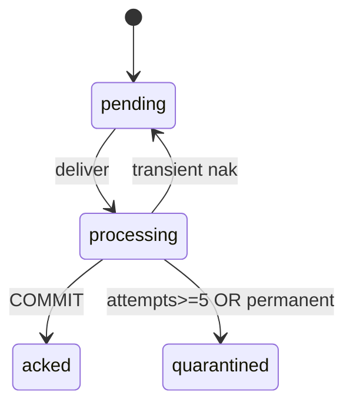

# R07 — Riscos: `modules/graph`

**Rodada:** R7 · 2026-09-11 · ANX-389  
**Callers:** [R06-dependencies.md](./R06-dependencies.md) · [R08-decision-log.md](./R08-decision-log.md) · [ROUNDS.md](./ROUNDS.md)  
**Histórico:** [poison pill](../../structure-debate/graph/R07-poison-pill-quarantine.md)

**KEEP adapter-gateway** se já exportado. Pack ANX-389 — não `done`.

## In / Out (R7)

**In:** poison pill, DLQ, replay. **Out:** quarentena ack+DLQ. **Não** D-GOV-010.

## Non-goals

Não spec `accepted`. Não ST08 live. Não ANX-389 `done`. Partial rebuild operacional não é v1.

## Ownership

| Superfície | Dono |
| --- | --- |
| Quarentena / DLQ graph | **graph** |
| adapter-gateway | **KEEP** |

## Debate R7

**Arquiteto:** Poison pill = falha determinística fora do hot path após N tentativas. Quarentena **ack + DLQ** preserva ordem; nak infinito é anti-padrão.

**Crítico:** Quarentena sem DLQ auditável = evento fantasma. Partial rebuild operacional **não** é v1.

**Security:** Replay DLQ só PLATFORM + manifest; `payload_ref` redacted. Rate limit por `traversalId`.

## Registro de riscos

| ID | Risco | Sev | Mitigação |
| --- | --- | ---: | --- |
| R-GRP-01 | ALLOW só do grafo stale | 20 | revalidar epoch PG no path mutável |
| R-GRP-02 | Cypher injection | 19 | `traversalId` only; schema Zod |
| R-GRP-03 | Credencial Neo4j em agente/módulo | 20 | adapter exclusivo + AR04 |
| R-GRP-04 | Inbox poison pill | 16 | `max_attempts=5` → quarantine + DLQ + NATS ack |
| R-GRP-05 | Cache T01 pós-revogação | 18 | epoch na chave; ALLOW+intentHash never cache |
| R-GRP-06 | 24º módulo gateway | 12 | proibido ADR0006 |
| R-GRP-07 | Cross-tenant leak em traversal | 18 | scope injetado; G5-GRP-02 |
| R-GRP-08 | Pending >100k pós-rebuild | 14 | throttle batch; bloqueia novo rebuild |
| R-GRP-09 | Secrets em nó/evento de grafo | 19 | INV-GRP-04 + redact DLQ |

Top 5 (01, 02, 03, 05, 07) → R08.

## Oráculos G3 / G5

| ID | Prova |
| --- | --- |
| G3-GRP-01 | Inbox idempotente |
| G5-GRP-01 | Zero credencial Neo4j no agente |
| G5-GRP-02 | FORBIDDEN sem leak |
| G5-GRP-04 | DLQ replay sem secrets no payload |

## Non-goals

Auto-replay DLQ batch; partial rebuild operacional; D-GOV-010 (risk P06); pasta approvals.

## Saída R7

Para [R08](./R08-decision-log.md).
