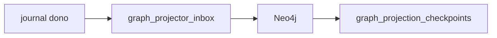

# R09 — Plano de implementação: `modules/graph`

**Rodada:** R9 · 2026-09-11 · ANX-389  
**Callers:** [R08-decision-log.md](./R08-decision-log.md) · [R10-g0-handoff.md](./R10-g0-handoff.md) · [ROUNDS.md](./ROUNDS.md). Sem migration ST08.

## In / Out (R9 — plano, não G1)

**In (futuro G1):** journal/outbox dos 22 donos (graph **não** é ledger); eventId para inbox; catálogo de projeções; T01–T05 fixtures.

**Out:** catálogo PG + mutação Neo4j + checkpoint. **Não** writes de Grant/Order/Position. P1 só este pack. **Não** ST08. **Não** ANX-342/389 done.

## Non-goals

Não spec `accepted`. Não ST08 live. Não D-GOV-010 aqui. Graph **projeta**, não é ledger (PC 09). Sem pasta `approvals/`.

## Ownership

| Superfície | Dono |
| --- | --- |
| Catálogo de projeções / inbox / Neo4j mutação | **graph** |
| Journal autoritativo | **módulo dono** (22) |
| adapter-gateway | **KEEP** |

## Pré-requisitos G1 futuro (greenlight Owner)

Eventing inbox; catálogo de projeções; consumers por `ownerDomain`; T01–T05 fixtures; **não** ledger.

## Fatias (pós-greenlight)

| Slice | Entrega |
| --- | --- |
| S1 | catálogo PG de projeções / checkpoints |
| S2 | inbox idempotente (eventId) |
| S3 | projector organizations/governance/agents |
| S4 | T01–T05 fixtures |
| S5 | dispatcher |
| S6 | rebuild a partir de journal |
| S8 | defer checklist structure |

## Oráculos a preservar na G1

G3-GRP-01..03 · G5-GRP-01..02 · AR04 · AR05.

## Defer

RLS P09; driver em outros módulos; ST08 0/23; spec `accepted`.

P1 **só** pack documental. APIs neste dir permanecem draft até issue impl.

## Saída R9

Para R10.
