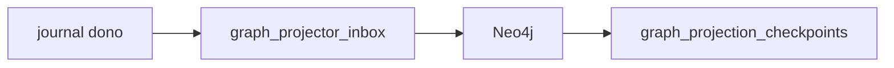

# R09 — Plano de implementação: `modules/graph`

**Rodada:** R9 · 2026-09-11 · ANX-389  
**Callers:** [R08-decision-log.md](./R08-decision-log.md) · [R10-g0-handoff.md](./R10-g0-handoff.md) · [ROUNDS.md](./ROUNDS.md). Sem migration ST08. Instrução: fatten graph R09 se ainda curto.

## Pré-requisitos G1 futuro (greenlight Owner)

Eventing inbox; catálogo de projeções; consumers por `ownerDomain`; T01–T05 fixtures; **não** ledger.

## Fatias (pós-greenlight)

| Slice | Entrega |
| --- | --- |
| S1 | catálogo PG de projeções / checkpoints |
| S2 | inbox idempotente (eventId) |
| S3 | projector organizations/governance/agents |
| S4 | T01–T05 fixtures |
| S5 | dispatcher |
| S6 | rebuild a partir de journal |
| S8 | defer checklist structure |

P1 **só** pack documental. APIs neste dir permanecem draft até issue impl. Graph **projeta**, não é ledger (PC 09). Specs 001–005 **draft**. D-GOV-010 **não** aqui. ANX-342 **não** done. Oráculos a preservar na G1: G3-GRP-01..03 · G5-GRP-01..02 · AR04 · AR05.

## Defer

RLS P09; driver em outros módulos; ST08 0/23.

## In / Out (R9 — plano, não G1)

**In (futuro G1):** journal/outbox dos 22 donos (graph não é ledger); eventId para inbox.
**Out:** catálogo PG + mutação Neo4j + checkpoint; T01–T05 fixtures. **Não** writes de Grant/Order/Position. P1 só este pack.

## Saída R9

Para R10.
