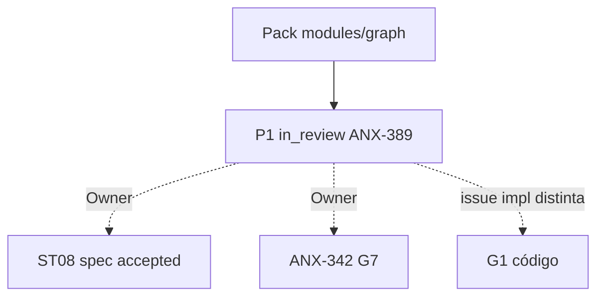

# R10 — Pacote G0 (handoff): `modules/graph`

**Rodada:** R10 · 2026-09-11  
**Programa:** ANX-389 (permanece `in_review`)  
**Callers:** [R09-dev-plan.md](./R09-dev-plan.md) · [ROUNDS.md](./ROUNDS.md)  
**Histórico:** [structure R10](../../structure-debate/graph/R10-g0-handoff.md) — G0 de **código** ANX-32 é issue distinta; este pack **não** autoriza claim G1.

## Classificação epistemológica

| Afirmação | Status |
| --- | --- |
| Debate R01–R10 documental neste dir | fechado P1 |
| ADR0001 grafo operacional | **proposto** — não substituído |
| Specs 001–005 | **draft** (ST08 0/23) |
| ANX-342 | **todo** — não hijack |
| D-GOV-010 | **risk P06** — fora |
| Código `backend/modules/graph` | Parcial; pack ≠ G7 |

## In scope documental

Kernel, catálogo T01–T20, inbox, DLQ, rebuild full-swap, dispatcher, consumers `graph:{domain}:v1`, cache epoch-aware, R01–R10 neste diretório, APIs draft [node.get](./node-get-neighbors-api-v1.md) / [T01–T05](./t01-t05-fixtures-v1.md).

## Out of scope

| Item | Destino |
| --- | --- |
| Ledger grants/capital/ordens | donos |
| Cypher / neo4j-driver fora do adapter | proibido |
| Partial rebuild operacional | S8 spike |
| OpenAPI Scalar público | defer |
| Auto-replay DLQ | pós-G1 |
| Pasta approvals/policies | **não criar** |
| D-GOV-010 | risk P06 |
| Spec `accepted` / ST08 migrations | Owner |
| ANX-342 G7 | Owner |

## Critérios de aceite **deste** pack (P1 documental)

| # | Critério |
| --- | --- |
| AC-P1-01 | In/out/non-goals explícitos em R01–R02 e R10 |
| AC-P1-02 | Oráculos G3/G5 nomeados em R04/R07 |
| AC-P1-03 | Ownership PG vs Neo4j em R05 |
| AC-P1-04 | Decision log R08 com P1-GRP-* |
| AC-P1-05 | R09 fatias futuras **sem** greenlight implícito |

**Veredito P1:** pack G0 **documental** completo após agents+orchestration. Graph **projeta**; não é ledger. **Não** autoriza G1.

## Saída R10

G0 debate P1 fechado. Próximo serial: polish identity R05 → accounting R07 → capital R06–R07 → audit R10 → performance R08+R10 → orchestration R09–R10.
