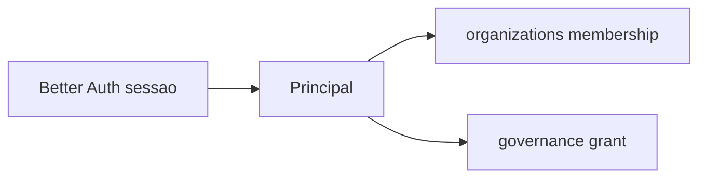

# R01 — Contexto: `modules/identity`

**Componente:** modules/identity  
**Rodada:** R1 — Inventário documental  
**Pacote SDD:** P02  
**Data:** 2026-09-11  
**Issue pack:** ANX-389 · histórico ANX-42 / ANX-77 · impl P0 ANX-28 (`done`) — **este slice não reabre G1**  
**Callers:** [R02-boundaries.md](./R02-boundaries.md) · [R06-dependencies.md](./R06-dependencies.md) · [ROUNDS.md](./ROUNDS.md).  
**PC:** [02 Organization](../../../../notes/anxionos-pc02-organization-debate.md).  
**Histórico:** [structure R01](../../structure-debate/identity/R01-context.md).

## Objetivo da rodada

Inventariar Principal institucional (humano/service), estado de revogação e journal. Better Auth **só** em `apps/api`. Specs 001–005 **draft**. ST08 **0/23**. Não stamp `accepted`. Não done ANX-342 / ANX-389.

## Propósito

Identity **é a âncora de quem age**. Organizations consome Principal para membership; governance consome para grants. Tokens **nunca** no grafo nem em eventos.

## In / Out (R1)

**In:** Pedido autenticado Better Auth (`apps/api`) com agencyId; comandos Register/Suspend/Revoke Principal; evento de sessão a revogar; `expectedRevision` + Idempotency-Key.

**Out:** Principal persistido (PG) + `identity.principal.*.v1` / `identity.session.revoked.v1` **sem token**; consumers organizations/governance/graph projector `graph:identity:v1`. Sem membership, grant, secret de provider, Agent.

## O módulo POSSUI

Principal, SessionRef (não o token), ServiceCredentialRef, command journal identity.

## O módulo NÃO POSSUI (ownership nomeado)

| Item | Dono |
| --- | --- |
| Agency / membership | **organizations** |
| Grant / T01 | **governance** |
| Provider secrets | **connections** |
| Agent | **agents** |
| Tokens no grafo | **proibido** |
| D-GOV-010 | **risk** P06 |
| Pasta organization única | PC 02 — **sem pasta** |

## Non-goals

- Não duplicar `authUserId` em organizations.
- Não SQLite sessão institucional.
- Não identity importa `better-auth` no `domain/`.
- Não `approvals/` / `policies/`.
- Não fake ST08 live.

## Dependências

| Direção | Componentes |
| --- | --- |
| Upstream | apps/api Better Auth (composition) |
| Downstream | organizations, governance, graph, audit |

## Armazenamento

PG `identity_principals` + journal + outbox. Neo4j `:User` projetado **sem tokens**. SQLite **proibido** para sessão. ST08 0/23.

## Spec / ADR

| Artefato | Status |
| --- | --- |
| ADR0002 módulo `identity/` | accepted |
| ADR0004 PG + Neo4j | accepted |
| spec 001 envelope | **draft** |
| PC 02 organization | composto — sem pasta única |

## Estado do código

P0 envelope genérico existe (ANX-28). Layout alvo `@anxionos/contracts/identity/` é **P1 documental** neste pack — não impl deste slice.

## Oráculos (não executados neste pack)

| ID | Gate | Esperado |
| --- | --- | --- |
| G3-IDN-01 | G3 | getPrincipalById no agency scope |
| G3-IDN-02 | G3 | register idempotente |
| G5-IDN-01 | G5 | token **não** em evento |
| G5-IDN-02 | G5 | suspend → session consumer |

→ **R02** ([R02-boundaries.md](./R02-boundaries.md))
