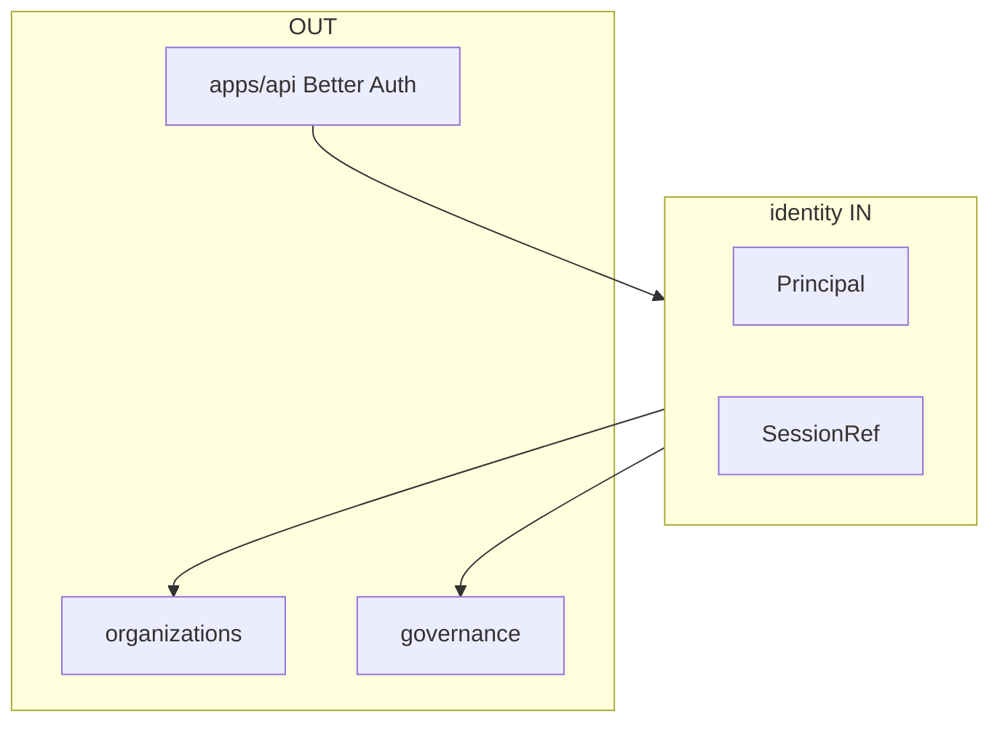

# R02 — Fronteiras: `modules/identity`

**Rodada:** R2 · 2026-09-11 · ANX-389  
**Callers:** [R01-context.md](./R01-context.md) · [R03-domain-sketch.md](./R03-domain-sketch.md).  
**Histórico:** [structure R02](../../structure-debate/identity/R02-boundaries.md). Instrução: fatten identity R01–R05.

## POSSUI

Principal, sessão Better Auth (**infra composition**), service principals, estado de revogação, command journal identity.

## NÃO POSSUI

| Item | Dono |
| --- | --- |
| Agency/membership | organizations |
| Grant | governance |
| Provider secrets | connections |
| Agent | agents |
| D-GOV-010 | risk P06 |

## Non-goals

Não duplicar authUserId em organizations. Tokens **nunca** no grafo. SQLite **nunca** sessão institucional. Sem pasta organization única (PC 02). Sem `approvals/`.

## Invariantes IDN-R02-INV-*

01 Revogação de Principal invalida sessões derivadas (consumer BA)  
02 domain/ sem HTTP Better Auth — ports  
03 Sem FK para organizations  
04 ownerDomain=identity  
05 D-GOV-010 não aqui

## Saída R2

Para R3.
