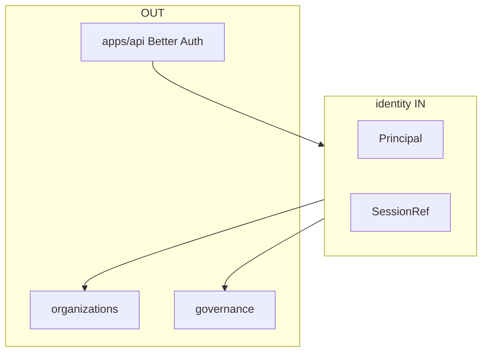

# R02 — Fronteiras: `modules/identity`

**Rodada:** R2 — Scope boundary  
**Data:** 2026-09-11  
**Issue pack:** ANX-389  
**Callers:** [R01-context.md](./R01-context.md) · [R03-domain-sketch.md](./R03-domain-sketch.md).  
**Histórico:** [structure R02](../../structure-debate/identity/R02-boundaries.md).

## Objetivo da rodada

Fechar possui/não possui entre identity e **organizations**, **governance**, **connections**, **agents**, **graph**. Better Auth fica em composition root.

## Debate R2 (síntese)

**Arquiteto:** Principal é o único agregado de identidade humana/service neste módulo.

**Crítico:** Membership não vive aqui. Token não atravessa o grafo.

**Security:** Revogação invalida sessões derivadas (consumer BA). Eventos redacted.

## O módulo POSSUI

Principal, sessão Better Auth (**infra composition**), service principals, estado de revogação, command journal identity.

## O módulo NÃO POSSUI

| Item | Dono |
| --- | --- |
| Agency/membership | **organizations** |
| Grant | **governance** |
| Provider secrets | **connections** |
| Agent | **agents** |
| D-GOV-010 | **risk** P06 |

## Non-goals

- Não duplicar authUserId em organizations.
- Tokens **nunca** no grafo.
- SQLite **nunca** sessão institucional.
- Sem pasta organization única (PC 02).
- Sem `approvals/`.

## In / Out (R2)

**In:** sessão Better Auth validada em `apps/api`; comandos de Principal; pedido de revoke de sessão.

**Out:** fatos `identity.*` sem token; PrincipalLookup para outros módulos. Sem FK para `organizations_*`.

## Invariantes (`IDN-R02-INV-*`)

| ID | Regra |
| --- | --- |
| IDN-R02-INV-01 | Revogação de Principal invalida sessões derivadas (consumer BA) |
| IDN-R02-INV-02 | `domain/` sem HTTP Better Auth — só ports |
| IDN-R02-INV-03 | Sem FK para organizations |
| IDN-R02-INV-04 | `ownerDomain=identity` |
| IDN-R02-INV-05 | D-GOV-010 não aqui |

## Oráculos

| ID | Gate | Esperado |
| --- | --- | --- |
| G5-IDN-01 | G5 | token ausente em evento |
| G3-IDN-02 | G3 | register idempotente |

→ **R03** ([R03-domain-sketch.md](./R03-domain-sketch.md))
