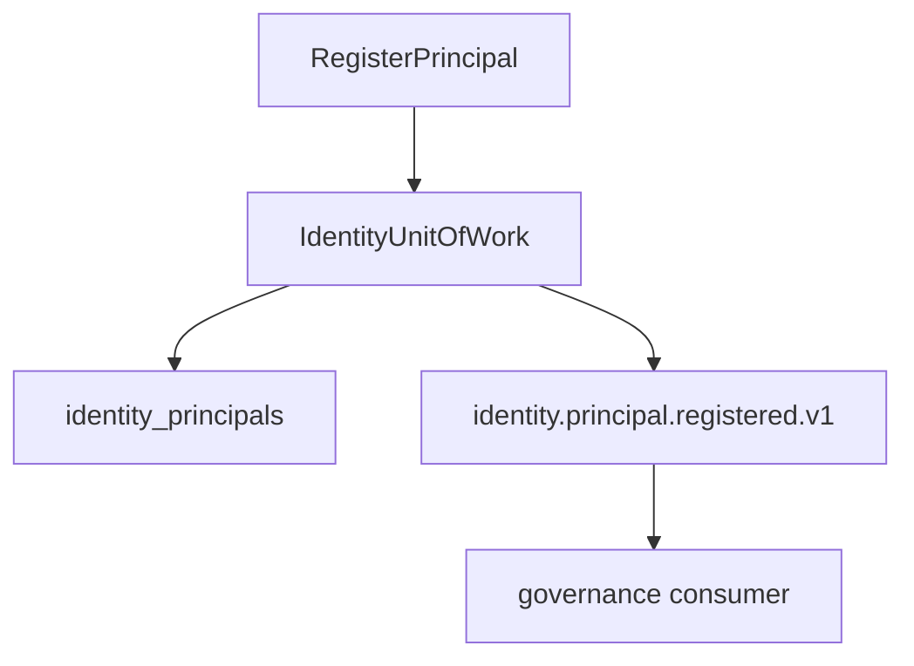

# R03 — Esboço de domínio: `modules/identity`

**Rodada:** R3 · 2026-09-11 · ANX-389  
**Callers:** [R02-boundaries.md](./R02-boundaries.md) · [R04-contracts.md](./R04-contracts.md).  
**Histórico:** [structure R03](../../structure-debate/identity/R03-domain-sketch.md).

## Agregados

| Agregado | Notas |
| --- | --- |
| Principal | humano/service; revision |
| PrincipalStatus | ACTIVE \| SUSPENDED \| REVOKED |
| SessionRef | id lógico — **não** o token |
| ServiceCredentialRef | hash/ref — secret só em packages/secrets / BA |

## Ports

PrincipalRepository, SessionRevocationPort, IdentityUnitOfWork, PrincipalLookup (export público).

## Comandos

RegisterPrincipal, SuspendPrincipal, RevokePrincipal, RecordSessionRevoked.

**INV-IDN-01:** Principal SUSPENDED impede novos grants (consumer governance).  
**INV-IDN-02:** UoW estado+journal+outbox.  
**INV-IDN-03:** eventos sem token/PAN.

## In / Out (R3)

**In:** comando com expectedRevision + idempotencyKey; lookup por principalId no agency scope.
**Out:** agregados Principal/SessionRef; ports UoW; invariantes INV-IDN-01..03. Sem Agency, Grant, Agent.

## Saída R3

Para R4.
