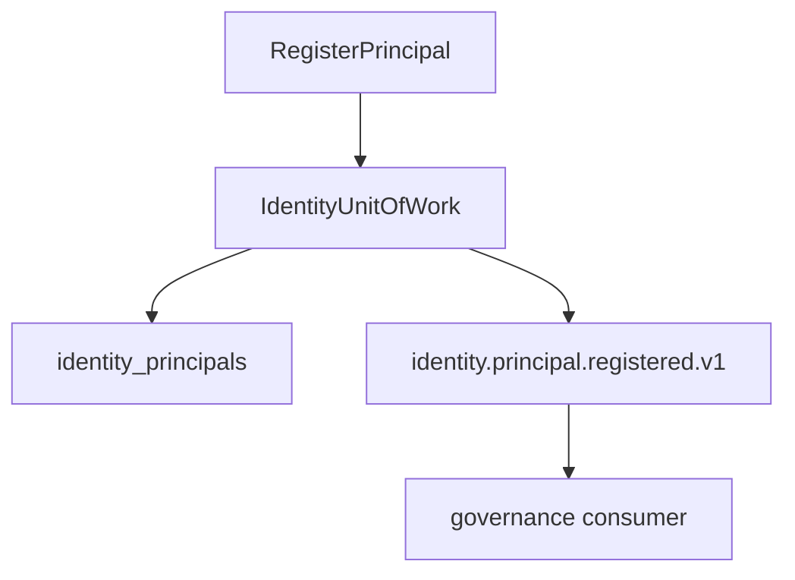

# R03 — Esboço de domínio: `modules/identity`

**Rodada:** R3 — Domain model  
**Data:** 2026-09-11  
**Issue pack:** ANX-389  
**Callers:** [R02-boundaries.md](./R02-boundaries.md) · [R04-contracts.md](./R04-contracts.md).  
**Histórico:** [structure R03](../../structure-debate/identity/R03-domain-sketch.md).

## Debate R3 (síntese atribuída)

**Arquiteto:** Agregados Principal + SessionRef + ServiceCredentialRef. Status ACTIVE | SUSPENDED | REVOKED.

**Executor:** IdentityUnitOfWork = estado + journal + outbox. PrincipalLookup é porta pública.

**Crítico:** SUSPENDED impede novos grants (consumer governance). Eventos sem token/PAN.

**Security:** Secret de credential só em packages/secrets / Better Auth — aqui só hash/ref.

## In / Out (R3)

**In:** comando com expectedRevision + idempotencyKey; lookup por principalId no agency scope.

**Out:** Principal/SessionRef persistidos; eventos `identity.principal.*` / `identity.session.revoked.v1`. Sem Agency, Grant, Agent.

## Non-goals

- Não modelar Membership aqui.
- Não persistir accessToken.
- Não D-GOV-010.

## Agregado: Principal

Humano ou service; `revision` optimistic concurrency; `kind` imutável após insert.

## Agregado: PrincipalStatus

ACTIVE | SUSPENDED | REVOKED.

**INV-IDN-01:** Principal SUSPENDED impede novos grants (consumer governance).

## Entidade: SessionRef

Id lógico — **não** o token.

## Entidade: ServiceCredentialRef

Hash/ref — secret só em packages/secrets / BA.

## Ports (domain/)

| Port | Responsabilidade |
| --- | --- |
| PrincipalRepository | CRUD + status |
| SessionRevocationPort | invalidar sessões derivadas |
| IdentityUnitOfWork | estado + journal + outbox |
| PrincipalLookup | export público read-only |
| AgencyScopePort | organizations (scope, não FK) |

**INV-IDN-02:** UoW estado+journal+outbox.  
**INV-IDN-03:** eventos sem token/PAN.

## Comandos application

| Comando | Idempotência | Evento |
| --- | --- | --- |
| RegisterPrincipal | (organizationId, subjectKey) | `identity.principal.registered.v1` |
| SuspendPrincipal | (principalId, expectedRevision) | `identity.principal.suspended.v1` |
| RevokePrincipal | (principalId, expectedRevision) | `identity.principal.revoked.v1` |
| RecordSessionRevoked | sessionRefId | `identity.session.revoked.v1` |

## Oráculos

| ID | Gate | Esperado |
| --- | --- | --- |
| G3-IDN-01 | G3 | getPrincipalById |
| G3-IDN-02 | G3 | register idempotente |
| G5-IDN-02 | G5 | suspend dispara session consumer |

## Saída R3

Para R4.
