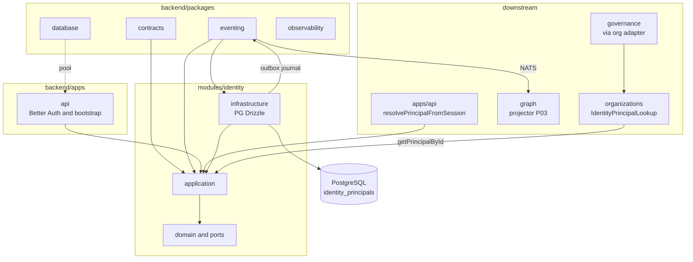

# R06 — Dependências: `modules/identity`

**Rodada:** R6 — Upstream, packages, downstream e contratos cross-module  
**Data:** 2026-09-08  
**Issue:** ANX-77 (debate R06–R10) · implementação P0: ANX-28 (`done`, G7 2026-09-07) · debate estrutura R01–R05: ANX-42 · pack ANX-389

## In / Out (R6)

**In:** PrincipalLookup consumers; Better Auth só em `apps/api`; AgencyScopePort (sem FK); eventing.

**Out:** eventos `identity.*` sem token; projector `graph:identity:v1`. Sem membership, grant, secrets de connections.

## Non-goals

- Não D-GOV-010 neste módulo (risk P06).
- Não import de better-auth em `domain/`.
- Não pasta organization única (PC 02).

## Participantes

| Papel | Agente |
| --- | --- |
| Arquiteto | architect |
| Executor | code-architect |
| Security | security-reviewer |
| Crítico | critic-reviewer |

## Objetivo da rodada

Fechar o mapa de dependências do módulo **identity** após entrega P0 (ANX-28): packages upstream, consumidores downstream, fronteira Better Auth, exports públicos, imports proibidos e resolução das pendências P-R5-01..05 de [structure-debate/identity/R05-storage.md](../../structure-debate/identity/R05-storage.md).

## Fontes aplicadas

| Fonte | Uso em R6 |
| --- | --- |
| [structure-debate/identity/R05-storage.md](../../structure-debate/identity/R05-storage.md) | PG, journal/outbox, projector deferido |
| [structure-debate/identity/R04-contracts-events.md](../../structure-debate/identity/R04-contracts-events.md) | EventTypes, exports, PrincipalLookup |
| [structure-debate/identity/R02-boundaries.md](../../structure-debate/identity/R02-boundaries.md) | Better Auth, fronteiras |
| [organizations/R06-dependencies.md](../organizations/R06-dependencies.md) | Adapter `IdentityPrincipalLookup`, D-R6-01..04 |
| [governance/R06-dependencies.md](../governance/R06-dependencies.md) | `PrincipalLookup` via port |
| `backend/modules/identity/src/index.ts` | Superfície pública ANX-28 |
| `brain/notes/anxionos-backend-structure.md` | Regras 1–12 de dependência |

## Debate R6 (diálogo atribuído)

**Arquiteto:** identity é **upstream** de P02 — organizations e governance validam `principalId` via port/adapters; graph projeta `:Principal` a partir de eventos. identity **não** importa módulos downstream.

**Executor:** ANX-28 exporta `registerPrincipal`, `getPrincipalByAuthUserId`, `getPrincipalById`, `ensureIdentitySchema`. Adapter concreto `createIdentityPrincipalLookup` vive em **organizations** e é reexportado para governance bootstrap — identity permanece agnóstico de organizations.

**Security:** Better Auth permanece exclusivo de `apps/api`. identity recebe `authUserId` apenas no boundary `registerPrincipal` — nunca em payload de evento alvo (gap P1 ainda no código).

**Crítico:** governance importa `createIdentityPrincipalLookup` de `@anxionos/organizations`, não de identity — acoplamento indireto aceitável v1 desde que organizations permaneça dono do adapter.

**Síntese Orquestrador:** Mapa v1 fechado; P-R5-02 (projector) e P-R5-03 (ServicePrincipal) adiados; P-R5-04 (testes integração rollback) → R09.

---

## Decisões-chave de dependência

| ID | Decisão | Direção | Evidência / nota |
| --- | --- | --- | --- |
| D-R6-IDN-01 | identity **não** importa `organizations`, `governance`, `graph` | boundary | ADR0002 regra 4 |
| D-R6-IDN-02 | Better Auth só em `apps/api`; identity nunca importa `better-auth` | boundary | R02, `auth.ts` |
| D-R6-IDN-03 | Journal/outbox via `@anxionos/eventing` na mesma transação PG | package | `register-principal.ts` |
| D-R6-IDN-04 | Schemas de evento alvo em `@anxionos/contracts/identity/*` (**P1 — ausente**) | package | R04; código usa envelope genérico |
| D-R6-IDN-05 | Bootstrap `ensureEventingSchema` → `ensureIdentitySchema` no composition root | downstream wiring | `organizations/bootstrap.ts`, `governance/bootstrap.ts` |
| D-R6-IDN-06 | Adapter `IdentityPrincipalLookup` em **organizations**; governance reutiliza via export organizations | downstream | `governance/bootstrap.ts` importa `@anxionos/organizations` |
| D-R6-IDN-07 | Projector Neo4j no módulo **graph**, consumer `graph:identity:v1` | downstream | P-R5-02 resolvido (contrato); impl P03 |
| D-R6-IDN-08 | Consumer sessão BA `apps/api:identity-sessions:v1` em `principal.suspended` | downstream | R03 Q3; **deferido R09** |
| D-R6-IDN-09 | `resolvePrincipalFromSession` em `apps/api` orquestra signup → `registerPrincipal` | composition root | `resolve-principal.ts` |
| D-R6-IDN-10 | RLS PostgreSQL **não** obrigatório v1 — consistente com organizations | adiado | R07 |

---

## Upstream — packages e composition root

### Packages compartilhados

| Package | Uso em identity | Camada |
| --- | --- | --- |
| `@anxionos/contracts` | `domainEventEnvelopeSchema` em `registerPrincipal` | application |
| `@anxionos/eventing` | `appendJournal`, `enqueueOutbox` | application/infrastructure |
| `@anxionos/database` | Pool injetado via `createIdentityDb(pool)` | infrastructure |
| `@anxionos/observability` | Logger (quando wiring completo) | infrastructure |
| `@anxionos/secrets` | **Não usado v1** — BA secrets em `apps/api` | — |

**Regra:** `contracts` não importa `modules/*`.

### Composition root (`apps/api`) — o que chama identity

| Necessidade | Mecanismo | Arquivo |
| --- | --- | --- |
| Bootstrap schema PG | `ensureIdentitySchema(pool)` | `organizations/bootstrap.ts`, `governance/bootstrap.ts` |
| Sessão → Principal | `resolvePrincipalFromSession` → `getPrincipalByAuthUserId` / `registerPrincipal` | `organizations/resolve-principal.ts` |
| Signup pós-BA | Hook implícito via primeira rota autenticada | `resolve-principal.ts` |
| Better Auth runtime | **Não** no módulo identity | `apps/api/src/auth.ts` |

### O que identity **nunca** chama

| Proibido | Motivo |
| --- | --- |
| `organizations/*`, `governance/*`, `graph/*` | Regra 4 — sem repositório cross-module |
| `better-auth`, cookies, handlers HTTP | Boundary composition root |
| Neo4j / `neo4j-driver` | Projeção via eventos |
| Tabelas `organizations_*`, `governance_*` | Escrita lateral proibida |

---

## Downstream — consumidores

### `modules/organizations` (síncrono — **implementado**)

| Aspecto | Decisão |
| --- | --- |
| Relação | organizations → adapter → `getPrincipalById` |
| Adapter | `createIdentityPrincipalLookup(pool)` em `organizations/infrastructure/adapters/` |
| Port | `PrincipalLookup.exists(principalId)` — fail-closed |
| Wiring | `apps/api/src/organizations/bootstrap.ts` |
| Evidência | ANX-28 G7; testes organizations usam `ensureIdentitySchema` |

### `modules/governance` (síncrono — **implementado**)

| Aspecto | Decisão |
| --- | --- |
| Relação | governance → `PrincipalLookup` port → adapter organizations |
| Comandos | `IssueGrant`, `SubmitChangeProposal` validam principal via lookup |
| Import compile-time | `@anxionos/organizations` (`createIdentityPrincipalLookup`) — **não** `@anxionos/identity` no domain governance |
| Evidência | `governance/bootstrap.ts`, `issue-grant.ts` |

**Nota arquitetural:** adapter identity poderia migrar para `packages/` ou `identity/infrastructure/adapters/` se governance precisar lookup sem depender de organizations — **deferido** (registrar em R08).

### `modules/graph` (assíncrono — **contrato only**)

| Aspecto | Decisão |
| --- | --- |
| Consumer | `graph:identity:v1` |
| Eventos subscritos | `identity.principal.registered.v1`, `identity.principal.suspended.v1`, `identity.principal.email_updated.v1` |
| Código atual emite | `principal.registered` (legado) — normalizar P1 |
| Implementação projector | graph P03 (ANX-32) |

```typescript
export const IDENTITY_GRAPH_CONSUMER = "graph:identity:v1" as const;

export const IDENTITY_GRAPH_EVENT_TYPES = [
  "identity.principal.registered.v1",
  "identity.principal.suspended.v1",
  "identity.principal.email_updated.v1",
] as const;
```

### `apps/api` (composition root)

| Responsabilidade | Detalhe |
| --- | --- |
| Ordem bootstrap | eventing → identity → organizations → governance |
| Auth plugin | `getPrincipalByAuthUserId` via `resolvePrincipalFromSession` |
| Rotas HTTP identity | **Nenhuma v1** — identity não expõe `/v1/identity/*` |
| Consumer sessão suspend | Worker `apps/api:identity-sessions:v1` — **deferido R09** |

### Outros consumidores assíncronos (registro)

| Módulo | Evento | Uso |
| --- | --- | --- |
| audit (P06) | `identity.*.v1` | Flight recorder |
| governance (futuro) | `identity.principal.suspended.v1` | Revogar grants derivados |
| billing (P07) | — | Não consome identity v1 |

---

## Exports públicos — `modules/identity/index.ts`

### Exportado (ANX-28 — evidência)

| Export | Consumidor |
| --- | --- |
| `registerPrincipal` | `apps/api` resolve-principal |
| `getPrincipalByAuthUserId` | `apps/api` auth flow |
| `getPrincipalById` | organizations adapter (via pool/repository) |
| `createIdentityDb`, `ensureIdentitySchema` | composition root bootstrap |
| `principals` (schema Drizzle) | testes, bootstrap |
| Tipos `Principal`, `PrincipalRepository` | testes, wiring |

### Não exportar

| Proibido | Motivo |
| --- | --- |
| `infrastructure/persistence/principal-repository.ts` | Implementação concreta |
| `better-auth`, handlers Elysia | Boundary HTTP |
| Port `PrincipalLookup` | Pertence a organizations/governance domain |

---

## Imports proibidos (checklist AR01)

| Origem proibida | Alternativa |
| --- | --- |
| `modules/organizations/**` | Eventos apenas |
| `modules/governance/**` | Eventos apenas |
| `modules/graph/**` | Eventos apenas |
| `better-auth` | `apps/api` only |
| `neo4j-driver` | graph module |
| Escrita em `domain_journal` sem eventing | `appendJournal` |

### Matriz compile-time

| De → Para | contracts | eventing | database | observability |
| --- | ---: | ---: | ---: | ---: |
| identity `domain` | tipos | — | — | — |
| identity `application` | schemas | sim | — | — |
| identity `infrastructure` | — | sim | pool injetado | sim |
| `apps/api` | sim | sim | sim | sim |

---

## Diagrama de dependências



---

## Resolução pendências R05 (structure-debate)

| ID | Assunto | Status R6 | Decisão / destino |
| --- | --- | --- | --- |
| **P-R5-01** | Migration 0001 + `suspendPrincipal` | ⏳ **Adiado R09** | P1 follow-up identity |
| **P-R5-02** | Wiring projector graph + consumer | ✅ **Resolvido** (contrato) | `graph:identity:v1`; impl graph P03 |
| **P-R5-03** | `identity_service_principals` | ⏳ **Deferido** | P02+ execution-go |
| **P-R5-04** | Testes integração PG rollback | ⏳ **R09** | Plano de testes |
| **P-R5-05** | Consumer `graph:identity:v1` | ⏳ graph P03 | Não bloqueia identity P0 |

---

## Relação taskboard

| Issue | Relação | Notas |
| --- | --- | --- |
| ANX-77 | Debate R6 entregue | Este artefato |
| ANX-28 | P0 implementação `done` | G7 2026-09-07 |
| ANX-29 | Downstream organizations | Desbloqueado identity G7 |
| ANX-32 | graph P03 | Consumer projector |
| ANX-42 | structure-debate R01–R05 | Pré-requisito deste R06 |

**Ordem bootstrap (`apps/api`):**

1. `ensureEventingSchema(pool)`
2. `ensureIdentitySchema(pool)`
3. `ensureOrganizationsSchema(pool)`
4. `ensureGovernanceSchema(pool)`

---

## Critérios de aceite R6

| # | Critério | Status |
| --- | --- | --- |
| AC-R6-01 | Upstream packages documentados | ✅ |
| AC-R6-02 | Fronteira Better Auth explícita | ✅ |
| AC-R6-03 | Downstream org/gov/graph/api documentados | ✅ |
| AC-R6-04 | Exports index.ts e imports proibidos | ✅ |
| AC-R6-05 | P-R5-02 resolvido; demais adiados com destino | ✅ |
| AC-R6-06 | Diagrama mermaid de dependências | ✅ |

## Pendências para rodadas seguintes

| ID | Assunto | Rodada |
| --- | --- | --- |
| P-R6-01 | Normalizar `eventType` → `identity.principal.registered.v1` | R07 / R09 |
| P-R6-02 | Remover `authUserId` do payload outbox | R07 |
| P-R6-03 | `@anxionos/contracts/identity/*` | R09 |
| P-R6-04 | Avaliar adapter identity fora de organizations | R08 defer |

## Saída R6

✅ Mapa de dependências aprovado para R7 (riscos).
