# R12 — Overview e diagramas do módulo `identity`

Documento derivado do **código verificado** (não de sketch). Cada diagrama tem a fonte
(`arquivo:linha`) ao lado, e os números citados foram medidos no digest `cf9ea2ec`:
`tsc --build --force` 0 · `lint` 0 · `boundaries` 0 · suíte completa com PostgreSQL real
**1611 pass / 0 fail / 0 skip** · oráculo de banco virgem **PASS**.

> Correção de registro: a ficha e vários comentários meus citavam "7 eventos". São **12**
> (`packages/contracts/src/identity/events.ts:15-28`). Este documento é a referência.

---

## 1. Visão em uma linha

`identity` é o dono do **Principal institucional** (global, sem FK de agência), das
**sessões humanas** via Better Auth (só referências lógicas), dos **service principals**
com credenciais rotacionáveis, e do **contrato de projeção `:User`** consumido pelo `graph`.
Não é dono de grants (`governance`), nem de memberships/agências (`organizations`), nem do
projector de grafo (`graph`).

## 2. Arquitetura em camadas (ADR0002)

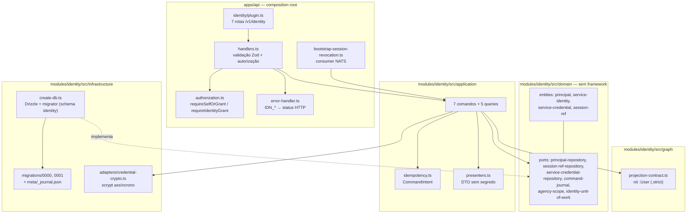

## 3. Mapa de ownership e integração

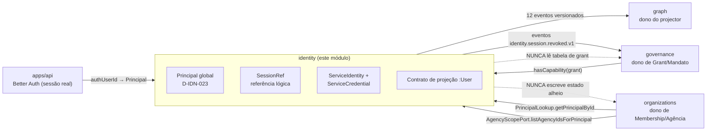

**Regra de fronteira:** o módulo **não** guarda FK de agência e **não** lê a tabela de
grants — a autorização chega por `hasCapability` (governance) e a tenancy por
`AgencyScopePort` (organizations).

## 4. Ciclo de vida do Principal

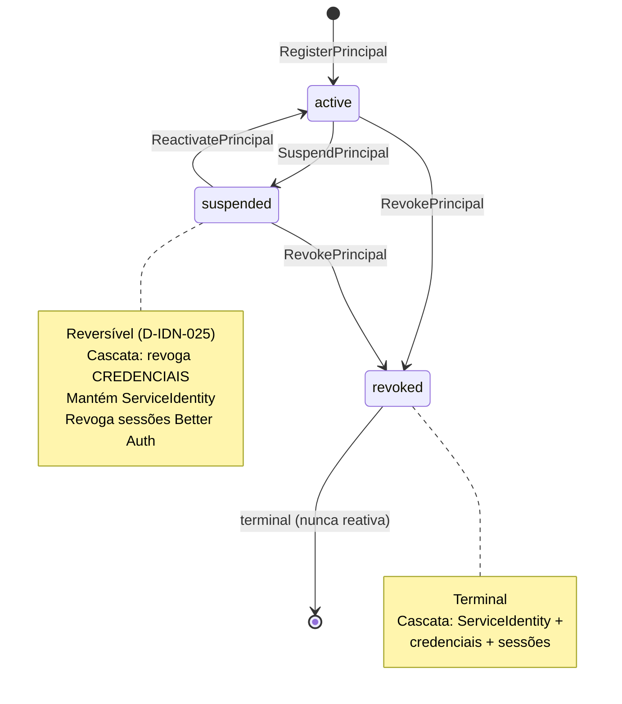

Leituras **fail-closed**: `getPrincipalById` devolve `null`/404 para qualquer estado
≠ `active` (INV-IDN-01, D-IDN-008) — não há caminho que devolva o DTO de um principal
suspenso ou revogado.

## 5. Ciclo de vida da credencial de serviço

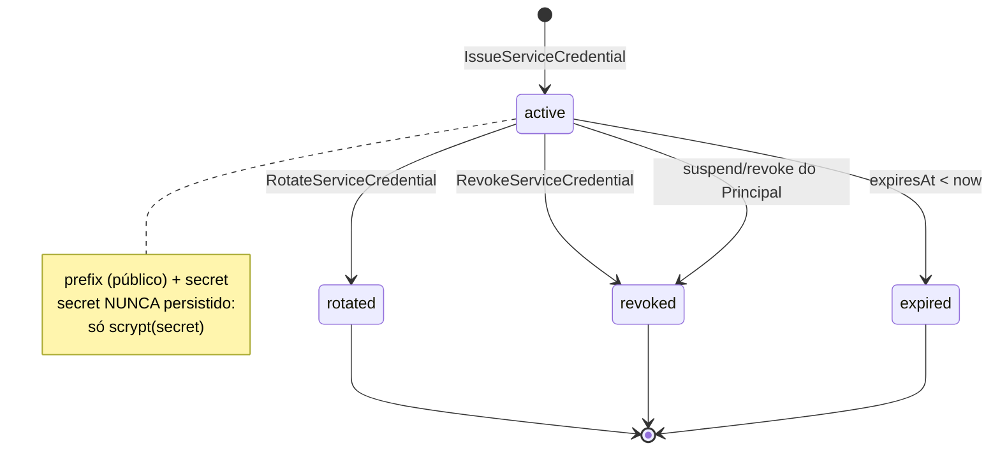

`verifyServiceCredential` devolve `{ valid, reason }` discriminado:
`malformed | not_found | revoked | rotated | expired | mismatch | identity_inactive |
principal_inactive`. **Sem rota HTTP** (D-IDN-032) — expor `verify` criaria oráculo de
adivinhação de chave.

## 6. Fluxo de uma requisição HTTP (com autorização)

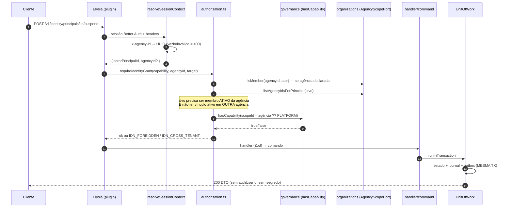

## 7. Decisão de autorização (as 3 regras)

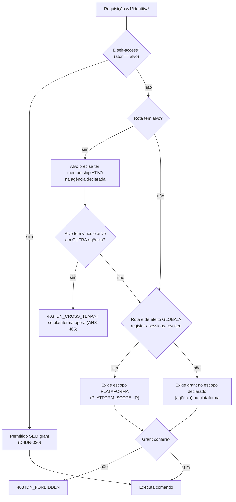

**`identity.admin` NÃO implica `identity.read`** (D-IDN-034): as duas capabilities são
verificadas separadamente, e o catálogo as declara distintas.

## 8. Registro de Principal — idempotência e corrida

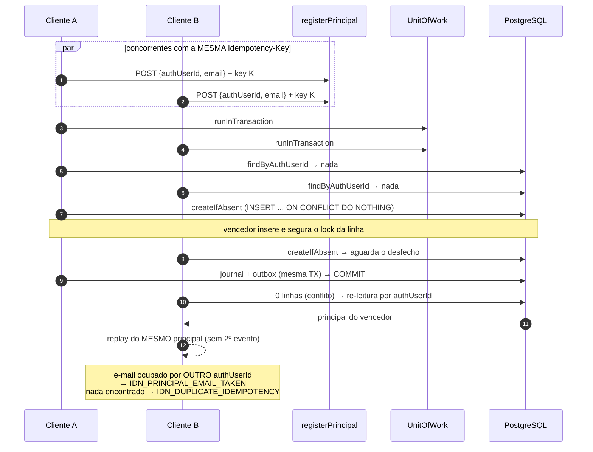

Prova real (5 execuções × 10 chamadas simultâneas em PostgreSQL): **todas 200, 1
principal, 1 linha de journal, 1 evento, zero 500** (D-IDN-036).

## 9. Revogação de sessão — posse como invariante

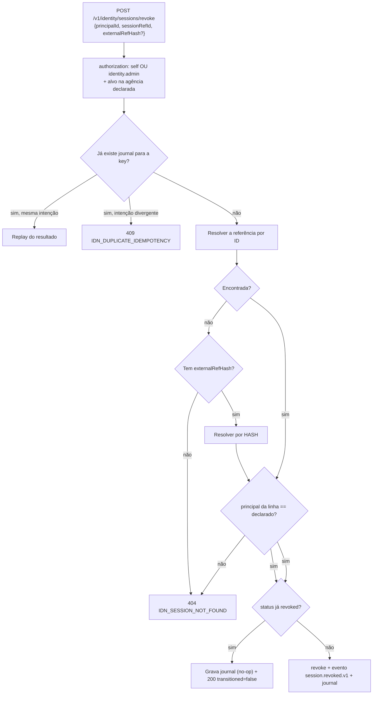

Os **três caminhos** (id, hash, journal) validam posse — o IDOR e o bypass por
`externalRefHash` foram fechados (D-IDN-043, D-IDN-047), com **404 opaco** para não
confirmar a existência de referência de terceiro.

## 10. Idempotência — modelo geral

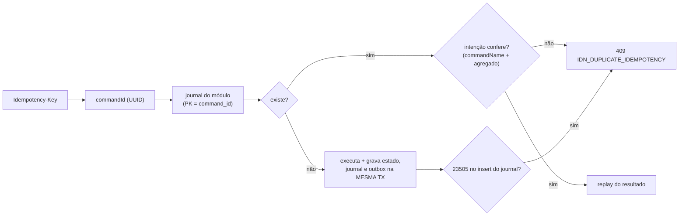

O guard `isUniqueViolation` **percorre a cadeia `cause`** — o drizzle embrulha o erro do
pg em `DrizzleQueryError` com o `code` em `cause`; sem isso o mapeamento ficava morto.

## 11. Modelo de dados (ER)

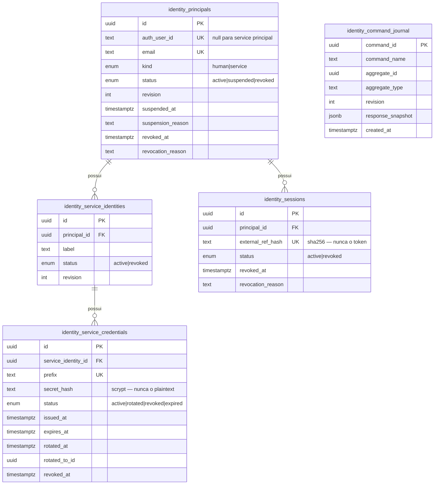

Migrator Drizzle com **journal no schema `identity`** (`migrationsSchema`), o que evita o
defeito de journal compartilhado entre módulos (ANX-463).

## 12. Projeção de grafo — nó `:User`

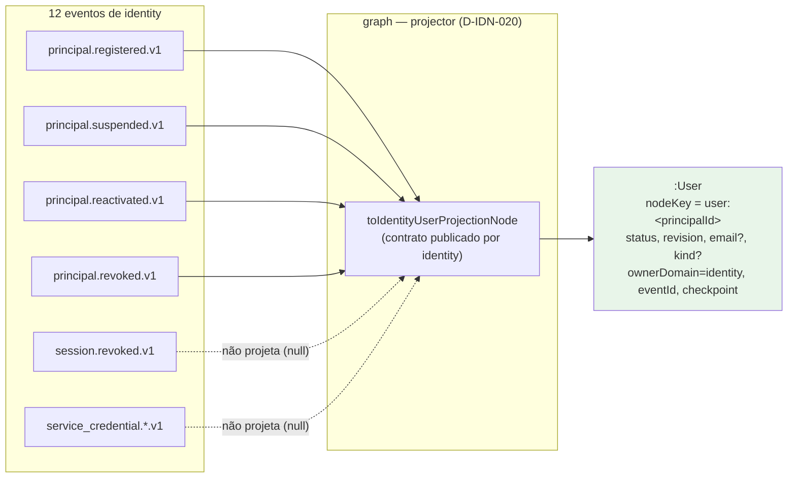

O schema é **`.strict()`**: atributo extra (token, `secretHash`, `externalRefHash`,
cookie) **falha** em vez de passar. Cada atributo opcional é validado isoladamente — um
campo corrompido no envelope é **omitido**, não derruba o nó (D-IDN-038).

## 13. Eventos, outbox e consumidores

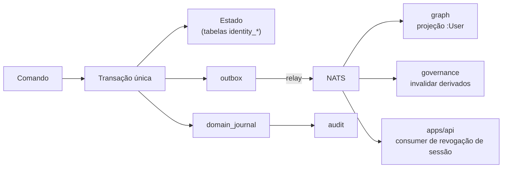

Se a outbox falhar, **nada** é gravado (rollback atômico) — provado em teste de
integração com PostgreSQL real.

## 14. Superfície pública

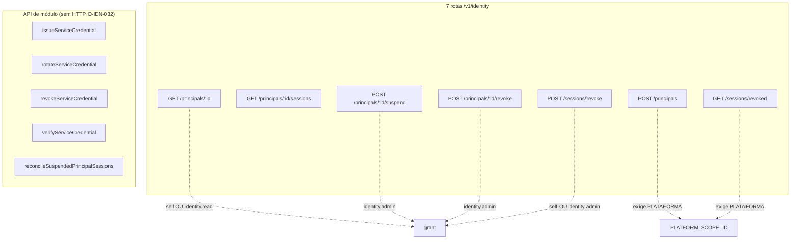

## 15. Gaps e fronteiras (com dono)

| Item | Dono | Estado |
| --- | --- | --- |
| Projector Neo4j real (`:User`) | `graph` | contrato pronto; projector não implementado (P03) |
| RLS PostgreSQL | P09 | fora do slice |
| Rota HTTP para credenciais | — | **deliberadamente ausente** (D-IDN-032) |
| Autoridade de plataforma | `governance` | implementada (ANX-462); exige grant no escopo `PLATFORM_SCOPE_ID` |
| 5 módulos sem migrations | `audit`, `billing`, `connections`, `knowledge`, `orchestration` | **ANX-470** — `apps/workers` não sobe em banco novo |

## 16. Decisões que explicam o desenho

`D-IDN-001`..`D-IDN-048` (R08 + R11). As que mais explicam o código:

- `D-IDN-023` Principal é **global**, sem FK de agência — tenancy só na autorização.
- `D-IDN-034` `identity.admin` **não** implica `identity.read`.
- `D-IDN-035/042` operação global exige **escopo de plataforma**, não "escopo nulo".
- `D-IDN-039/043` o escopo declarado limita o **alvo**, e posse de sessionRef é
  invariante nos três caminhos de resolução.
- `D-IDN-044` registro e ledger são operações de plataforma.
- `D-IDN-036` corrida de registro resolvida por `ON CONFLICT DO NOTHING` + releitura.
- `D-IDN-038` atributo opcional inválido é omitido, não derruba o nó.
