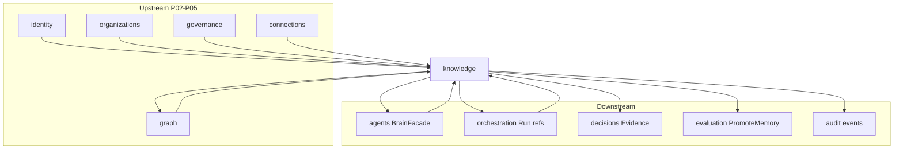

# R06 — Dependências: `modules/knowledge`

**Componente:** modules/knowledge  
**Rodada:** R6 — Upstream, downstream, bootstrap  
**Pacote SDD:** P04  
**Data:** 2026-09-08  
**Issues:** ANX-85 · ANX-36 · ANX-32 (graph consumer) · ANX-82 (agents upstream)

## Objetivo

Mapa upstream/downstream, ordem bootstrap, wiring agents/connections/graph/orchestration.

## Decisões-chave

| ID | Decisão |
| --- | --- |
| KN-R06-01 | knowledge **não** importa repos privados agents/graph/orchestration |
| KN-R06-02 | `EmbeddingPort` → connections MODEL binding |
| KN-R06-03 | `GraphTraversalPort` → `@anxionos/graph` exports públicos |
| KN-R06-04 | agents BrainFacade consome `RetrievalPort` via index knowledge |
| KN-R06-05 | orchestration correlaciona `runId` — não duplica memory store |
| KN-R06-06 | evaluation gate `PromoteMemory` — async consumer |
| KN-R06-07 | Bootstrap após connections MODEL stub + graph traversal |

## Diagrama de dependências

## Upstream

| Módulo | Port / uso |
| --- | --- |
| **governance** | `GrantValidationPort`, `AclResolverPort` — ACL pré-filtro retrieval |
| **organizations** | `OrganizationScopePort` — tenancy |
| **identity** | `PrincipalLookup` — principalId validation |
| **graph** | `GraphTraversalPort` adapter — T05/T10 expansion |
| **connections** | `EmbeddingPort` → MODEL invoke embed/rerank/OCR/STT |

## Downstream

| Módulo | Consumo |
| --- | --- |
| **agents** | `queryKnowledge`, `buildContextManifest` via BrainFacade |
| **orchestration** | `context.manifest.created.v1`, episodic memory `sourceRunId` |
| **decisions** | `knowledge.evidence.recorded.v1` |
| **evaluation** | `knowledge.memory.promotion_requested.v1` |
| **graph** | projector `graph:knowledge:v1` (ANX-32) |

## Bootstrap order

1. `ensureEventingSchema`
2. identity → organizations → governance
3. graph (traversal handlers)
4. connections (MODEL binding stub)
5. **`ensureKnowledgeSchema`**
6. Register `/v1/knowledge/*` plugin

## Critérios de aceite — R06

| # | Critério | Status |
| --- | --- | --- |
| AC-R06-01 | Upstream/downstream documentados | ✅ |
| AC-R06-02 | Diagrama mermaid | ✅ |
| AC-R06-03 | Bootstrap order | ✅ |
| AC-R06-04 | Wiring agents/connections/graph/orchestration | ✅ |
| AC-R06-05 | Proibições cross-module import | ✅ |

## Saída R6

✅ → [R07-risks.md](./R07-risks.md)
