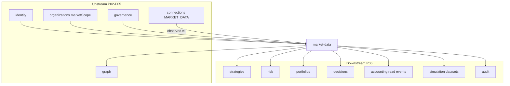

# R06 — Dependências: `modules/market-data`

**Componente:** modules/market-data  
**Rodada:** R6 — Upstream, downstream, bootstrap  
**Pacote SDD:** P06  
**Data:** 2026-09-08  
**Issues:** ANX-87 · ANX-58 · ANX-62 (connections upstream) · ANX-83 (connections debate)

## Objetivo

Mapa upstream/downstream, ordem bootstrap, wiring connections/graph/organizations/strategies.

## Decisões-chave

| ID | Decisão |
| --- | --- |
| MD-R06-01 | market-data **não** importa repos privados connections/accounting/strategies |
| MD-R06-02 | Feed via connections `MARKET_DATA` binding — não adapter direto |
| MD-R06-03 | Consumer `connections.market_data.observed.v1` em worker |
| MD-R06-04 | strategies/risk/portfolios consomem `getPriceAsOf` via index.ts |
| MD-R06-05 | accounting consome MarketEvent read-only — lançamentos próprios |
| MD-R06-06 | graph projector `graph:market-data:v1` — async |
| MD-R06-07 | Bootstrap após connections MARKET_DATA stub + organizations market scope |

## Diagrama de dependências

## Upstream

| Módulo | Port / uso |
| --- | --- |
| **organizations** | `OrganizationMarketScopePort` — DRAINING, market enablement |
| **governance** | Grants `market_data.*` |
| **identity** | Principal validation HTTP |
| **connections** | `connections.market_data.observed.v1`; binding `MARKET_DATA` |
| **graph** | Projector consumer only (reverse dep) |

## Downstream

| Módulo | Consumo |
| --- | --- |
| **strategies** | `resolveInstrument`, historical prices, `datasetId` |
| **risk** | `getPriceAsOf` + `getFreshnessStatus` FAIL_CLOSED |
| **portfolios** | Mark-to-market snapshots asOf |
| **decisions** | Price snapshot no TradeIntent context |
| **accounting** | MarketEvent read — lançamento separado pós-execution |
| **simulation** | `MarketDataset` replay pin |
| **graph** | projector `graph:market-data:v1` |

## Bootstrap order

1. `ensureEventingSchema`
2. identity → organizations → governance
3. graph (inbox handlers)
4. connections (MARKET_DATA binding stub — ANX-84)
5. **`ensureMarketDataSchema`** (PG registry S1)
6. Timescale hypertables (S2)
7. Register `/v1/market-data/*` + observed consumer worker

## Imports proibidos

| Origem | Destino | Veredito |
| --- | --- | --- |
| market-data | `connections/infrastructure/**` | ❌ |
| market-data | `accounting_*`, `execution_*` tables | ❌ |
| strategies | `market-data/infrastructure/**` | ❌ — só index.ts |

## Critérios de aceite — R06

| # | Critério | Status |
| --- | --- | --- |
| AC-R06-01 | Upstream/downstream | ✅ |
| AC-R06-02 | Diagrama mermaid | ✅ |
| AC-R06-03 | Bootstrap order | ✅ |
| AC-R06-04 | Wiring connections/graph/P06 | ✅ |
| AC-R06-05 | Proibições cross-module | ✅ |

## Saída R6

✅ → [R07-risks.md](./R07-risks.md)
