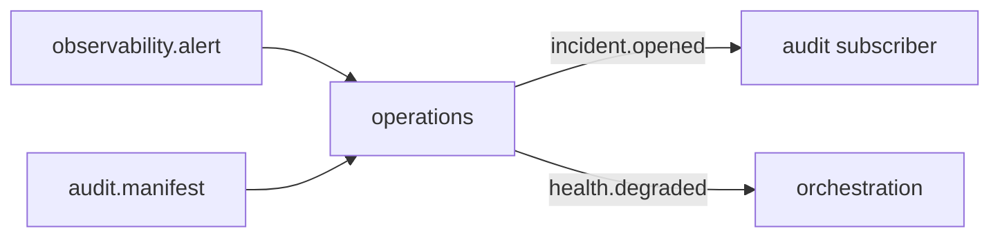

# R01 — Contexto: `modules/operations`

**Componente:** modules/operations  
**Rodada:** R1 — Inventário documental  
**Pacote SDD:** P07  
**Data:** 2026-09-11  
**Issue pack:** ANX-389 · debate estrutura ANX-42 · debate módulo **ANX-111** · impl futura **ANX-112** (não neste pack)  
**Callers:** [R02-boundaries.md](./R02-boundaries.md) · [R10-g0-handoff.md](./R10-g0-handoff.md) · [ROUNDS.md](./ROUNDS.md). Sem API runtime.  
**Fontes:** `brain/notes/anxionos-pc17-deployments-debate.md`, `brain/notes/anxionos-pc18-infrastructure-debate.md`, `brain/notes/anxionos-pc20-incidents-debate.md`.

## Objetivo da rodada

Inventariar operação da **plataforma**: incidentes, runbooks, retenção, export jobs, health de serviços, adapters OP01–OP08 como **procedimento** (não 24º módulo). Specs **draft**. ST08 **0/23**. Não stamp `accepted`. Não G1.

## Propósito

Operations **orquestra procedimento** (abrir incidente, exportar evidência com retenção, snapshot de health, executar runbook versionado). **Não** é Flight Recorder (`audit`) nem kill switch (`risk`). Health **não** concede trading (ADR0006).

## In / Out (R1)

**In:** alerta correlacionado (`observability.alert.fired.v1`); heartbeat; `audit.manifest.recorded.v1` (só `deltaRefId`); POST export (Idempotency-Key + grant); probe de health; ProcedureVersion / Runbook a executar; AgencyScope + T01.

**Out:** Incident / ExportJob / ServiceHealthSnapshot / RetentionPolicy / Runbook em PG `operations_*` + journal + outbox; `operations.incident.opened.v1` / closed; `operations.export.completed.v1` / failed; `operations.health.degraded.v1`; blob de export (object store) referenciando `deltaRefId` de audit — **não** copia journal.

**Não sai daqui:** `audit.manifest.*` (emitir), kill-switch, ledger, `execution.order.*`, secrets de infra.

## O módulo POSSUI (estado)

Incident, Runbook, RetentionPolicy, ExportJob, ServiceHealthSnapshot.

## O módulo NÃO POSSUI (ownership nomeado)

| Item | Dono correto |
| --- | --- |
| Audit replay / manifest autoritativo | **audit** |
| Kill switch / D-GOV-010 | **risk** P06 |
| Secrets store | **packages/secrets** |
| Neo4j driver | **graph** |
| Ledger / ordens | **accounting** / **execution** |
| Alert timeseries store | **packages/observability** |
| Pasta `infrastructure/` / `deployments/` / `incidents/` | PC 17/18/20 — **sem 24º módulo** |

## Non-goals

- Não criar `infrastructure/`, `deployments/`, `incidents/` como pasta-módulo.
- Não SQLite de incidente autoritativo.
- Não emitir `audit.manifest.*`.
- Não CI/CD como estado de pipeline neste módulo.
- Não fake ST08 live; não done ANX-342 / ANX-389; não G1 ANX-112.

## Dependências (mapa R1)

| Direção | Componentes |
| --- | --- |
| Upstream | identity, organizations, governance (T01), audit (deltaRef), observability probes, eventing |
| Downstream | apps/api `/v1/operations`, Platform console, graph projector `graph:operations:v1`, audit (subscriber de export) |

## Armazenamento (mapa draft)

PostgreSQL `operations_*` + journal + outbox. Object store para blob de export. Neo4j: IMPACTS via projector. SQLite: diagnóstico local reconcilável, **não** verdade. ST08 0/23.

## Spec / ADR

| Artefato | Papel | Status |
| --- | --- | --- |
| ADR0002 | módulo físico `operations/` | accepted |
| ADR0004 | PG + Neo4j | accepted |
| ADR0006 | health ≠ grant de trading | accepted (quando vigente no brain) |
| spec 001 | envelope / tenancy | **draft** |
| PC 17/18/20 | deploy / infra / incidents compostos | P1 sem pasta extra |

## Estado do código

**Ausente** como bounded context completo. Pack G0 documental.

## Oráculos (inventário — não executados)

| ID | Gate | Esperado |
| --- | --- | --- |
| G3-OPS-01 | G3 | export replay mesmo idempotency_key não duplica job |
| G3-OPS-02 | G3 | retention não DELETE accounting/execution |
| G3-OPS-03 | G3 | health snapshot não emite order.* |
| G5-OPS-01 | G5 | cross-tenant 403 |
| G5-OPS-02 | G5 | export sem grant 403 |

→ **R02** ([R02-boundaries.md](./R02-boundaries.md))
