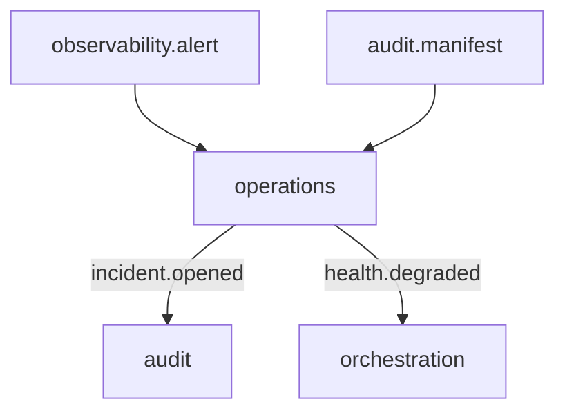

# R02 — Fronteiras: `modules/operations`

**Rodada:** R2 · P07 · 2026-09-11 · ANX-111 · ANX-389  
**Callers:** [R01-context.md](./R01-context.md) · [R03-domain-sketch.md](./R03-domain-sketch.md). Sem API runtime. Instrução: fatten operations.

## Debate

**Arquiteto:** operations dono de incidente, export, health, runbook, retenção.

**Crítico:** Export **lê** audit via `deltaRefId` — não reescreve journal. Health não substitui observability metrics store.

**Security:** T01 em export/incident mutate; export grant + RetentionPolicy; PII no object store, não no grafo.

## POSSUI

Incident, Runbook, RetentionPolicy, ExportJob, ServiceHealthSnapshot.

## NÃO POSSUI

| Item | Dono |
| --- | --- |
| Manifest/replay | audit |
| Alert timeseries | observability package |
| Kill switch | risk |
| Secrets | packages/secrets |
| D-GOV-010 | risk P06 |

## Non-goals

Não criar `infrastructure/`, `deployments/`, `incidents/` como 24º. Não SQLite de incidente. Não emitir `audit.manifest.*`.

## Invariantes OPS-R02-INV-*

01 dono único · 02 só contrato/evento · 03 SQLite não autoritativo · 04 ownerDomain=operations · 05 export referencia deltaRefId audit · 06 D-GOV-010 não aqui.

→ **R03** ([R03-domain-sketch.md](./R03-domain-sketch.md))
