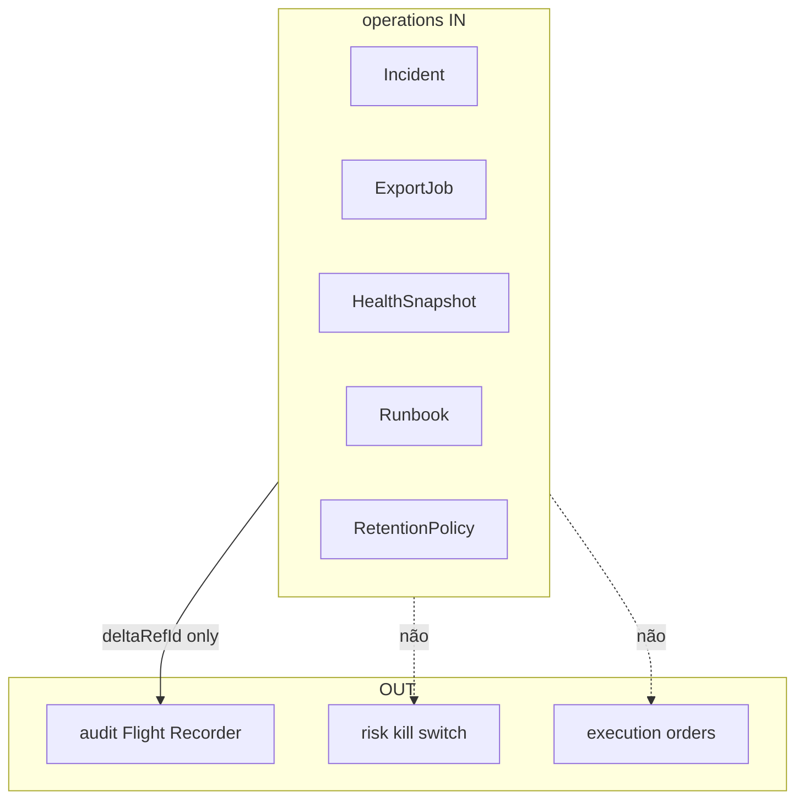

# R02 — Fronteiras: `modules/operations`

**Componente:** modules/operations  
**Rodada:** R2 — Scope boundary  
**Pacote SDD:** P07  
**Data:** 2026-09-11  
**Issue:** ANX-42 · **ANX-111** · pack **ANX-389**  
**Callers:** [R01-context.md](./R01-context.md) · [R03-domain-sketch.md](./R03-domain-sketch.md) · [ROUNDS.md](./ROUNDS.md). Sem API runtime.

## Objetivo da rodada

Fechar **possui / não possui** entre operations e **audit**, **risk**, **graph**, **observability**, **execution**, **accounting**. Export lê audit via `deltaRefId` — não reescreve journal.

## Fontes aplicadas

| Fonte | Uso em R2 |
| --- | --- |
| [R01-context.md](./R01-context.md) | Inventário |
| PC 17/18/20 | sem 24º módulo |
| ADR0002 / ADR0006 | dono físico; health ≠ trading |
| ANX-111 | debate histórico |

## Debate R2 (síntese)

**Arquiteto:** operations dono de incidente, export, health, runbook, retenção.

**Crítico:** Export **lê** audit via `deltaRefId` — não reescreve journal. Health não substitui metrics store.

**Security:** T01 em export/incident mutate; export grant + RetentionPolicy; PII no object store, não no grafo.

## O módulo POSSUI

Incident, Runbook, RetentionPolicy, ExportJob, ServiceHealthSnapshot.

## O módulo NÃO POSSUI

| Item | Dono correto |
| --- | --- |
| Manifest / replay / Flight Recorder | **audit** |
| Alert timeseries | **packages/observability** |
| Kill switch / D-GOV-010 | **risk** P06 |
| Secrets | **packages/secrets** |
| Driver Neo4j | **graph** |
| Ledger / ordens | **accounting** / **execution** |

## Non-goals

- Não criar `infrastructure/`, `deployments/`, `incidents/` como 24º.
- Não SQLite de incidente.
- Não emitir `audit.manifest.*`.
- Não kill-switch.
- Não conceder trading via health.

## In / Out (R2)

**In:** EventConsumer (alerts, heartbeats, audit.manifest); TraversalEvaluator; AgencyScopePort; ObjectStorePort.

**Out:** fatos `operations.*`; projector IMPACTS (ids de serviço). Sem mutate de ledger/audit journal.

## Decisão: possui / não possui

| Dado / comportamento | Dono |
| --- | --- |
| Incident, ExportJob, HealthSnapshot, Runbook, RetentionPolicy | **operations** |
| Flight Recorder | **audit** |
| Kill switch | **risk** |
| Metrics store | **observability** |

## Invariantes R02 (`OPS-R02-INV-*`)

| ID | Regra |
| --- | --- |
| OPS-R02-INV-01 | Dono único dos agregados R03 |
| OPS-R02-INV-02 | Cross-module só contrato/evento |
| OPS-R02-INV-03 | SQLite não autoritativo |
| OPS-R02-INV-04 | `ownerDomain=operations` |
| OPS-R02-INV-05 | Export referencia `deltaRefId` audit — não copia journal |
| OPS-R02-INV-06 | D-GOV-010 **não** aqui |
| OPS-R02-INV-07 | Health snapshot não emite `execution.order.*` |

## Oráculos

| ID | Gate | Esperado |
| --- | --- | --- |
| G3-OPS-03 | G3 | health ≠ ordem |
| G5-OPS-02 | G5 | export sem grant 403 |

## Critérios de aceite — R02

| # | Critério | Status |
| --- | --- | --- |
| AC-R02-01 | Tabela possui/não possui | ✅ documental |
| AC-R02-02 | Export ≠ Flight Recorder | ✅ documental |
| AC-R02-03 | Sem pasta infrastructure/ | ✅ documental |

→ **R03** ([R03-domain-sketch.md](./R03-domain-sketch.md))
