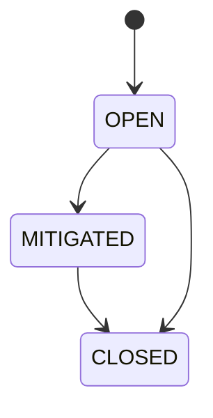

# R03 — Esboço de domínio: `modules/operations`

**Rodada:** R3 — Domain model  
**Data:** 2026-09-11  
**Issue pack:** ANX-389 · histórico ANX-111  
**Pré-requisito:** [R02-boundaries.md](./R02-boundaries.md)  
**Callers:** [R04-contracts-events.md](./R04-contracts-events.md) · [ROUNDS.md](./ROUNDS.md). Sem schema de produção.

## Debate R3 (síntese atribuída)

**Arquiteto:** Cinco agregados v1 — Incident, Runbook, RetentionPolicy, ExportJob, ServiceHealthSnapshot.

**Executor:** `OperationsUnitOfWork` (estado + journal + outbox). Blob de export via ObjectStorePort.

**Crítico:** ExportJob carrega `deltaRefId` — não copia journal. Alert → OpenIncident correlacionado (não storm 1:1 obrigatório).

**Security:** T01 em mutate; RetentionPolicy fail-closed no export; sem PII no grafo.

## In / Out (R3)

**In:** EventConsumer (alerts, heartbeats, audit.manifest); ObjectStorePort; AgencyScopePort; TraversalEvaluator.

**Out:** Incident `open|mitigated|closed`; ExportJob `PENDING→RUNNING→COMPLETED|FAILED|CANCELLED`; ServiceHealthSnapshot (PG, não Timescale); Runbook versão imutável.

## Non-goals

- Não Timescale de métricas neste módulo.
- Não Flight Recorder.
- Não D-GOV-010.
- Não BYTEA de export no PG.

## Agregado: Incident

`correlationId`; status open/mitigated/closed; `serviceIds` (UUIDs lógicos — sem FK).

**OPS-R03-02:** Alert → OpenIncident correlacionado (não storm 1:1 obrigatório).

## Agregado: Runbook

Versão imutável; passos **sem** secret; refs a procedimentos OP01–OP08.

## Agregado: RetentionPolicy

Org-scoped. Export **deve** honrar. **Não** DELETE em ledger alheio.

## Agregado: ExportJob

Idempotency-Key. `resultRef` object store.

**OPS-R03-01:** ExportJob carrega `deltaRefId` de audit — não copia journal.

## Agregado: ServiceHealthSnapshot

Probes as-of. Não é série Timescale. Não é grant.

## Ports (domain/)

| Port | Responsabilidade |
| --- | --- |
| IncidentRepository | lifecycle |
| ExportJobRepository | job + idempotency |
| HealthSnapshotRepository | probes |
| RunbookRepository | versões imutáveis |
| RetentionPolicyRepository | políticas |
| OperationsUnitOfWork | estado + journal + outbox |
| AgencyScopePort | organizations |
| TraversalEvaluator | T01 |
| EventConsumerPort | alerts, heartbeats, audit.manifest |
| ObjectStorePort | export blob |

## Comandos application

| Comando | Idempotência | Evento |
| --- | --- | --- |
| OpenIncident | (agencyId, correlationId) | `operations.incident.opened.v1` |
| CloseIncident | (incidentId, expectedRevision) | `operations.incident.closed.v1` |
| StartExportJob | Idempotency-Key | queued interno; completed/failed depois |
| RecordHealthSnapshot | (serviceId, asOf) | `operations.health.degraded.v1` se degradado |

## Oráculos

| ID | Gate | Esperado |
| --- | --- | --- |
| G3-OPS-01 | G3 | export idempotente |
| G3-OPS-02 | G3 | retention não apaga ledger |

## Saída R3

Modelo v1 para R4.
