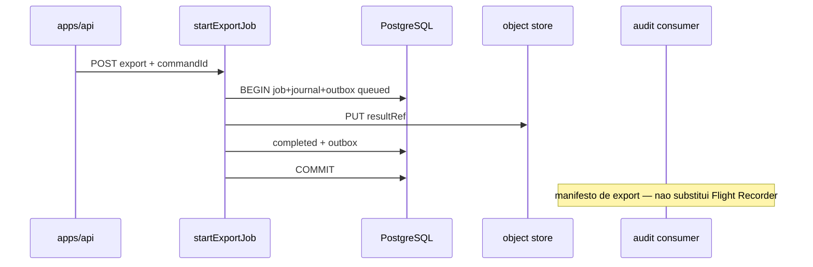

# R05 — Armazenamento: `modules/operations`

**Rodada:** R5 · 2026-09-11 · ANX-389 · ANX-111 · **nao** impl ANX-112  
**Callers:** [R04-contracts-events.md](./R04-contracts-events.md) · [R06-dependencies.md](./R06-dependencies.md).  
**Fonte:** `brain/notes/anxionos-storage-ownership.md` · ADR0004 · P07 estrutura · ADR0006 (catalogo tecnico de artefatos).

## In scope

| Engine | O que operations **possui** |
| --- | --- |
| PostgreSQL | Incidentes, runbooks, politicas de retencao, export jobs, health snapshots, command journal |
| Object store | Blob de export (`resultRef`); nao BYTEA |
| Neo4j | IMPACTS (servico) via projector `graph:operations:v1` |

## Out of scope

| Dado | Dono |
| --- | --- |
| Flight Recorder / replay / linhagem autoritativa | `audit` |
| Journal de dominio de outros modulos | cada owner + eventing |
| Kill switch / D-GOV-010 | `risk` P06 |
| Secrets | `packages/secrets` |
| Driver Neo4j | `graph` |
| Ledger / ordens | accounting / execution |
| Pasta `infrastructure/` como 24o modulo | **proibido** (PC 18) |

## Non-goals

Sem migration; ST08 0/23; SQLite nao e incidente autoritativo (so diagnostico local reconcilavel); CI/CD real nao e tabela; specs draft; sem G1.

## Principios

| Principio | Decisao |
| --- | --- |
| Fato operacional | PostgreSQL `operations_*` |
| Export | object store + hash; job idempotente (`idempotency_key`) |
| Health | snapshot; nao concede trading (ADR0006) |
| PII no grafo | **Proibido** |
| FK cross-module | **Nao** |

## Fluxo export

## Tabelas PostgreSQL

| Tabela | Proposito |
| --- | --- |
| `operations_incidents` | Incident; severity; status; service_ids |
| `operations_runbooks` | Runbook versionado; procedure refs |
| `operations_retention_policies` | RetentionPolicy; nao apaga ledger alheio |
| `operations_export_jobs` | ExportJob; idempotency_key UNIQUE; result_ref |
| `operations_health_snapshots` | ServiceHealthSnapshot; as_of |
| `operations_command_journal` | command_id PK |

**OPS-R05-01** PG autoritativo. **OPS-R05-02** UoW+outbox. **OPS-R05-03** RLS defer P09. **OPS-R05-04** blob em object store.

## Neo4j

`incident.opened` → IMPACTS (ids de servico). Sem PII, sem grants, sem saldos.

## Alternativas rejeitadas

Health snapshot como grant; export em BYTEA; SQLite como audit trail; pasta `infrastructure/` dona de deploy state.

## Oraculos

| ID | Gate | Esperado |
| --- | --- | --- |
| G3-OPS-01 | G3 | export replay mesmo idempotency_key nao duplica job |
| G3-OPS-02 | G3 | retention **nao** DELETE em tabelas de accounting/execution |
| G3-OPS-03 | G3 | health snapshot nao emite order.* |
| G5-OPS-01 | G5 | cross-tenant incident 403 |
| G5-OPS-02 | G5 | export sem grant 403 |
| G5-OPS-03 | G5 | ST04: apagar SQLite local nao muda incidents |

## Saida R5

Modelo v1. Sem migration.
