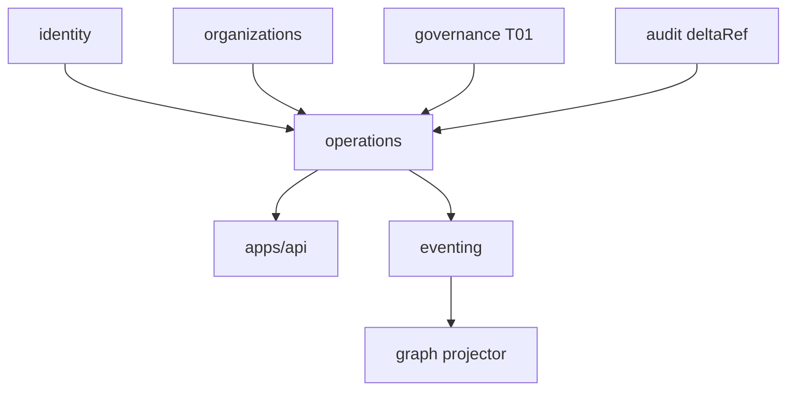

# R06 — Dependências: `modules/operations`

**Rodada:** R6 · 2026-09-11 · ANX-389 · ANX-111 · **ANX-112** não impl  
**Callers:** [R05-storage-pg.md](./R05-storage-pg.md) · [R07-risks.md](./R07-risks.md) · [ROUNDS.md](./ROUNDS.md). Sem API runtime neste artefato. D-GOV-010 = **risk P06**.

## Decisões-chave

| ID | Decisão |
| --- | --- |
| OPS-R06-01 | Health via eventos/probes — sem import de infrastructure/ alheia |
| OPS-R06-02 | Graph SDK só leitura; projector graph:operations:v1 no **graph** |
| OPS-R06-03 | T01 fail-closed em export/incident (operations.export, operations.incident) |
| OPS-R06-04 | D-GOV-010 / kill switch **não** é deste módulo (risk P06) |
| OPS-R06-05 | PC 17/18/20 neste módulo **sem** pasta infrastructure/ 24º |
| OPS-R06-06 | Flight Recorder / replay autoritativo = **audit** — operations só deltaRefId |
| OPS-R06-07 | Journal/outbox mesma UoW PG (operations_command_journal) |
| OPS-R06-08 | Blob de export em object store (resultRef); não BYTEA |
| OPS-R06-09 | Sem pasta approvals/policies |
| OPS-R06-10 | AgencyScopePort — sem FK organizations |

## Upstream

| Módulo | Port / contrato | Uso |
| --- | --- | --- |
| identity | PrincipalLookup | actor |
| organizations | AgencyScopePort | tenancy |
| governance | TraversalEvaluator | T01 |
| audit | EventConsumer / deltaRefId | manifesto de export ≠ Flight Recorder |
| graph | GraphContextPort | T04/T05 leitura |
| packages/eventing | journal + outbox | |
| packages/observability | probes | health snapshot |
| packages/contracts | operations/* | |

## Downstream

| Consumidor | Contrato |
| --- | --- |
| apps/api | /v1/operations health/incidents/export esboço |
| Platform console | jobs + incidents |
| audit | subscriber de export completed (não substitui recorder) |
| graph | graph:operations:v1 IMPACTS |
| deploy (procedimento) | runbook refs — **não** estado de CI na tabela |

Não depende de execution/capital/strategies para mutar saldo. Health snapshot **não** concede trading (ADR0006).

## Imports proibidos

audit/infrastructure/**, graph/infrastructure/**, neo4j-driver, secret plaintext em domain/, pasta infrastructure/ como módulo.

## Oráculos de fronteira (G3)

| ID | Esperado |
| --- | --- |
| G3-OPS-01 | export replay mesmo idempotency_key não duplica job |
| G3-OPS-02 | retention **não** DELETE em accounting/execution |
| G3-OPS-03 | health snapshot não emite order.* |

## Saída R6

Mapa v1 fechado para R7. Sem código.
