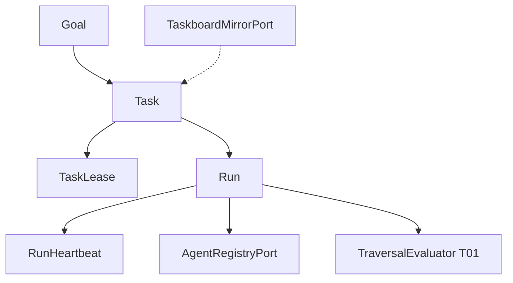

# R01 — Contexto: `modules/orchestration`

**Módulo:** orchestration (P04 runtime)  
**Rodada:** R1  
**Data:** 2026-09-11  
**Issue:** ANX-393  
**PC:** [04](../../../../notes/anxionos-pc04-agent-teams-debate.md) · [11](../../../../notes/anxionos-pc11-projects-debate.md) · [12](../../../../notes/anxionos-pc12-tasks-debate.md)

## In / Out (R1)

**In:** inventário Goal/Task/Run/lease/heartbeat neste pack G0.

**Out:** AgentVersion (`agents`). Grant (`governance`). Board Dashi como ledger.

## Non-goals

Não spec `accepted`. Não ST08 live. Não ANX-389 `done`. Sem código de produto.

## Ownership

| Superfície | Dono |
| --- | --- |
| Goal / Task / Run / TaskLease | **orchestration** |
| adapter-gateway | **KEEP** |

## Participantes

Explorador, Arquiteto, Crítico, Orquestrador.

## Objetivo

Pack G0 canônico neste diretório (layout governance). Histórico: [structure R01](../../structure-debate/orchestration/R01-context.md) · [hierarquia](../../structure-debate/orchestration/R01-hierarchy-modes.md).

Dashi/taskboard de **desenvolvimento** (ANX-*) ≠ Goal/Task/Run do **produto**. Personas Cursor ≠ Agent institucional.

## Inventário documental

| Fonte | Relevância |
| --- | --- |
| spec 002 | Run, heartbeat, Brain invoke correlation |
| spec 006 | GateBinding, TREE/CIRCULAR, OH01–OH12 |
| estrutura ADR0002 | dono Goal/Task/Run/lease |
| storage ADR0004 | PG `orchestration_*`; Neo4j só projeção |
| PC 04/11/12 | sem pastas agent-teams/projects/tasks |
| agents R10 | AgentRegistryPort |

## Inventário de código

`backend/modules/orchestration` pode existir (Parcial). Não é DEV_READY. Este pack não autoriza código novo.

## Debate R1

**Arquiteto:** orchestration é o runtime de trabalho institucional — checkout atômico, heartbeat, gates G0–G7 no produto (não no board Cursor).

**Crítico:** `in_review` no Dashi ≠ gate PASS. Sem 24º módulo.

## Diagrama de contexto

## Saída R1

Context brief aprovado para R2.
