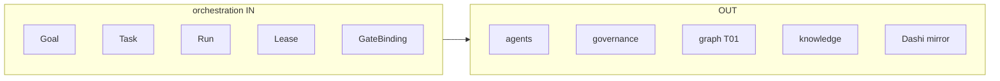

# R02 — Fronteiras: `modules/orchestration`

**Rodada:** R2  
**Data:** 2026-09-11  
**Issue:** ANX-393  
**Fontes:** PC 04/11/12 · [structure R02](../../structure-debate/orchestration/R02-paperclip-checkout-heartbeat.md)

## In / Out (R2)

**In:** TaskLease, heartbeat, Goal ancestry, Run.

**Out:** AgentVersion (`agents`). Dashi como ledger. Secrets (`connections`).

## Ownership

| Superfície | Dono |
| --- | --- |
| Goal / Task / Run / TaskLease | **orchestration** |
| adapter-gateway | **KEEP** |

## Debate R2

**Arquiteto:** checkout = TaskLease transacional PG (ORCH-R02-01). Heartbeat recusa lease expirado. Goal ancestry denormalizado em Task/Run (ORCH-R02-03).

**Crítico:** board Dashi é espelho (`TaskboardMirrorPort`), não ledger de produto.

## O módulo POSSUI

| Agregado | Responsabilidade | Storage |
| --- | --- | --- |
| Goal | Missão decomponível; parentGoalId | orchestration_goals |
| Task | Unidade de trabalho produto; issueIdentifier ANX-* espelho | orchestration_tasks |
| Run | Execução de agente sobre Task | orchestration_runs |
| TaskLease | Checkout atômico (taskId, agentId, leaseToken, expiresAt) | tabela filha 1:1 |
| RunHeartbeat | Sinal de vida + budget | orchestration_heartbeats |
| GateBinding | G0–G7 no produto | orchestration_gate_bindings |
| PlanRevision | Mudança de estratégia; revalida G0 | orchestration_plan_revisions |
| TaskboardMirrorPort | Espelho ANX-* — não ownership do board |

## O módulo NÃO POSSUI

| Item | Dono |
| --- | --- |
| Agent / AgentVersion / Skill | agents |
| Grant / authorityEpoch | governance |
| Neo4j traverse T01 | graph |
| inference.invoke | connections |
| Evidence persistida | knowledge (só runId) |
| Claim Dashi como fonte de verdade de código | board local |

## Non-goals

- Não pasta `projects/` nem `tasks/` nem `agent-teams`.
- PC 11 e PC 12 compartilham este módulo; não fundir Goal vs Task.
- `in_review` no board ≠ gate PASS.
- D-GOV-010 fora (risk P06).

## Invariantes de fronteira

1. No máximo um TaskLease vigente por taskId.
2. Heartbeat não estende lease além do cap (8h); TTL default 4h.
3. Checkout + journal + outbox na mesma transação.
4. T01 fail-closed antes de efeito externo no Run.
5. Sem FK física para agents/governance.

## Diagrama in/out

## Saída R2

Boundary aprovada para R3.
