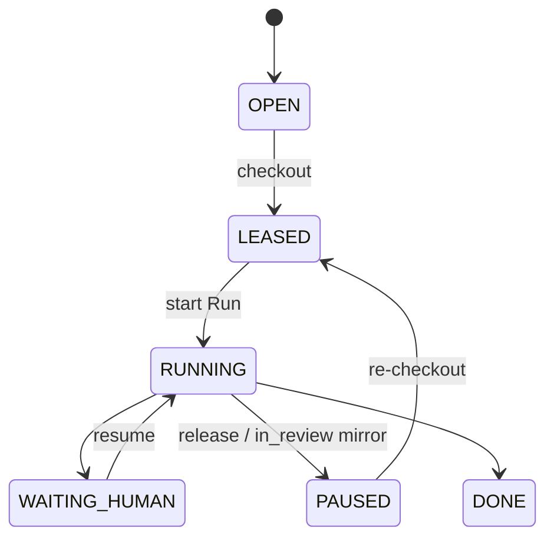

# R03 — Esboço de domínio: `modules/orchestration`

**Rodada:** R3  
**Data:** 2026-09-11  
**Issue:** ANX-393

## Agregados

**Goal:** parentGoalId, status draft|active|completed|archived, ancestry âncora na org (OH01).

**Task:** goalId, goalAncestry[], issueIdentifier opcional, checkoutStatus, lease?, assignedAgentId.

**TaskLease:** taskId, agentId, leaseToken, expiresAt — no máximo um vigente (INV-ORC-02).

**Run:** taskId, agentId, status, goalAncestry, correlationId, budget.

**RunHeartbeat:** runId, at, remainingBudget — entidade de fila, não agregado raiz.

**GateBinding:** gate G0–G7, disposition PASS|CHANGES_REQUIRED|BLOCKED|NOT_APPLICABLE, evidência command/file/issue.

**PlanRevision:** entidade **separada** de Goal (ORCH-R03-04).

## Invariantes INV-ORC

| ID | Regra |
| --- | --- |
| INV-ORC-01 | Goal ancestry ancora em organizationId |
| INV-ORC-02 | Um TaskLease vigente por taskId |
| INV-ORC-03 | Checkout idempotente (agentId, taskId) |
| INV-ORC-04 | Heartbeat após expiry não renova — exige novo checkout |
| INV-ORC-05 | UoW estado+journal+outbox |
| INV-ORC-06 | domain/ sem Neo4j/HTTP/secrets |
| INV-ORC-07 | in_review board ≠ GateBinding PASS |
| INV-ORC-08 | waiting_human não auto-aprova |

## Ports

GoalRepository, TaskRepository, RunRepository, GateBindingRepository, LeaseClock, TaskboardMirrorPort, AgentRegistryPort (agents), TraversalEvaluator (governance/graph).

## TTL

leaseTtlMs default 4h; cap renovação 8h. Heartbeat interval por adapter (Cursor/Codex/CLI) — config, não hardcoded de negócio em código de domínio.

## Diagrama ciclo

## Saída R3

Domain sketch aprovado para R4.
