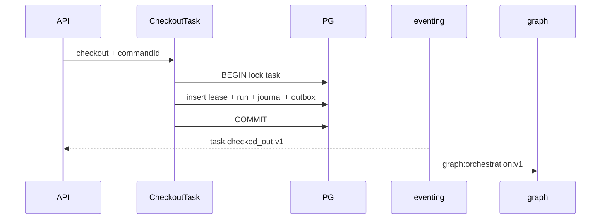

# R05 — Armazenamento: `modules/orchestration`

**Rodada:** R5  
**Data:** 2026-09-11  
**Issue:** ANX-393 · pack ANX-389  
**Callers:** [R04-contracts.md](./R04-contracts.md) · [R06-dependencies.md](./R06-dependencies.md) · [ROUNDS.md](./ROUNDS.md).  
**ADR0004:** PostgreSQL autoritativo; Neo4j só projector **graph**; sem Timescale/pgvector neste módulo; SQLite **não** é lease autoritativo.  
**Fonte:** `brain/notes/anxionos-storage-ownership.md` (**draft**; ST08 **0/23**). Tabelas alvo G1 — **nenhuma migration** neste pack.

## In / Out (R5)

**In:** writes de Goal/Task/Run/TaskLease/GateBinding/PlanRevision via UoW; projector consome eventos para Neo4j (módulo **graph**).

**Out:** rows `orchestration_*` + `orchestration_command_journal` + outbox. Sem leaseToken em claro no grafo; sem FK para `agents_*` / `governance_*`.

## Out of scope (não gravar aqui)

| Dado | Dono |
| --- | --- |
| Agent / AgentVersion | **agents** |
| Grants / authorityEpoch | **governance** |
| Driver Neo4j / T01 Cypher | **graph** |
| Evidence persistida | **knowledge** (só `runId`) |
| Claim Dashi como ledger | board local |
| Secrets / prompts | **connections** / **agents** |

## Non-goals

- Pasta `projects/` `tasks/` `agent-teams`.
- SQLite como verdade de lease.
- Spec `accepted`.
- ST08 live / migration agora.
- ANX-342 G7 / ANX-389 `done`.
- D-GOV-010 (risk P06).

## Ownership de engines

| Store | Uso | Não |
| --- | --- | --- |
| PG `orchestration_goals` | Goal DAG, ancestry | Agency/membership |
| PG `orchestration_tasks` | Task + issueIdentifier espelho | claim Dashi autoritativo |
| PG `orchestration_task_leases` | 1:1 vigente (ORCH-R05-01) | segundo lease |
| PG `orchestration_runs` | Run + correlationId | Agent estado |
| PG `orchestration_heartbeats` | append-only | PII |
| PG `orchestration_gate_bindings` | G0–G7 disposition + evidência | auto-PASS |
| PG `orchestration_plan_revisions` | entidade separada de Goal | mutar Goal in-place |
| PG `orchestration_command_journal` + outbox | estado+journal atômico | tokens |
| Neo4j via `graph:orchestration:v1` | ids de Goal/Task/Run | neo4j-driver neste módulo |
| SQLite | **proibido** como lease | — |

Sem FK cross-module. Eventos **sem** secrets. **KEEP adapter-gateway**.

## Princípios

| Princípio | Decisão |
| --- | --- |
| Fonte transacional | PostgreSQL |
| Grafo | projector `graph:orchestration:v1` — ids, não leaseToken |
| Journal/outbox | mesma transação |
| FK cross-module | **Não** |
| SQLite | **Não** autoritativo |

**ORCH-R05-01:** um TaskLease vigente por taskId. **ORCH-R05-02:** mutação + outbox mesma transação. **ORCH-R05-03:** RLS defer P09.

## Tabelas

| Tabela | Notas |
| --- | --- |
| orchestration_goals | DAG parent_goal_id lógico |
| orchestration_tasks | goal_id, issue_identifier, checkout_status |
| orchestration_task_leases | 1:1 task — ORCH-R05-01 |
| orchestration_runs | correlation_id |
| orchestration_heartbeats | append-only |
| orchestration_gate_bindings | gate + disposition |
| orchestration_plan_revisions | migration 0002 defer R09 se necessário |
| orchestration_command_journal | Idempotency-Key |

FK cross-module: **não**. Journal/outbox eventing mesma transação.

## Alternativas rejeitadas

Lease só no Dashi; Goal só Neo4j; FK para `agents_agents`; Timescale de heartbeat neste módulo.

## Saída R5

Modelo v1 para R6. **Nenhuma migration.** ST08 0/23.
