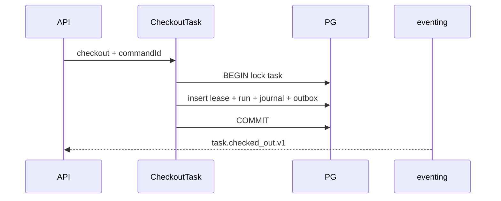

# R05 — Armazenamento: `modules/orchestration`

**Rodada:** R5  
**Data:** 2026-09-11  
**Issue:** ANX-393  
**ADR0004:** PostgreSQL autoritativo; Neo4j só projector graph; sem Timescale/pgvector neste módulo; SQLite não é lease autoritativo.

## Tabelas

| Tabela | Notas |
| --- | --- |
| orchestration_goals | DAG parent_goal_id lógico |
| orchestration_tasks | goal_id, issue_identifier, checkout_status |
| orchestration_task_leases | 1:1 task — ORCH-R05-01 |
| orchestration_runs | correlation_id |
| orchestration_heartbeats | append-only |
| orchestration_gate_bindings | gate + disposition |
| orchestration_plan_revisions | migration 0002 defer R09 se necessário |
| orchestration_command_journal | Idempotency-Key |

FK cross-module: **não**. Journal/outbox eventing mesma transação.

## Saída R5

Modelo v1 para R6.
