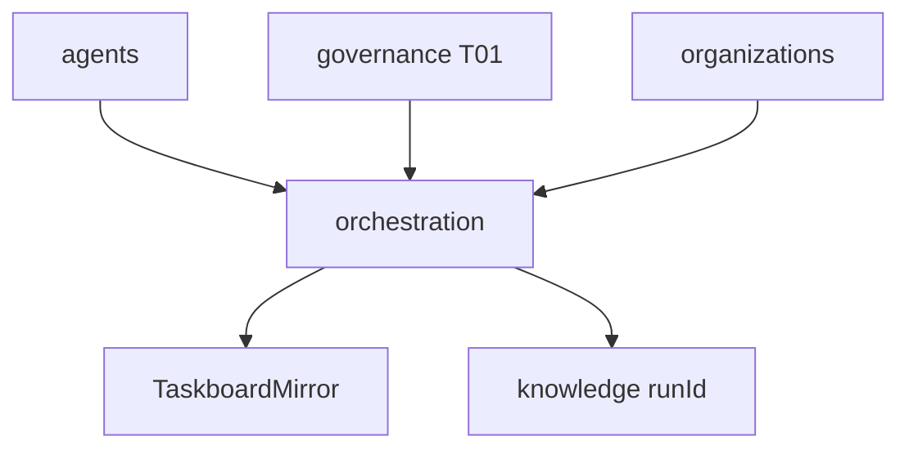

# R06 — Dependências: `modules/orchestration`

**Rodada:** R6  
**Data:** 2026-09-11  
**Issue:** ANX-393

## Upstream

| Módulo | Port |
| --- | --- |
| agents | AgentRegistryPort |
| identity | PrincipalLookup (actor humano waiting_human) |
| organizations | AgencyScopePort |
| governance | TraversalEvaluator T01 |
| graph | GraphContextPort (opcional T04) |
| eventing | journal + outbox |

## Downstream

knowledge (runId em Evidence), audit (subscriber), graph projector (status de Run se projetado), apps/workers (heartbeat adapters).

Não depende de execution/capital/billing. Sem pasta agent-teams.

## Imports proibidos

agents/infrastructure, graph neo4j-driver, secrets, LLM SDK em domain/.

## Saída R6

Mapa v1 para R7.
