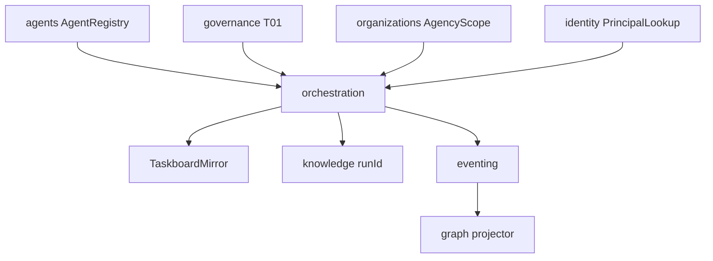

# R06 — Dependências: `modules/orchestration`

**Rodada:** R6  
**Data:** 2026-09-11  
**Issue:** ANX-393 · pack ANX-389  
**Callers:** [R05-storage.md](./R05-storage.md) · [R07-risks.md](./R07-risks.md) · [ROUNDS.md](./ROUNDS.md). Sem API runtime neste artefato.

## In / Out (R6)

**In:** AgentRegistryPort (agents); PrincipalLookup (actor humano `waiting_human`); AgencyScopePort; TraversalEvaluator T01; GraphContextPort opcional T04; eventing journal+outbox.

**Out:** `orchestration.*` sem leaseToken; projector `graph:orchestration:v1`; knowledge só `runId`; TaskboardMirror (espelho). Sem mutate de grants, AgentVersion ou Neo4j driver.

## Non-goals

- Não D-GOV-010 neste módulo (risk P06).
- Não import de `agents/infrastructure/**` nem `neo4j-driver` em `domain/`.
- Não pasta `projects/` `tasks/` `agent-teams`.
- Não execution/capital/billing.

## Ownership de ports

| Port | Dono da implementação | Uso em orchestration |
| --- | --- | --- |
| AgentRegistryPort | **agents** | checkout / StartRun |
| PrincipalLookup | **identity** (adapter downstream) | actor `waiting_human` |
| AgencyScopePort | **organizations** | tenancy — sem FK |
| TraversalEvaluator | **governance** | T01 fail-closed |
| GraphContextPort | **graph** | T04 leitura opcional |
| TaskboardMirrorPort | **orchestration** (adapter infra) | espelho Dashi — não ledger |
| LeaseClock | **orchestration** infra | TTL 4h / cap 8h |

**KEEP adapter-gateway** se o wiring de API já o exportar.

## Decisões-chave

| ID | Decisão |
| --- | --- |
| ORC-R06-01 | Agent via port — sem import agents/infrastructure |
| ORC-R06-02 | AgencyScopePort — sem FK organizations |
| ORC-R06-03 | T01 pré-StartRun efeito externo; timeout → DENY |
| ORC-R06-04 | Graph SDK só leitura — nunca neo4j-driver no módulo |
| ORC-R06-05 | Journal/outbox mesma transação PG |
| ORC-R06-06 | Projector no **graph** `graph:orchestration:v1` |
| ORC-R06-07 | knowledge consome runId — orchestration não persiste Evidence |
| ORC-R06-08 | Dashi é mirror, não ledger |
| ORC-R06-09 | D-GOV-010 não é deste módulo (risk P06) |
| ORC-R06-10 | Sem 24º módulo projects/tasks |

## Upstream

| Módulo | Port |
| --- | --- |
| agents | AgentRegistryPort |
| identity | PrincipalLookup (actor humano waiting_human) |
| organizations | AgencyScopePort |
| governance | TraversalEvaluator T01 |
| graph | GraphContextPort (opcional T04) |
| eventing | journal + outbox |

## Downstream

| Consumidor | Contrato |
| --- | --- |
| knowledge | `runId` em Evidence — não payload de prompt |
| audit | subscriber `orchestration.*.v1` |
| graph | `graph:orchestration:v1` |
| apps/workers | heartbeat adapters |
| operations | GateBinding disposition |

Não depende de execution, capital, billing, simulation. Sem pasta `agent-teams/`.

## Imports proibidos

`agents/infrastructure/**`, `graph/infrastructure/**`, `neo4j-driver`, LLM SDK em `domain/`, secrets store, `better-auth`.

## Saída R6

Mapa v1 para R7.
