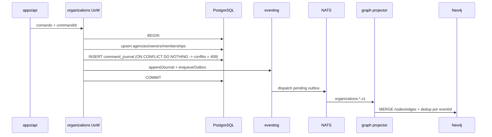

# R05 — Armazenamento: `modules/organizations`

**Rodada:** R5 — PostgreSQL, journal/outbox, projeção Neo4j  
**Data:** 2026-09-07  
**Issue:** ANX-39 (debate) · ANX-29 (implementação, bloqueada até G0)

**KEEP adapter-gateway** se já exportado. Pack ANX-389 — não `done`.

## In / Out (R5)

**In:** PG `organizations_*` + journal/outbox. **Out:** projeção graph. Sem Neo4j autoritativo.

## Non-goals

Não spec `accepted`. Não ST08 live. Não ANX-389 `done`.

## Ownership

| Superfície | Dono |
| --- | --- |
| Tabelas organizations_* | **organizations** |
| adapter-gateway | **KEEP** |
| Neo4j | **graph** |

## Participantes

| Papel | Agente |
| --- | --- |
| Arquiteto | architect |
| Security | security-reviewer |
| Executor | code-architect |
| Crítico | critic-reviewer |

## Objetivo da rodada

Definir o modelo de persistência autoritativo do módulo **organizations** antes de dependências (R6): tabelas PostgreSQL, alinhamento journal/outbox com `packages/eventing`, estratégia de hash de convite, projeção Neo4j (organograma) e exclusões SQLite — espelhando padrões já estabelecidos em `backend/modules/identity/`.

## Fontes aplicadas

| Fonte | Uso em R5 |
| --- | --- |
| [R04-contracts.md](./R04-contracts.md) | EventTypes, comandos, idempotência `commandId`, tokens fora de eventos |
| [R03-domain-sketch.md](./R03-domain-sketch.md) | Entidades, invariantes INV-ORG-01..05, `OrganizationUnitOfWork` |
| [R02-boundaries.md](./R02-boundaries.md) | PG autoritativo; Neo4j via projeção graph |
| `brain/notes/anxionos-storage-ownership.md` | Matriz organizations: PG + Neo4j; SQLite só preferência UI local |
| `brain/notes/anxionos-graph-schema-v1.md` | E003, E008, E016; tipos Agency, Membership |
| `backend/modules/identity/` | Prefixo de tabela, Drizzle, `ensureIdentitySchema`, sem FK cross-module |
| `backend/packages/eventing/` | `domain_journal`, `outbox`, `appendEventAtomic` |

## Debate R5 (diálogo atribuído)

**Arquiteto:** PostgreSQL confirma Agency, Owner e Membership. Prefixo `organizations_` nas tabelas, alinhado a `identity_principals`. Journal de domínio e outbox compartilhados via `@anxionos/eventing` — não duplicar DDL de eventos no módulo.

**Security:** `invite_token` nunca em eventos, logs ou colunas reversíveis. Persistir apenas hash com pepper de `packages/secrets` (ou env `ORG_INVITE_TOKEN_PEPPER` em dev). Email de convite é PII mínima necessária na linha `invited`.

**Crítico:** Idempotência de comando (`Idempotency-Key` → `commandId`) exige tabela própria — `domain_journal` registra eventos, não mapeia replay de comando para `revision`. Propor `organizations_command_journal`.

**Executor:** Sem FK física para `identity_principals` — referência lógica por `principal_id` UUID, validada via port `PrincipalLookup` (R06). Transação única: estado agregado + `organizations_command_journal` + `appendJournal` + `enqueueOutbox`.

**Arquiteto (Neo4j):** Projeção v1 cobre subconjunto E003/E008/E016 — Agency, Membership, OWNS_COMPANY, HAS_MEMBERSHIP, OPERATES_IN. Organization, Department, OnboardingRun deferidos (R04/R09). Projector pertence ao módulo **graph**; organizations só publica eventos.

**Síntese Orquestrador:** Modelo de armazenamento v1 fechado; sem objeção bloqueante.

---

## Princípios de autoridade

| Princípio | Decisão |
| --- | --- |
| Fonte de verdade transacional | PostgreSQL (`organizations_*`) |
| Grafo institucional | Neo4j — projeção derivada de eventos com `revision` |
| Journal de eventos | Tabela compartilhada `domain_journal` (`ownerDomain: "organizations"`) |
| Outbox | Tabela compartilhada `outbox` — mesma transação que mutação de estado |
| Idempotência de comando | Tabela dedicada `organizations_command_journal` |
| SQLite | **Proibido** para estado institucional deste módulo (ver §SQLite) |
| FK cross-module | **Não** — `principal_id` é referência lógica a identity |

Fluxo de escrita (alinhado ao `brain/notes/anxionos-storage-ownership.md` §Fluxo):



---

## PostgreSQL — enums

Prefixo de enum: `organizations_*` (espelha `identity_principal_status`).

| Enum Drizzle | Valores | Uso |
| --- | --- | --- |
| `organizations_agency_status` | `draft`, `connections_pending`, `ready`, `draining`, `archived` | [R04](./R04-contracts.md) `agencyStatusSchema` |
| `organizations_market_scope` | `stocks`, `crypto`, `both` | `marketScopeSchema` |
| `organizations_onboarding_step` | `created`, `markets_set`, `blueprint_pending`, `mandate_pending`, `ready` | `onboardingStepSchema` |
| `organizations_membership_role` | `owner`, `admin`, `operator`, `viewer` | `membershipRoleSchema` |
| `organizations_membership_status` | `invited`, `active`, `revoked` | `membershipStatusSchema` |

---

## PostgreSQL — tabela `organizations_agencies`

Tenant operacional principal. `id` = `agencyId` em rotas e eventos.

| Coluna | Tipo | Nullable | Descrição |
| --- | --- | --- | --- |
| `id` | `uuid` PK | não | `gen_random_uuid()` |
| `owner_principal_id` | `uuid` | não | Titular (referência lógica → identity) |
| `display_name` | `text` | não | 1–200 chars (validação Zod na borda) |
| `market_scope` | `organizations_market_scope` | não | Mercados habilitados |
| `status` | `organizations_agency_status` | não | Default `draft` |
| `onboarding_step` | `organizations_onboarding_step` | não | Default `created` |
| `revision` | `integer` | não | Default `1`; incrementa por comando |
| `created_at` | `timestamptz` | não | `defaultNow()` |
| `updated_at` | `timestamptz` | não | Atualizado em cada mutação |

### Índices `organizations_agencies`

| Nome | Colunas | Propósito |
| --- | --- | --- |
| `organizations_agencies_owner_principal_id_idx` | `(owner_principal_id)` | `ListAgenciesForPrincipal` |
| `organizations_agencies_status_idx` | `(status)` | Filtros operacionais / billing readiness |

### Tenancy

- `agencyId` (`id`) é a chave de escopo em comandos e queries.
- Toda mutação valida membership ativo do principal da sessão na Agency alvo (camada api + application — [R04](./R04-contracts.md)).
- `owner_principal_id` denormalizado para listagem rápida; não substitui checagem de membership.

---

## PostgreSQL — tabela `organizations_owners`

Vínculo titular ↔ perfil Owner. **Uma linha por `(tenant_id, principal_id)`** — como cada Agency é um tenant, um Owner legítimo tem N linhas, uma por Agency que possui (D-ORG-035 / D-ORG-046).

| Coluna | Tipo | Nullable | Descrição |
| --- | --- | --- | --- |
| `id` | `uuid` PK | não | |
| `tenant_id` | `uuid` | não | Agency (tenant) dona da linha; usado pelo RLS e pelo índice único |
| `agency_id` | `uuid` | não | Agency à qual o vínculo pertence |
| `principal_id` | `uuid` | não | Referência lógica identity. **Não** é UNIQUE sozinho (D-ORG-035) |
| `default_organization_id` | `uuid` | sim | Reservado v2 multi-company; null em v1 |
| `created_at` | `timestamptz` | não | |

### Índices `organizations_owners`

| Nome | Colunas | Propósito |
| --- | --- | --- |
| `organizations_owners_principal_id_idx` | `(principal_id)` | Lookup por principal (não-único) |
| `organizations_owners_tenant_principal_uidx` | `(tenant_id, principal_id)` **UNIQUE** | Uma linha de owner por `(tenant, principal)` — como cada Agency é um tenant, isso permite N Agencies por Owner e dá integridade de banco à tabela (D-ORG-046) |

---

## PostgreSQL — tabela `organizations_memberships`

Principal ↔ Agency com papel e ciclo de convite.

| Coluna | Tipo | Nullable | Descrição |
| --- | --- | --- | --- |
| `id` | `uuid` PK | não | `membershipId` |
| `agency_id` | `uuid` | não | FK lógica → `organizations_agencies.id` |
| `principal_id` | `uuid` | sim | Null enquanto `invited` sem Principal |
| `invite_email` | `text` | sim | Email do convite; obrigatório se `principal_id` null e `invited` |
| `invite_token_hash` | `text` | sim | Hash do token; ver §Hash de convite |
| `invite_expires_at` | `timestamptz` | sim | Expiração opcional v1 (default 7d em G1) |
| `role` | `organizations_membership_role` | não | |
| `status` | `organizations_membership_status` | não | |
| `invited_at` | `timestamptz` | sim | |
| `joined_at` | `timestamptz` | sim | |
| `revoked_at` | `timestamptz` | sim | |
| `revision` | `integer` | não | Default `1` |
| `created_at` | `timestamptz` | não | |
| `updated_at` | `timestamptz` | não | |

### Índices `organizations_memberships`

| Nome | Definição | Propósito |
| --- | --- | --- |
| `organizations_memberships_agency_id_idx` | `(agency_id)` | `ListMembershipsByAgency` |
| `organizations_memberships_principal_id_idx` | `(principal_id)` WHERE `principal_id IS NOT NULL` | Lookup cross-agency |
| `organizations_memberships_agency_principal_active_uidx` | UNIQUE `(agency_id, principal_id)` WHERE `status = 'active'` | Um ativo por par |
| `organizations_memberships_agency_email_invited_uidx` | UNIQUE `(agency_id, lower(invite_email))` WHERE `status = 'invited'` | Convite duplicado → `ORG_MEMBERSHIP_EXISTS` |
| `organizations_memberships_one_owner_active_uidx` | UNIQUE `(agency_id)` WHERE `role = 'owner' AND status = 'active'` | [INV-ORG-02] exatamente um owner ativo |

### Tenancy em memberships

- Queries sempre filtram por `agency_id` + autorização de membership da sessão.
- `invite_email` e `invite_token_hash` são dados sensíveis — redact em logs (`observability`).

---

## PostgreSQL — tabela `organizations_command_journal`

Registro de idempotência de **comandos** (distinto de `domain_journal` de eventos).

| Coluna | Tipo | Descrição |
| --- | --- | --- |
| `command_id` | `uuid` PK | `Idempotency-Key` do HTTP |
| `command_name` | `text` | Ex.: `CreateAgency`, `InviteMember` |
| `aggregate_id` | `uuid` | ID do agregado afetado |
| `aggregate_type` | `text` | `agency` \| `membership` \| `owner` |
| `revision` | `integer` | `revision` retornado ao cliente |
| `response_snapshot` | `jsonb` | Opcional: `{ aggregateId, revision }` para replay exato |
| `request_hash` | `text` | Fingerprint canônico (SHA-256 de JSON com chaves ordenadas) do payload do comando — binding de intenção da `Idempotency-Key` (migration 0006). `null` apenas em linhas anteriores à 0006 |
| `created_at` | `timestamptz` | | |

**Comportamento (atualizado por S2/S3, ANX-460):**

1. **Antes da transação:** `findByCommandId` + validação de **intenção** (`commandName`, `aggregateId`/`matchesAggregate`, `request_hash`). Intenção divergente → **409 `ORG_DUPLICATE_IDEMPOTENCY`** (reuso da key com outro payload **não** é replay). Intenção idêntica → replay de `response_snapshot` com `idempotentReplay: true`, **antes** das validações de estado (o retry legítimo continua válido depois de o agregado mudar).
2. **Dentro da transação:** a mesma checagem roda de novo (o vencedor pode ter commitado no intervalo) e é a **primeira** operação.
3. **Na gravação:** `INSERT ... ON CONFLICT (command_id) DO NOTHING` + `RETURNING`. Colisão de `command_id` **não** devolve a linha alheia — lança `CommandJournalConflictError`, a transação do perdedor faz **ROLLBACK** e o chamador recebe 409. Devolver a linha alheia era o **double-apply**, corrigido em S2.

> A descrição anterior ("leitura prévia; se existir, retornar `response_snapshot`") descrevia o comportamento com double-apply e foi corrigida. Ver [R04](./R04-contracts.md) e D-ORG-045/D-ORG-046 em [R08](./R08-decision-log.md).

---

## Disposições registradas (ANX-460)

| Achado | Severidade | Disposição |
| --- | --- | --- |
| `request_hash` de `AcceptInviteByToken` retém um derivado de 2ª ordem do HMAC do token de convite (SHA-256 sobre o `token_hash`, não o token) | LOW | **Aceito, sem correção.** O valor não é invertível nem testável sem o pepper (que vive em env, não no banco), o token tem 256 bits e TTL curto, e o consumo já anula `invite_token_hash` na membership. Não há token cru em journal, evento ou DTO. |
| Linhas de `organizations_command_journal` anteriores à migration 0006 têm `request_hash = NULL`; um retry legítimo de uma key em voo passa a **409** | LOW | **Aceito, fail-closed.** Mesmo padrão do `governance` (migration 0011 sem backfill); as keys são de curta duração. Um backfill não é possível (o hash não é reconstruível do snapshot). |
| `revoked → active` reconcede acesso sem consentimento **fresco** | LOW | **Aceito por desenho (D-ORG-046).** A premissa de consentimento é a da **primeira** vinculação; a reativação é ato de owner/admin sobre quem já consentiu antes. |
| Reativar a membership de um principal **suspenso** devolve 200 (o lookup de existência saiu de `/activate`) | LOW | **Aceito (F-3 do G4).** Impacto contido: principal suspenso não autentica, e o `governance` só emite baseline de owner para `role === "owner"` — ramo que a rota não alcança. Uma checagem de *status* (não de existência) exigiria um lookup ciente de estado no port de identidade; fica na família de ANX-481. |
| Erro desconhecido no boundary não é logado (o detalhe vive só na `cause`) | INFO | **Aceito (F-4 do G4), com ressalva.** A confidencialidade melhorou, a observabilidade de 500 piorou: não há `onError` global em `apps/api/src/index.ts` nem logger no boundary. Registrar como lacuna de plataforma a resolver antes de operar em produção. |

> **Correção de rastreabilidade:** uma versão anterior deste registro atribuía o primeiro item a `ANX-480`. ANX-480 trata de outro achado (namespace global de `Idempotency-Key`); nenhuma issue do board cobria o fingerprint do token nem o `request_hash` NULL. Por isso as disposições estão registradas **aqui**, na issue da ANX-460, e não em ANX-480.

---

## Journal e outbox — alinhamento `packages/eventing`

O módulo **não** cria tabelas `domain_journal` / `outbox`. Usa o pacote compartilhado:

| Função (`@anxionos/eventing`) | Uso em organizations |
| --- | --- |
| `ensureEventingSchema(pool)` | Bootstrap idempotente no composition root (`apps/api` startup ou testes) |
| `appendJournal(client, envelope)` | Dentro da transação do `OrganizationUnitOfWork` |
| `enqueueOutbox(client, envelope)` | Mesma transação — publicação NATS assíncrona |
| `appendEventAtomic` | **Não** usar isoladamente — organizations precisa incluir mutação de estado na mesma `BEGIN`/`COMMIT` |

### Pseudocódigo `OrganizationUnitOfWork`

```typescript
async function executeCommand(deps, input) {
  // 1) Replay ANTES de tudo, validando a INTENCAO (comando + recurso + request_hash).
  //    Intencao divergente e' 409 ORG_DUPLICATE_IDEMPOTENCY, nao replay.
  const existing = await deps.commandJournal.findByCommandId(input.commandId);
  if (existing) {
    assertIntentMatches(existing, input.intent); // lanca se divergir
    return { ...existing.responseSnapshot, idempotentReplay: true };
  }

  const client = await deps.pool.connect();
  try {
    await client.query("BEGIN");
    await deps.ensureEventingSchema(client); // no-op após primeiro run

    const { aggregate, envelope } = await deps.handler(client, input);

    await deps.commandJournal.insert(client, {
      commandId: input.commandId,
      commandName: input.commandName,
      aggregateId: aggregate.id,
      aggregateType: aggregate.type,
      revision: aggregate.revision,
      responseSnapshot: { aggregateId: aggregate.id, revision: aggregate.revision },
    });
    await appendJournal(client, envelope);
    await enqueueOutbox(client, envelope);

    await client.query("COMMIT");
    return { aggregateId: aggregate.id, revision: aggregate.revision };
  } catch (e) {
    await client.query("ROLLBACK");
    throw e;
  } finally {
    client.release();
  }
}
```

**Regra:** um evento por comando bem-sucedido (ex.: `CreateAgency` → `organizations.agency.created.v1`). Comandos que não alteram estado não entram nesta rodada.

---

## Hash de `invite_token`

| Aspecto | Decisão |
| --- | --- |
| Geração | 32 bytes `crypto.randomBytes`, codificação `base64url` (~43 chars) |
| Armazenamento | Coluna `invite_token_hash` apenas |
| Algoritmo | `HMAC-SHA256(pepper, token)` → hex lowercase 64 chars |
| Pepper | `ORG_INVITE_TOKEN_PEPPER` (dev) → `packages/secrets` em produção |
| Comparação | `crypto.timingSafeEqual` sobre buffers do hash calculado e armazenado |
| Eventos | Token **não** aparece em payload ([R04](./R04-contracts.md) §Eventos) |
| Email link | `apps/api` monta URL com token plaintext; organizations valida hash na ativação por token (rota opcional G1) ou via `membershipId` autenticado |
| Revogação | Limpar `invite_token_hash` ao `active` ou `revoked` |
| Rotação pepper | Reemitir convites pendentes — documentar em R07 |

**Justificativa:** token de alta entropia não exige bcrypt; HMAC com pepper impede rainbow table se o banco vazar sem o segredo.

---

## Projeção Neo4j (organograma v1)

Projector implementado no módulo **graph** (P03); organizations publica eventos. Subconjunto alinhado ao `brain/notes/anxionos-graph-schema-v1.md`:

### Nós projetados

| Label | Propriedades mínimas | Origem evento |
| --- | --- | --- |
| `Agency` | `agencyId`, `displayName`, `marketScope`, `status`, `revision`, `ownerPrincipalId` | `agency.created.v1`, `agency.markets_updated.v1`, `agency.status_changed.v1` |
| `Membership` | `membershipId`, `agencyId`, `principalId`, `role`, `status`, `revision` | `membership.*.v1` |
| `MarketDomain` | `key` (`stocks` \| `crypto`) | Seed estático + `OPERATES_IN` |

`User`/`Principal` no grafo é responsabilidade do projector **identity** — organizations referencia `principalId` nas arestas, não duplica nó User.

### Arestas projetadas

| Edge | De → Para | eventType gatilho | Notas |
| --- | --- | --- | --- |
| `OWNS_COMPANY` (E003) | `User` → `Agency` | `agency.created.v1` | `ownerPrincipalId`; invariante um Owner por Agency |
| `HAS_MEMBERSHIP` (E008) | `Agency` → `Membership` | `membership.invited.v1` | Atualiza status em activate/revoke |
| `PRINCIPAL` (E009) | `Membership` → `User` | `membership.activated.v1` | Só quando `principalId` resolvido |
| `OPERATES_IN` (E016) | `Agency` → `MarketDomain` | `agency.created.v1`, `agency.markets_updated.v1` | `both` → duas arestas ENABLED |

### Deferido (não projetar em v1)

| Elemento grafo | Motivo |
| --- | --- |
| `Organization`, `CONTAINS_AGENCY` (E002) | Multi-company deferido [R04](./R04-contracts.md) |
| `OnboardingRun` (E005) | Saga cross-módulo — R09 |
| `Department`, `Team` (E006–E007) | Fora escopo P02 organizations |
| `CompanyBlueprintVersion` (E004) | agents / onboarding saga |

### Deduplicação e proveniência

- Chave de idempotência do projector: `eventId` + consumer `graph:organizations:v1` via tabela `inbox` (`backend/packages/eventing/src/postgres.ts`).
- Propriedades `revision` no nó permitem ignorar eventos antigos (`WHERE event.revision > node.revision`).
- Crash após commit PG, antes de ack Neo4j: replay seguro (`brain/notes/anxionos-storage-ownership.md` ST02).

---

## O que permanece FORA do SQLite

Conforme `brain/notes/anxionos-storage-ownership.md` e [R02](./R02-boundaries.md):

| Dado | Motivo da exclusão |
| --- | --- |
| Agency, Owner, Membership | Autoridade transacional única em PG |
| `organizations_command_journal` | Idempotência institucional — sem fallback offline |
| `invite_token` / hash | Segredo derivado; sem cache local autoritativo |
| Estado de onboarding para autorização | Revalidação sempre no domínio PG |
| Membership roles para AuthZ | organizations publica fatos; grants em governance |
| Projeção Neo4j | Engine separado; sem réplica SQLite do grafo |
| Outbox / journal | Mecanismo compartilhado PG |

**Permitido em SQLite (fora do módulo):** preferência de UI local do cliente (ex.: última Agency visualizada no console) — cache sem autoridade, TTL curto, apagável sem efeito institucional (ST04).

---

## Drizzle — ownership e alinhamento identity

Estrutura espelhando `backend/modules/identity/`:

```text
backend/modules/organizations/
├── drizzle.config.ts              # schema + out migrations
├── package.json                   # db:generate, db:migrate
└── src/infrastructure/
    ├── persistence/
    │   ├── schema.ts              # pgTable + enums organizations_*
    │   ├── agency-repository.ts
    │   ├── membership-repository.ts
    │   ├── owner-repository.ts
    │   └── command-journal.ts
    ├── create-db.ts               # createOrganizationsDb(pool)
    ├── migrate.ts                 # ensureOrganizationsSchema(pool)
    └── migrations/
        ├── 0000_organizations_core.sql
        └── meta/
```

| Aspecto | identity (referência) | organizations (decisão) |
| --- | --- | --- |
| Prefixo tabela | `identity_principals` | `organizations_agencies`, etc. |
| Drizzle config | `drizzle.config.ts` local ao módulo | Igual |
| Migrações | `src/infrastructure/migrations/` | Igual — **ownership do módulo** |
| Bootstrap | `ensureIdentitySchema(pool)` | `ensureOrganizationsSchema(pool)` |
| Factory | `createIdentityDb(pool)` | `createOrganizationsDb(pool)` |
| FK cross-module | Nenhuma | Nenhuma — `principal_id` lógico |
| Export schema | `export { principals }` em index | Export opcional de tabelas para testes |
| Dependências | `@anxionos/contracts`, `@anxionos/eventing`, `drizzle-orm`, `pg` | Mesmo conjunto |

**Ordem de bootstrap no composition root (`apps/api`):**

1. `ensureEventingSchema(pool)`
2. `ensureIdentitySchema(pool)`
3. `ensureOrganizationsSchema(pool)`

Migrações são **independentes por módulo** — sem schema único monolítico; mesmo banco PostgreSQL compartilhado via `DATABASE_URL`.

---

## Mapa evento → colunas afetadas

| eventType | Tabelas / colunas |
| --- | --- |
| `organizations.agency.created.v1` | INSERT `agencies`, `owners` (se novo), `memberships` (owner) |
| `organizations.agency.markets_updated.v1` | UPDATE `agencies.market_scope`, `revision` |
| `organizations.agency.status_changed.v1` | UPDATE `agencies.status`, `onboarding_step`, `revision` |
| `organizations.membership.invited.v1` | INSERT `memberships` + `invite_token_hash` |
| `organizations.membership.activated.v1` | UPDATE `status`, `principal_id`, `joined_at`; CLEAR `invite_*` |
| `organizations.membership.revoked.v1` | UPDATE `status`, `revoked_at`; CLEAR `invite_*` |

---

## Critérios de aceite R5

| # | Critério | Status |
| --- | --- | --- |
| AC-R5-01 | Tabelas PG com colunas, tipos e índices definidos | ✅ |
| AC-R5-02 | Tenancy por `agencyId` documentado | ✅ |
| AC-R5-03 | Journal/outbox via `packages/eventing` na mesma transação | ✅ |
| AC-R5-04 | `organizations_command_journal` para idempotência de comando | ✅ |
| AC-R5-05 | Estratégia hash `invite_token` sem plaintext persistido | ✅ |
| AC-R5-06 | Subconjunto Neo4j E003/E008/E016 mapeado | ✅ |
| AC-R5-07 | Exclusões SQLite explícitas | ✅ |
| AC-R5-08 | Ownership Drizzle alinhado a identity | ✅ |

## Pendências para rodadas seguintes

| ID | Assunto | Rodada |
| --- | --- | --- |
| P-R5-01 | Adapter `PrincipalLookup` e degradação se identity indisponível | R6 |
| P-R5-02 | Wiring projector graph + contrato consumer `graph:organizations:v1` | R6 |
| P-R5-03 | RLS PostgreSQL vs validação application-only | R7 |
| P-R5-04 | TTL padrão de convite e rota de ativação por token | R7 / R09 |
| P-R5-05 | Tabela `organizations_blueprints` (onboarding) — se entra v1 | R09 |
| P-R5-06 | Testes integração PG: transação estado+journal+outbox+command_journal | R9 |

## Saída R5

✅ Modelo de armazenamento aprovado para R6 (dependências upstream/downstream).
