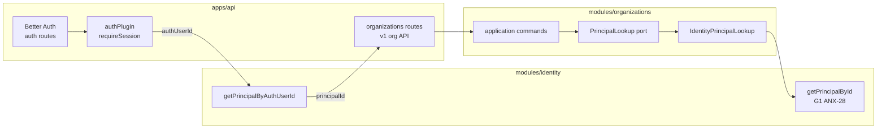
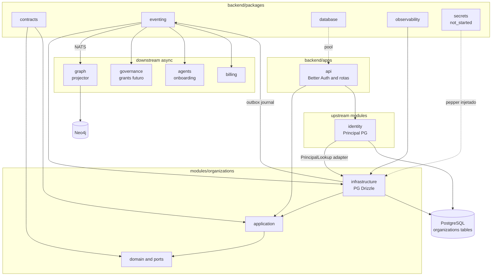

# R06 — Dependências: `modules/organizations`

**Rodada:** R6 — Upstream, packages, downstream e contratos cross-module  
**Data:** 2026-09-07  
**Issue:** ANX-39 (debate) · ANX-29 (implementação, bloqueada até G0) · ANX-28 (identity `in_review`)

## Participantes

| Papel | Agente |
| --- | --- |
| Arquiteto | architect |
| Executor | code-architect |
| Security | security-reviewer |
| Crítico | critic-reviewer |

## Objetivo da rodada

Fechar o mapa de dependências do módulo **organizations** antes de riscos (R7): quem organizations **chama**, quem **consome** seus fatos, fronteira com **identity** e **Better Auth**, uso de **packages** compartilhados, exports públicos, imports proibidos e resolução das pendências P-R5-01..03 de [R05](./R05-storage.md).

## Fontes aplicadas

| Fonte | Uso em R6 |
| --- | --- |
| [R05-storage.md](./R05-storage.md) | PG, UoW, projector deferido, P-R5-01..06 |
| [R04-contracts.md](./R04-contracts.md) | EventTypes, REST sketch, integração packages |
| [R03-domain-sketch.md](./R03-domain-sketch.md) | Port `PrincipalLookup`, invariantes |
| [R02-boundaries.md](./R02-boundaries.md) | Fatos vs grants; auth fora do módulo |
| `brain/notes/anxionos-backend-structure.md` | Regras 1–12 de dependência |
| `backend/modules/identity/src/index.ts` | Superfície pública atual |
| `backend/packages/contracts`, `eventing`, `observability` | Contratos e mecanismos |
| `backend/apps/api/src/auth.ts`, `plugins/auth.ts` | Fronteira Better Auth |

## Debate R6 (diálogo atribuído)

**Arquiteto:** organizations depende de **identity** apenas via port `PrincipalLookup` e, no composition root, do bootstrap `ensureIdentitySchema`. Better Auth permanece exclusivo de `apps/api` — o módulo nunca resolve sessão.

**Executor:** Adapter `IdentityPrincipalLookup` em `infrastructure/adapters/` injeta `getPrincipalById` exportado por identity (gap G1: query ainda não está no `index.ts`; ANX-28 deve acrescentar antes de organizations G1).

**Security:** Falha em `PrincipalLookup` durante mutação → **fail-closed** (`503` dependência ou `404` principal). Sem cache autoritativo cross-request. Pepper de convite via env em dev; `packages/secrets` quando existir — organizations só recebe o valor resolvido no adapter.

**Crítico:** Projector Neo4j é **downstream** no módulo graph; organizations publica eventos e não importa Neo4j. Consumer `graph:organizations:v1` documentado aqui; implementação em P03.

**Arquiteto (governance):** organizations emite fatos de membership (`role`, `status`); governance deriva grants em epoch futuro. Proibido organizations importar repositório de governance ou emitir `ALLOW`/`DENY`.

**Síntese Orquestrador:** Mapa de dependências v1 fechado; P-R5-01 e P-R5-02 resolvidos em nível de contrato; P-R5-03 adiado a R7.

---

## Decisões-chave de dependência

| ID | Decisão | Direção | Evidência / nota |
| --- | --- | --- | --- |
| D-R6-01 | `PrincipalLookup` é port de **domain**; adapter chama API pública de identity | upstream | Sem import de `infrastructure/persistence` de identity |
| D-R6-02 | Better Auth só em `apps/api`; organizations recebe `principalId` já resolvido | boundary | [R02](./R02-boundaries.md), `auth.ts` |
| D-R6-03 | identity indisponível em mutação que exige principal → fail-closed | upstream | P-R5-01 resolvido |
| D-R6-04 | Convite sem Principal existente **não** chama `PrincipalLookup` até `ActivateMembership` | upstream | `invite_email` only em PG |
| D-R6-05 | Journal/outbox via `@anxionos/eventing` na mesma transação PG | package | [R05](./R05-storage.md) |
| D-R6-06 | Schemas públicos em `@anxionos/contracts/organizations/*` | package | [R04](./R04-contracts.md) |
| D-R6-07 | Pepper `ORG_INVITE_TOKEN_PEPPER` injetado no composition root; sem leitura direta de cofre no domain | package/secrets | `packages/secrets` `not_started` |
| D-R6-08 | Projector Neo4j no módulo **graph**, consumer `graph:organizations:v1` | downstream | P-R5-02 resolvido (contrato) |
| D-R6-09 | governance **subscreve** eventos; não é chamado síncronamente por organizations v1 | downstream | Fatos vs autorização |
| D-R6-10 | agents reage a `agency.created` / `status_changed` para onboarding saga (P04) | downstream | Assíncrono via NATS |
| D-R6-11 | Rotas HTTP montadas em `apps/api`; módulo expõe use cases | downstream | Composition root |
| D-R6-12 | RLS PostgreSQL **não** obrigatório em v1 — validação application + api | adiado | P-R5-03 → R7 |
| D-R6-13 | ANX-29 bloqueada até identity G7 + R10 G0 | taskboard | `blocks` identity aceite |

---

## Upstream — `modules/identity`

### O que organizations **chama** (permitido)

| Necessidade | Mecanismo | Camada |
| --- | --- | --- |
| Validar `principalId` existe | Port `PrincipalLookup.exists(id)` → adapter → `getPrincipalById` (identity) | application → infrastructure |
| Bootstrap schema PG compartilhado | `ensureIdentitySchema(pool)` no startup `apps/api` | composition root |
| Resolver sessão → principal | **Não** no módulo — `apps/api` chama `getPrincipalByAuthUserId` e injeta `principalId` nos comandos | api boundary |

### Port `PrincipalLookup` (domain)

```typescript
/** organizations/domain/ports/principal-lookup.ts */
export interface PrincipalLookup {
  /** Retorna true se Principal ativo existe em identity. */
  exists(principalId: string): Promise<boolean>;
}
```

### Adapter proposto

```text
modules/organizations/src/infrastructure/adapters/identity-principal-lookup.ts
```

| Aspecto | Decisão |
| --- | --- |
| Implementação | Delega a `getPrincipalById(deps, principalId)` exportado por `@anxionos/identity` |
| Gap ANX-28 | Adicionar query pública `getPrincipalById` em `identity/index.ts` (espelha `getPrincipalByAuthUserId`) |
| Testes | Mock do port em unit; integração usa identity real ou fixture PG |
| Timeout | 2s por lookup em produção; falha → erro de dependência |

### Degradação se identity indisponível (P-R5-01 — **resolvido**)

| Cenário | Comportamento |
| --- | --- |
| `CreateAgency`, `ActivateMembership` (principal obrigatório) | `PrincipalLookup` falha → `503` com `details.code: ORG_IDENTITY_UNAVAILABLE` ou mapear para `AppError` dependency |
| `InviteMember` (apenas email) | **Não** consulta identity; grava `invited` com `principal_id` null |
| `GetAgencyById`, listagens | Leitura local PG; sem lookup identity |
| Health agregado `apps/api` | `/health` já reporta `postgres`; organizations não expõe health próprio |
| Cache | **Proibido** cache de existência de principal para autorização de mutação |

**Princípio:** fail-closed em mutações que exigem principal válido; nunca assumir principal existe sem lookup ou sessão já vinculada.

### O que organizations **nunca** chama

| Proibido | Motivo |
| --- | --- |
| `identity/infrastructure/persistence/*` | Viola regra 4 — repositório privado |
| `principals` Drizzle schema direto | FK lógica apenas; validação via port |
| `better-auth`, `authApi`, cookies | Auth é composition root |
| `registerPrincipal` | Registro ocorre no fluxo auth/api, não em organizations |
| Tabelas `identity_*` via SQL cru no módulo | Escrita lateral proibida (AR04) |

### Fronteira Better Auth



| Camada | Responsabilidade |
| --- | --- |
| `apps/api` | Sessão, headers, rate limit, OpenAPI, injeção `ownerPrincipalId` |
| `identity` | Principal como agregado; evento `principal.registered` |
| `organizations` | Agency/Membership; ignora `authUserId` após receber `principalId` |

---

## Packages compartilhados

### `@anxionos/contracts`

| Uso | Artefato |
| --- | --- |
| Envelope institucional | `domainEventEnvelopeSchema`, `schemaVersion` |
| Erros HTTP | `AppError`, `ERROR_CODES`, `toErrorResponse` |
| Domínio organizations | `packages/contracts/src/organizations/{types,commands,queries,events}.ts` (G1) |
| Realtime (opcional v1) | Canal `organizations:agency:{agencyId}` — wiring deferido R09 |

**Regra:** `contracts` não importa `modules/*` (regra 6).

### `@anxionos/eventing`

| Função | Uso em organizations |
| --- | --- |
| `ensureEventingSchema` | Bootstrap no composition root (antes de identity/organizations) |
| `appendJournal` + `enqueueOutbox` | Dentro de `OrganizationUnitOfWork` |
| `processWithInbox` | **Não** usado por organizations — reservado ao consumer graph |
| `fetchPendingOutbox` | Worker de dispatch em `apps/api` ou worker global P02 |

organizations **não** implementa consumer inbox em v1.

### `@anxionos/database`

| Uso atual | Decisão R6 |
| --- | --- |
| `createConnection` / ping | Health check em `apps/api` |
| Pool `pg.Pool` | Instanciado no composition root; injetado em `createOrganizationsDb(pool)` |
| Migration runner ordenado | Futuro: `packages/database` orquestra ordem eventing → identity → organizations |

organizations mantém **ownership** das migrações Drizzle locais ([R05](./R05-storage.md)).

### `@anxionos/secrets` (não iniciado)

| Segredo | v1 (dev/staging) | v1 (prod, quando package existir) |
| --- | --- | --- |
| `ORG_INVITE_TOKEN_PEPPER` | Env var no `.env` | `secrets.resolve("organizations/invite-pepper")` injetado no adapter |

| Camada | Acesso ao pepper |
| --- | --- |
| `domain` | **Nunca** — recebe função `hashInviteToken(token)` via port |
| `infrastructure` | Adapter lê pepper do env ou secrets port |
| Eventos / logs | **Nunca** — [R05](./R05-storage.md) |

### `@anxionos/observability`

| Uso | Detalhe |
| --- | --- |
| `createLogger({ category: "organizations" })` | Por comando/query |
| `redactSecrets` / `PINO_REDACT_PATHS` | `invite_email`, `invite_token_hash`, tokens em URL |
| Bindings | `agencyId`, `commandId`, `membershipId`; `principalId` truncado em info |

---

## Downstream — consumidores

### `modules/graph` (projector — P-R5-02 **resolvido** em contrato)

| Aspecto | Decisão |
| --- | --- |
| Owner da projeção | Módulo **graph** (`application/projections/organizations/`) |
| Consumer inbox | `graph:organizations:v1` |
| Subscrição | Eventos `ownerDomain: "organizations"` via NATS subject derivado do `eventType` |
| Idempotência | `processWithInbox(eventId, consumerName)` |
| Nós/arestas | Subconjunto E003, E008, E009, E016 — [R05](./R05-storage.md) |
| organizations → graph | **Somente eventos**; sem import síncrono |

**Contrato consumer (especificação para graph P03):**

```typescript
export const ORGANIZATIONS_GRAPH_CONSUMER = "graph:organizations:v1" as const;

export const ORGANIZATIONS_GRAPH_EVENT_TYPES = [
  "organizations.agency.created.v1",
  "organizations.agency.markets_updated.v1",
  "organizations.agency.status_changed.v1",
  "organizations.membership.invited.v1",
  "organizations.membership.activated.v1",
  "organizations.membership.revoked.v1",
] as const;
```

Implementação do projector: **fora do escopo G1 organizations**; graph pode atrasar sem bloquear PG autoritativo.

### `modules/governance`

| Relação | Detalhe |
| --- | --- |
| Direção | organizations → (eventos) → governance |
| Fatos consumidos | `membership.activated.v1` (principalId, role, agencyId), `membership.revoked.v1` |
| Não consumido v1 | Grants, mandatos, authorityEpoch — governance ainda `not_started` |
| Chamada síncrona | **Nenhuma** em v1 |
| Autorização HTTP | organizations valida **membership role** (`owner`/`admin`) na api; governance valida ações sensíveis (mandato, drain) em fases posteriores |

### `modules/agents`

| Evento | Uso previsto |
| --- | --- |
| `agency.created.v1` | Disparar onboarding blueprint (saga P04) |
| `agency.status_changed.v1` | Avançar `OnboardingRun` no grafo (projetado por graph) |
| Chamada síncrona | **Nenhuma** em organizations v1 |

### `apps/api` (composition root)

| Responsabilidade | Detalhe |
| --- | --- |
| Montagem de rotas | Plugin Elysia `/v1/organizations/*` importa comandos/queries do módulo |
| Auth | `requireSession` → `getPrincipalByAuthUserId` → `principalId` |
| Idempotency | Header `Idempotency-Key` → `commandId` |
| Email de convite | `apps/api/src/email` monta link com token; organizations valida hash |
| Bootstrap | Ordem: eventing → identity → organizations schemas |
| Dependência ANX-28 | Rotas organizations só entram após identity G7 aceito |

### Outros consumidores assíncronos (registro)

| Módulo | Evento | Uso |
| --- | --- | --- |
| billing (P07) | `agency.status_changed.v1` | Readiness assinatura |
| audit (P06) | Todos `organizations.*.v1` | Linhagem |
| frontend realtime | `status_changed`, membership | Canal opcional v1 |

---

## Contratos cross-module

### Exports públicos — `modules/organizations/index.ts`

| Exportar | Não exportar |
| --- | --- |
| Commands + tipos `*Deps` | `infrastructure/persistence/schema` (exceto testes via path dedicado) |
| Queries | Adapters concretos (`IdentityPrincipalLookup`) |
| `createOrganizationsDb`, `ensureOrganizationsSchema` | `OrganizationUnitOfWork` interno |
| Re-export tipos domain leves | Drizzle repositories |

### Exports esperados de identity (dependência upstream)

| Export | Status | Issue |
| --- | --- | --- |
| `getPrincipalByAuthUserId` | ✅ Existe | ANX-28 |
| `getPrincipalById` | ⏳ Propor em G1 | ANX-28 — pré-requisito organizations G1 |
| `registerPrincipal` | ✅ | Não usado por organizations |
| `ensureIdentitySchema` | ✅ | Composition root |

### Subscrições de eventos

| Módulo | Subscreve | Publica |
| --- | --- | --- |
| organizations | **Nenhuma** v1 | `organizations.*.v1` |
| graph | `organizations.*.v1` | — |
| governance | membership + agency status (futuro) | — |
| agents | agency created/status (futuro) | — |
| identity | — | `principal.registered` |

organizations **não** reage a `principal.registered` em v1 — convite por email cobre principal ainda inexistente.

### Imports proibidos (checklist AR01)

| Origem proibida | Alternativa |
| --- | --- |
| `modules/identity/src/infrastructure/**` | `PrincipalLookup` adapter + exports públicos |
| `modules/governance/**` | Eventos |
| `modules/graph/**` | Eventos |
| `better-auth` | `apps/api` only |
| `neo4j-driver` | graph module |
| `@anxionos/contracts` → `modules` | Proibido no package contracts |
| Escrita em `domain_journal` sem eventing | `appendJournal` |

### Matriz de dependência direta (compile-time)

| De → Para | identity | contracts | eventing | database | observability | secrets |
| --- | ---: | ---: | ---: | ---: | ---: | ---: |
| organizations `domain` | — | tipos apenas | — | — | — | — |
| organizations `application` | port | schemas | — | — | — | — |
| organizations `infrastructure` | adapter | schemas | sim | pool injetado | sim | adapter pepper |
| `apps/api` | sim | sim | sim | sim | sim | env/secrets |

---

## Diagrama de dependências



---

## Resolução pendências R05

| ID | Assunto | Status R6 | Decisão / destino |
| --- | --- | --- | --- |
| **P-R5-01** | Adapter `PrincipalLookup` e degradação | ✅ **Resolvido** | Port + `IdentityPrincipalLookup`; fail-closed; `getPrincipalById` em identity (ANX-28) |
| **P-R5-02** | Wiring projector graph + consumer | ✅ **Resolvido** (contrato) | Consumer `graph:organizations:v1`; lista de eventTypes; impl em graph P03 |
| **P-R5-03** | RLS PostgreSQL vs application-only | ⏳ **Adiado R7** | v1: validação application + api; RLS como item de risco/ameaça |
| P-R5-04 | TTL convite e rota token | ⏳ R7 / R09 | Inalterado |
| P-R5-05 | `organizations_blueprints` | ⏳ R09 | Inalterado |
| P-R5-06 | Testes integração PG | ⏳ R9 | Inalterado |

---

## Relação taskboard e gates

| Issue | Relação | Notas |
| --- | --- | --- |
| ANX-39 | Debate R6 entregue | Este artefato |
| ANX-29 | `blocks` até R10 + identity G7 | Impl G1+ |
| ANX-28 | Upstream `in_review` | Export `getPrincipalById` antes de wiring organizations |
| ANX-32+ | graph P03 | Consumer projector |

**Ordem de bootstrap recomendada (`apps/api` startup):**

1. `ensureEventingSchema(pool)`
2. `ensureIdentitySchema(pool)`
3. `ensureOrganizationsSchema(pool)`
4. Registrar rotas `/v1/organizations` após auth plugin

---

## Critérios de aceite R6

| # | Critério | Status |
| --- | --- | --- |
| AC-R6-01 | Upstream identity documentado (chama vs nunca chama) | ✅ |
| AC-R6-02 | Fronteira Better Auth explícita | ✅ |
| AC-R6-03 | Packages mapeados com responsabilidade por camada | ✅ |
| AC-R6-04 | Downstream graph/governance/agents/api documentados | ✅ |
| AC-R6-05 | Exports index.ts e imports proibidos | ✅ |
| AC-R6-06 | P-R5-01 e P-R5-02 resolvidos; P-R5-03 adiado com justificativa | ✅ |
| AC-R6-07 | Diagrama mermaid de dependências | ✅ |

## Pendências para rodadas seguintes

| ID | Assunto | Rodada |
| --- | --- | --- |
| P-R6-01 | Export `getPrincipalById` em identity (ANX-28) | Pré-G1 |
| P-R6-02 | RLS vs defense-in-depth (P-R5-03) | R7 |
| P-R6-03 | Saga onboarding agents + corrida de convites | R7 |
| P-R6-04 | Plugin Elysia organizations em apps/api | R9 |
| P-R6-05 | Teste AR01 dependency boundary organizations | R9 |

## Saída R6

✅ Mapa de dependências aprovado para R7 (riscos e perguntas abertas).
