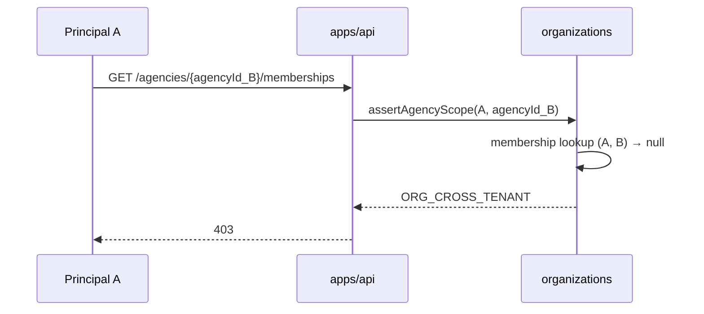

# R07 — Riscos: `modules/organizations`

**Rodada:** R7 — Registro de riscos, ameaças e controles propostos  
**Data:** 2026-09-07  
**Issue:** ANX-39 (debate) · ANX-29 (implementação, bloqueada até R10 G0) · ANX-28 (identity `in_review`)

## Participantes

| Papel | Agente |
| --- | --- |
| Crítico | critic-reviewer |
| Security | security-reviewer |
| Red Team | security-reviewer (escopo G5) |
| Arquiteto | architect |

## Objetivo da rodada

Fechar o registro de riscos do módulo **organizations** antes da síntese (R8): ameaças cross-tenant (UI03), corrida de convites, trade-off RLS (P-R5-03), saga de onboarding (UI01), dependência identity (ANX-28), rotação de pepper, cenários adversariais e checklist Red Team (G5).

## Fontes aplicadas

| Fonte | Uso em R7 |
| --- | --- |
| [R06-dependencies.md](./R06-dependencies.md) | P-R5-03, P-R6-02/03, fail-closed identity, pepper |
| [R05-storage.md](./R05-storage.md) | Índices convite, hash HMAC, command journal |
| [R04-contracts.md](./R04-contracts.md) | `ORG_CROSS_TENANT`, rotas REST, idempotência |
| [R03-domain-sketch.md](./R03-domain-sketch.md) | INV-ORG-01..05 |
| `brain/project-docs/specs/001-institutional-contract/spec.md` | UI01, UI03, GK08, saga onboarding |
| [Playbook](../../module-development-playbook.md) | Gates G4 Security, G5 Red Team |

## Debate R7 (diálogo atribuído)

**Security:** O maior risco v1 não é Neo4j desatualizado — é **bypass de tenancy** em query ou rota (`agencyId` trocado no path). GK08 e UI03 exigem negação explícita inclusive em paginação e export futuro.

**Crítico:** RLS adiado em R6 aumenta superfície humana: um `WHERE` omitido vaza tenant. Mitigação obrigatória: guard centralizado `assertAgencyMembership` + testes AR01/G5, não confiança em revisão manual.

**Arquiteto:** Saga UI01 é cross-módulo (billing → Agency → agents). organizations só garante **idempotência local** (`commandId`, índice owner único); duplicação de Agency por webhook duplicado é risco compartilhado — registrar como dependência downstream, não resolver só em PG organizations.

**Red Team:** Convite é vetor clássico: token brute-force (mitigado por entropia), replay após revogação, corrida activate+revoke, email case-sensitivity bypass do índice único.

**Síntese Orquestrador:** Registro de riscos v1 fechado; decisões P-R5-03 e P-R5-04 registradas abaixo.

---

## Registro de riscos

Severidade = impacto × likelihood (escala 1–5). **Top 5** na seção de retorno.

| ID | Risco | L | I | Sev | Mitigação (resumo) | Gate |
| --- | --- | ---: | ---: | ---: | --- | --- |
| **R-ORG-01** | Cross-tenant: principal acessa `agencyId` alheio via path, query ou listagem | 3 | 5 | **15** | Guard `assertAgencyScope` em api+application; filtro obrigatório `agency_id`; `ORG_CROSS_TENANT` 403; testes G3/G5 | G4, G5 |
| **R-ORG-02** | Bypass de autorização por omissão de `WHERE agency_id` em repositório | 2 | 5 | **10** | Repositórios só expõem métodos com `agencyId` obrigatório; lint/review checklist; sem `findAll` genérico | G4 |
| **R-ORG-03** | Identity indisponível durante `CreateAgency` / `ActivateMembership` | 3 | 4 | **12** | Fail-closed `503 ORG_IDENTITY_UNAVAILABLE`; sem cache autoritativo; health agregado; ANX-28 `getPrincipalById` | G4 |
| **R-ORG-04** | Corrida de convites duplicados (mesmo email, requests paralelos) | 3 | 3 | **9** | UNIQUE parcial `(agency_id, lower(invite_email)) WHERE invited`; transação + `ORG_MEMBERSHIP_EXISTS` 409 | G3, G5 |
| **R-ORG-05** | Token de convite adivinhado ou vazado (link email) | 2 | 4 | **8** | 32 bytes `randomBytes`; HMAC-SHA256+pepper; TTL 7d; rate limit ativação; timing-safe compare | G4, G5 |
| **R-ORG-06** | Onboarding duplicado (UI01) — múltiplas Agencies por mesmo Owner | 3 | 4 | **12** | `Idempotency-Key` + command journal; índice `owner_principal_id`; saga billing idempotente (fora do módulo) | G3, G5 |
| **R-ORG-07** | Replay de evento NATS / projector duplica estado grafo | 2 | 3 | **6** | `eventId` + inbox `graph:organizations:v1`; `revision` monotônica no projector | G4 |
| **R-ORG-08** | Pepper `ORG_INVITE_TOKEN_PEPPER` rotacionado invalida convites pendentes sem plano | 2 | 3 | **6** | Runbook: reemitir convites; dual-pepper janela 24h em rotação (G1 adapter) | G4 |
| **R-ORG-09** | Último owner revogado — Agency órfã | 2 | 4 | **8** | INV-ORG-02 + `ORG_OWNER_REQUIRED` 409; índice único owner ativo | G3 |
| **R-ORG-10** | `principalId` injetado no body em vez da sessão | 2 | 5 | **10** | Handler ignora body; Zod strip; teste G5 body tampering | G4, G5 |
| **R-ORG-11** | SQL injection / pool compartilhado sem isolamento DB | 1 | 5 | **5** | Drizzle parametrizado; RLS adiado v1 com compensação application (ver §P-R5-03) | G4 |
| **R-ORG-12** | Export/listagem futura vaza membership cross-tenant (UI03) | 2 | 5 | **10** | Scope em query layer; sem endpoint global de memberships v1; revisão G4 antes de export | G4, G5 |
| **R-ORG-13** | ANX-28 atrasado — organizations G1 sem `getPrincipalById` | 3 | 4 | **12** | Bloqueio explícito ANX-29 até identity G7; mock port em testes unit | G0 |
| **R-ORG-14** | Ativação após `invite_expires_at` ou membership revogada | 3 | 2 | **6** | Checagem TTL no comando; `ORG_MEMBERSHIP_NOT_INVITED` / `ORG_INVITE_EXPIRED` | G3, G5 |
| **R-ORG-15** | PII (`invite_email`) em logs ou eventos indevidos | 2 | 3 | **6** | Redact observability; email só em `membership.invited.v1` | G4 |

**Legenda:** L = likelihood, I = impact, Sev = L×I.

---

## Deep dive — itens recomendados em R06

### 1. Cross-tenant e UI03 / GK08

**Risco:** Owner ou membro acessa Agency de outro titular manipulando `:agencyId` na URL, parâmetros de busca ou (futuro) export CSV.

**Controles propostos:**

| Camada | Controle |
| --- | --- |
| `apps/api` | Middleware `requireAgencyMembership(agencyId)` antes de qualquer handler `/agencies/:agencyId/*` |
| `application` | `assertAgencyScope(principalId, agencyId)` — consulta membership ativo em PG |
| `infrastructure` | Repositórios: assinaturas `findById(agencyId, …)` — proibido `findById(id)` sem scope |
| `queries` | `ListAgenciesForPrincipal` deriva lista **apenas** de memberships ativos — nunca listar todas as agencies |
| Erro | `403` + `details.code: ORG_CROSS_TENANT` (não 404 — evita oracle de existência quando aplicável) |
| SDD | GK08: cross-tenant negado inclusive em paginação — v1 sem paginação global; quando existir, `WHERE agency_id IN (…)` obrigatório |

**Evidência G4:** mapa de rotas × checagem de scope; ausência de query sem filtro tenant.

**Evidência G5:** principal A com membership na Agency X tenta `GET/PATCH/POST` na Agency Y → 403 consistente em todas as rotas mutáveis e de leitura sensível.

---

### 2. Corrida de convites (invite race)

**Risco:** Dois `InviteMember` paralelos para o mesmo email na mesma Agency; ou convite + revoke + activate intercalados.

**Controles propostos:**

| Cenário | Controle |
| --- | --- |
| Duplicata mesmo email | Índice `organizations_memberships_agency_email_invited_uidx` + transação SERIALIZABLE ou lock row em `InviteMember` |
| Re-convite após revoke | Novo `membershipId` e novo token; revoke limpa `invite_token_hash` |
| Activate vs revoke | `UPDATE … WHERE status = 'invited'` — linhas afetadas 0 → `409` |
| Idempotência HTTP | Mesmo `Idempotency-Key` → command journal replay sem segundo INSERT |
| Principal já ativo | Índice `(agency_id, principal_id) WHERE active` impede segundo membership ativo |

**G5:** script com 10 requests paralelos `InviteMember` mesmo email → exatamente 1 `201`, demais `409 ORG_MEMBERSHIP_EXISTS` ou replay idempotente.

---

### 3. P-R5-03 — RLS PostgreSQL vs application-only

Ver **§Decisão P-R5-03** abaixo.

---

### 4. Saga onboarding UI01

**Risco:** SDD exige onboarding idempotente: webhook billing duplicado ou retry de UI não deve criar segunda Agency/Owner/equipe.

**Escopo organizations v1:**

| Responsabilidade | Módulo | Mecanismo |
| --- | --- | --- |
| Uma Agency por `CreateAgency` idempotente | organizations | `commandId` + command journal |
| Um Owner por `principal_id` | organizations | UNIQUE `organizations_owners_principal_id` |
| Membership owner na criação | organizations | Transação única com Agency |
| Webhook billing → trigger criação | billing + apps/api | Fora organizations v1; deve passar mesmo `Idempotency-Key` ou chave de negócio |
| Blueprint / mandate / READY | agents + governance | Assíncrono P04; `AdvanceOnboarding` interno deferido R09 |

**Controles:**

- `CreateAgency` com mesmo `commandId` → replay sem segundo INSERT.
- Política comercial `maxCompanies` (SDD) **não** implementada em v1 — risco aceito documentado; enforcement em billing P07.
- Teste G3: duplo `POST /agencies` com mesma `Idempotency-Key` → uma Agency, segundo response `idempotentReplay: true`.

**Risco residual:** duas chaves idempotentes diferentes para o mesmo Owner criam duas Agencies — mitigação futura: índice opcional `(owner_principal_id, display_name)` ou quota billing síncrona antes de `CreateAgency` (R09/P07).

---

### 5. Dependência ANX-28 (identity)

**Risco:** organizations G1 wired sem export público `getPrincipalById`; ou identity em `in_review` com breaking change.

| Controle | Detalhe |
| --- | --- |
| Gate G0 | ANX-29 `blocked_by` ANX-28 até G7 |
| Contrato | `PrincipalLookup.exists` → adapter → `getPrincipalById` apenas via `identity/index.ts` |
| Timeout | 2s; falha → `503 ORG_IDENTITY_UNAVAILABLE` |
| Testes | Integração com identity fixture; unit com mock do port |
| Sem cache | Proibido cache de existência entre requests para AuthZ |

**Risco residual:** identity lento mas não down — latência p99; observabilidade com métrica `principal_lookup_duration_ms`.

---

### 6. Rotação de pepper (`ORG_INVITE_TOKEN_PEPPER`)

**Risco:** Rotação de segredo invalida hashes de convites pendentes; vazamento do pepper permite forge de tokens se DB também vazar.

**Controles propostos:**

| Fase | Controle |
| --- | --- |
| Dev | Env único em `.env.example`; nunca commitar valor |
| Prod (futuro) | `packages/secrets` resolve `organizations/invite-pepper` |
| Rotação | Runbook: (1) adicionar `ORG_INVITE_TOKEN_PEPPER_PREVIOUS` no adapter; (2) validar hash com current **ou** previous; (3) após 7d (TTL convite), remover previous; (4) opcional reemitir convites pendentes |
| Domain | Nunca lê pepper — port `InviteTokenHasher` injetado |
| Eventos/logs | Pepper e token plaintext proibidos ([R05](./R05-storage.md)) |

**G4:** verificar adapter não loga pepper; variável ausente → fail fast no startup (não default fraco).

---

## Decisão P-R5-03 — RLS v1 vs application-only

**Posição:** **Application-only em v1** — RLS PostgreSQL **não** obrigatório no slice G1 organizations.

**Rationale:**

| Fator | Avaliação |
| --- | --- |
| Padrão existente | `identity` v1 sem RLS; consistência P02 |
| Pool `pg` compartilhado | RLS exige `SET app.agency_id` / `SET ROLE` por request — frágil com pool Bun, fácil esquecer em worker |
| Custo de implementação | Policies em 3 tabelas + testes de bypass DB + migração — atrasa ANX-29 sem ganho proporcional se application guards falharem |
| Compensação aceita | Guards obrigatórios api+application, repositórios sem API global, testes G5 cross-tenant, revisão G4 em todo PR organizations |
| SDD GK08 | Exige negação de cross-tenant no **endpoint e acesso publicado** — atingível na camada application com evidência |
| Momento para RLS | **P09 Launch / tenancy hardening** — quando houver workers com credencial DB distinta, relatórios SQL ad-hoc ou requisito de compliance explícito |

**Condições para reabrir RLS antes de P09:**

1. Incidente ou achado G5 de vazamento cross-tenant por query omitida.
2. Introdução de ferramenta BI com acesso SQL direto ao pool.
3. ADR de tenancy exigindo defense-in-depth no storage.

**Registro:** P-R5-03 **resolvido** — application-only v1 com plano RLS P09.

---

## Decisão P-R5-04 — TTL de convite e rota de ativação

**Posição:**

| Aspecto | Decisão v1 |
| --- | --- |
| **TTL padrão** | **7 dias** (`invite_expires_at = now() + interval '7 days'`) |
| **Renovação** | Novo `InviteMember` após revoke ou expiração; sem extensão automática |
| **Rota autenticada** | `POST /v1/organizations/agencies/:agencyId/memberships/:membershipId/activate` — convidado logado ou admin ([R04](./R04-contracts.md)) |
| **Rota por token** | `POST /v1/organizations/invites/accept` — body `{ token }` + sessão obrigatória; organizations valida hash+TTL; resolve `principalId` da sessão |
| **Email link** | `apps/api` monta `{APP_URL}/accept-invite?token=…` → frontend redireciona para API accept com sessão |
| **Erros** | `ORG_INVITE_EXPIRED` (410), `ORG_MEMBERSHIP_NOT_INVITED` (409), token inválido (404 genérico) |
| **Rate limit** | 10 tentativas / IP / min na rota accept (composition root) |

**Rationale:** 7d alinha a prática SaaS e [R05](./R05-storage.md); rota token separada evita expor `membershipId` em email; sessão obrigatória na accept vincula Principal ao convite (INV-ORG-03).

**Registro:** P-R5-04 **resolvido** para v1; refinamento de UX frontend em R09.

---

## Cenários de ameaça

### A. Manipulação de path cross-tenant

**Pré-condição:** A não tem membership ativo em B.  
**Impacto:** sem controle, lista de membros e PII de B vazam.  
**Detecção:** audit log de 403 com `agencyId` tentado; alerta se taxa > threshold.

---

### B. Convites duplicados e race

| Passo | Ação adversária | Resultado esperado |
| --- | --- | --- |
| 1 | Paralelo: 2× `InviteMember` email `x@y.com` | 1 sucesso, 1× `409` |
| 2 | `InviteMember` + `RevokeMembership` + `ActivateMembership` intercalado | Estado final consistente; activate em revoked → `409` |
| 3 | Mesmo email, case `X@Y.com` vs `x@y.com` | Índice `lower(invite_email)` → `409` |

---

### C. Identity indisponível

| Momento | Comportamento |
| --- | --- |
| `CreateAgency` | Abort; `503`; nenhuma linha em PG |
| `InviteMember` | **Prossegue** (sem lookup) |
| `ActivateMembership` | Abort se precisa validar principal |
| `GetAgencyById` | **Prossegue** (leitura local) |

**Anti-padrão proibido:** criar Agency assumindo principal existe sem lookup.

---

### D. Replay de evento

| Vetor | Controle |
| --- | --- |
| NATS redelivery | Outbox idempotente; consumer inbox `eventId` |
| Projector graph | `processWithInbox`; ignorar se `revision` ≤ nó |
| HTTP replay | `commandId` no command journal |
| Convite token reuse | Limpar hash em activate; segundo uso → 404 |

**G5:** republicar `membership.activated.v1` com mesmo `eventId` → grafo e PG organizations inalterados (PG já commitado; grafo dedup).

---

## Checklist Red Team (G5)

Executar em sandbox com PG + API locais; **sem** produção nem capital real.

### Cross-tenant (UI03 / GK08)

- [ ] Principal A: enumerar `agencyId` UUIDs aleatórios em todas as rotas `/agencies/:id/*` → só 403/404, nunca 200 com dados alheios
- [ ] A com membership em X tenta mutação em Y → 403 `ORG_CROSS_TENANT`
- [ ] `ListAgenciesForPrincipal` retorna apenas agencies com membership ativo de A
- [ ] Body com `agencyId` diferente do path ignorado ou rejeitado

### Convites

- [ ] 20 paralelos mesmo email → um convite ativo
- [ ] Token expirado (>7d ou clock skew test) → 410
- [ ] Token após revoke → falha
- [ ] Token válido + sessão de principal errado (email não corresponde) → política: accept só se `invite_email` match sessão email **ou** admin activate — documentar comportamento G1
- [ ] Brute force token (amostra) → rate limit acionado

### Identity / dependência

- [ ] Simular identity down (mock 503) em `CreateAgency` → nenhuma Agency criada
- [ ] `InviteMember` com identity down → sucesso
- [ ] Timeout lookup >2s → 503

### Idempotência e UI01

- [ ] Duplo `CreateAgency` mesma `Idempotency-Key` → uma Agency
- [ ] Dupla `Idempotency-Key` diferente mesmo Owner → duas Agencies (risco residual documentado) — registrar achado se inaceitável

### Injeção e tampering

- [ ] `principalId` / `ownerPrincipalId` no body → ignorado
- [ ] `Idempotency-Key` inválido / reuso cross-comando → rejeição ou replay correto
- [ ] SQLi em `displayName`, `email` → sanitizado / parametrizado

### Eventos e replay

- [ ] Republicar evento organizations no NATS → sem duplicata no grafo (quando graph disponível)
- [ ] Matar worker após commit PG antes de outbox dispatch → evento eventualmente publicado; sem estado duplicado

### Segredos

- [ ] Logs não contêm `invite_email` em clear (amostragem)
- [ ] Resposta API não inclui `invite_token_hash`
- [ ] Startup sem pepper → falha explícita

### Owner invariant

- [ ] Revogar único owner ativo → `409 ORG_OWNER_REQUIRED`
- [ ] Tentativa segundo owner ativo → violação índice único

---

## Resolução pendências R06

| ID | Assunto | Status R7 |
| --- | --- | --- |
| **P-R6-02** | RLS vs defense-in-depth | ✅ **Resolvido** — application-only v1; RLS P09 |
| **P-R6-03** | Saga onboarding + corrida convites | ✅ **Documentado** — controles + risco residual UI01 |
| P-R5-03 | RLS | ✅ Resolvido (mesma decisão) |
| P-R5-04 | TTL + rota token | ✅ Resolvido |

---

## Critérios de aceite R7

| # | Critério | Status |
| --- | --- | --- |
| AC-R7-01 | Registro de riscos com L/I/mitigação/gate | ✅ |
| AC-R7-02 | Deep dive itens R06 (cross-tenant, invite, UI01, ANX-28, pepper) | ✅ |
| AC-R7-03 | Decisão P-R5-03 com rationale | ✅ |
| AC-R7-04 | Decisão P-R5-04 (TTL + rotas) | ✅ |
| AC-R7-05 | Cenários de ameaça documentados | ✅ |
| AC-R7-06 | Checklist G5 Red Team | ✅ |

## Pendências para rodadas seguintes

| ID | Assunto | Rodada |
| --- | --- | --- |
| P-R7-01 | Política accept-invite: email sessão deve match `invite_email`? | R8 / G1 |
| P-R7-02 | Quota `maxCompanies` — organizations vs billing | R8 / P07 |
| P-R7-03 | RLS P09 — critérios de adoção | R10 / P09 |
| P-R7-04 | Códigos `ORG_INVITE_EXPIRED` em contracts | R9 |

## Saída R7

✅ Riscos e controles aprovados para R8 (síntese e decision log).
