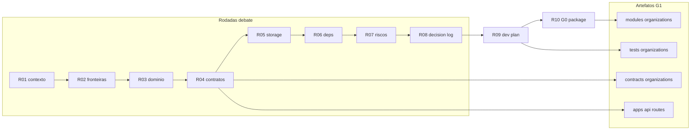

# R08 — Decision log: `modules/organizations`

**Rodada:** R8 — Síntese do debate e registro de decisões  
**Data:** 2026-09-07  
**Issue:** ANX-39 (debate) · ANX-29 (implementação, bloqueada até R10 G0) · ANX-28 (identity `in_review`)

**KEEP adapter-gateway** se já exportado. Pack ANX-389 — não `done`.

## In / Out (R8)

**In:** síntese D-ORG-*. **Out:** decision log. **Não** fechar spec accepted.

## Non-goals

Não spec `accepted`. Não ST08 live. Não ANX-389 `done`.

## Ownership

| Superfície | Dono |
| --- | --- |
| Decisões D-ORG-* | **organizations** |
| adapter-gateway | **KEEP** |

## Participantes

| Papel | Agente |
| --- | --- |
| Orquestrador | CTO orchestrator |
| Arquiteto | architect |
| Crítico | critic-reviewer |
| Security | security-reviewer |

## Objetivo da rodada

Consolidar todas as posições aceitas em R1–R7 num **decision log** rastreável (`D-ORG-*`), resolver pendências abertas em R7 (P-R7-01, P-R7-02), registrar deferências v1 e definir **pré-condições G0** para R10.

## Debate R8 (síntese atribuída)

**Orquestrador:** R1–R7 fecharam contexto, fronteiras, domínio, contratos, armazenamento, dependências e riscos. R8 não reabre decisões salvo lacunas explícitas (P-R7-01, P-R7-02).

**Crítico:** P-R7-01 é bloqueante de segurança na rota `accept-invite` — sem match de email, token vazado + sessão de terceiro ativa convite alheio.

**Security:** Concordo. Match case-insensitive `lower(session.email) === lower(invite_email)` na rota por token; rota autenticada por `membershipId` mantém regra equivalente para convidado.

**Arquiteto:** P-R7-02 (`maxCompanies`) é política comercial SDD — dono natural é **billing**; organizations expõe mecanismo, não quota. Duplicata de Agency por duas `Idempotency-Key` distintas permanece risco residual até billing P07.

**Síntese Orquestrador:** Decision log consolidado; R8 aprovado para R9 (plano de implementação).

---

## Tabela consolidada de decisões

| ID | Decisão | Rodada | Status |
| --- | --- | --- | --- |
| **D-ORG-001** | `modules/organizations` é dono autoritativo de Agency, Owner e Membership em PostgreSQL | R1, R2 | ✅ Aceito |
| **D-ORG-002** | Sessão, credencial e Better Auth permanecem em `identity` + `apps/api` — organizations recebe `principalId` já resolvido | R2, R6 | ✅ Aceito |
| **D-ORG-003** | Grants, mandatos, authorityEpoch e ALLOW/DENY pertencem a **governance** — organizations publica fatos (`role`, `status`) | R2, R6 | ✅ Aceito |
| **D-ORG-004** | Assinatura, invoice e webhooks pertencem a **billing** | R2 | ✅ Aceito |
| **D-ORG-005** | Projeção Neo4j (organograma) pertence ao módulo **graph**; organizations só emite eventos | R2, R5, R6 | ✅ Aceito |
| **D-ORG-006** | Agent/CEO blueprint runtime pertence a **agents** | R2 | ✅ Aceito |
| **D-ORG-007** | v1 scope = **Agency + Owner + Membership**; entidade `Organization` (multi-company) **fora** do v1 | R3, R4 | ✅ Aceito — deferido |
| **D-ORG-008** | `principalId` referencia identity via port `PrincipalLookup` — sem FK física cross-module | R3, R5, R6 | ✅ Aceito |
| **D-ORG-009** | Invariante INV-ORG-02: exatamente um Membership `role=owner` ativo por Agency | R3, R5 | ✅ Aceito |
| **D-ORG-010** | Idempotência HTTP via header `Idempotency-Key` → `commandId` + tabela `organizations_command_journal` | R4, R5 | ✅ Aceito |
| **D-ORG-011** | Eventos com `ownerDomain: "organizations"`, `schemaVersion: "0.1.0"`, sufixo `.v1` | R4 | ✅ Aceito |
| **D-ORG-012** | Contratos públicos em `@anxionos/contracts/organizations/*` (types, commands, queries, events) | R4, R6 | ✅ Aceito — impl G1 |
| **D-ORG-013** | REST prefixo `/v1/organizations`; mutações exigem `Idempotency-Key` | R4 | ✅ Aceito |
| **D-ORG-014** | `principalId` / `ownerPrincipalId` **nunca** vêm do body — derivados da sessão | R4, R7 | ✅ Aceito |
| **D-ORG-015** | Tenancy: toda mutação/leitura sensível valida membership ativo na Agency alvo; erro `ORG_CROSS_TENANT` 403 | R4, R7 | ✅ Aceito |
| **D-ORG-016** | Prefixo tabelas `organizations_*`; enums Drizzle alinhados a contracts | R5 | ✅ Aceito |
| **D-ORG-017** | Journal/outbox via `@anxionos/eventing` na mesma transação PG (`OrganizationUnitOfWork`) | R5, R6 | ✅ Aceito |
| **D-ORG-018** | Token de convite: 32 bytes random; persistir apenas `HMAC-SHA256(pepper, token)`; pepper via env/secrets | R5, R6 | ✅ Aceito |
| **D-ORG-019** | Token e pepper **proibidos** em eventos, logs e respostas API | R5, R7 | ✅ Aceito |
| **D-ORG-020** | SQLite **proibido** para estado institucional deste módulo | R5 | ✅ Aceito |
| **D-ORG-021** | Projeção Neo4j v1: subconjunto E003, E008, E009, E016; consumer `graph:organizations:v1` | R5, R6 | ✅ Aceito — impl graph P03 |
| **D-ORG-022** | Adapter `IdentityPrincipalLookup` implementa port; chama `getPrincipalById` exportado por identity | R6 | ✅ Aceito — pré-req ANX-28 |
| **D-ORG-023** | Identity indisponível em mutação que exige principal → fail-closed `503 ORG_IDENTITY_UNAVAILABLE` | R6, R7 | ✅ Aceito |
| **D-ORG-024** | `InviteMember` **não** consulta identity quando convidado ainda inexistente (`principal_id` null) | R6 | ✅ Aceito |
| **D-ORG-025** | Cache de existência de principal para AuthZ **proibido** | R6, R7 | ✅ Aceito |
| **D-ORG-026** | RLS PostgreSQL **não** obrigatório v1 — defense-in-depth na camada application + api | R6, R7 | ✅ Aceito — RLS adiado P09 |
| **D-ORG-027** | TTL padrão de convite: **7 dias** (`invite_expires_at`) | R7 | ✅ Aceito |
| **D-ORG-028** | Rota accept por token: `POST /v1/organizations/invites/accept` com sessão obrigatória | R7 | ✅ Aceito |
| **D-ORG-029** | Rate limit 10 tentativas/IP/min na rota accept (composition root) | R7 | ✅ Aceito |
| **D-ORG-030** | Guard centralizado `assertAgencyScope` em api + application; repositórios exigem `agencyId` | R7 | ✅ Aceito |
| **D-ORG-031** | Índice único parcial convite: `(agency_id, lower(invite_email)) WHERE status='invited'` | R5, R7 | ✅ Aceito |
| **D-ORG-032** | Rotação pepper: dual-pepper janela 24h + runbook reemitir convites | R7 | ✅ Aceito |
| **D-ORG-033** | ANX-29 bloqueada até identity G7 (ANX-28) + pacote G0 (R10) | R6, R7 | ✅ Aceito |
| **D-ORG-034** | Accept-invite por token exige **match** `lower(session.email) === lower(invite_email)` | R8 | ✅ Aceito — resolve P-R7-01 |
| **D-ORG-035** | Quota comercial `maxCompanies` (SDD) enforced por **billing** P07 — organizations v1 sem quota | R8 | ✅ Aceito — resolve P-R7-02 |
| **D-ORG-036** | Admin/owner pode ativar via `membershipId` sem match de email (fluxo assistido) | R8 | ✅ Aceito |
| **D-ORG-037** | Bootstrap `apps/api`: eventing → identity → organizations schemas | R5, R6 | ✅ Aceito |
| **D-ORG-038** | Realtime canal `organizations:agency:{agencyId}` — wiring opcional v1 | R4 | ⏸ Deferido R9 |
| **D-ORG-039** | Saga onboarding UI01 completa (`AdvanceOnboarding`, billing webhook) — fora v1 organizations | R4, R7 | ⏸ Deferido R9/P04 |
| **D-ORG-040** | RLS PostgreSQL tenancy hardening — critérios em P09 | R7 | ⏸ Deferido P09 |
| **D-ORG-041** | Código `ORG_INVITE_EXPIRED` em contracts | R7 | ⏸ Deferido R9 — P-R7-04 |
| **D-ORG-042** | Tabela `organizations_blueprints` / onboarding blueprint state | R5 | ⏸ Deferido R9 |
| **D-ORG-043** | Entidade `Organization` + `CONTAINS_AGENCY` (E002) multi-company | R3, R4, R5 | ⏸ Deferido pós-v1 |
| **D-ORG-044** | Export/listagem global de memberships — sem endpoint v1 | R7 | ⏸ Deferido — revisão G4 antes |

**Total decisões registradas:** 44 (`D-ORG-001` … `D-ORG-044`)  
**Aceitas v1:** 37 · **Deferidas:** 7

---

## Crosswalk Slack → decision log

Decisões registradas nas sessões Slack ([SLACK-TRANSCRIPTS.md](./SLACK-TRANSCRIPTS.md)) consolidadas neste artefato:

| ID Slack | Decisão (resumo) | Consolidado em |
| --- | --- | --- |
| **D-R7-S1-01** | Application-only tenancy v1; RLS → P09 | D-ORG-026, D-ORG-040 |
| **D-R7-S1-02** | Guard 3 camadas + `ORG_CROSS_TENANT` 403 | D-ORG-015, D-ORG-030 |
| **D-R7-S1-03** | TTL convite 7d; accept com sessão + email match | D-ORG-027, D-ORG-028, D-ORG-034 |
| **D-R7-S1-04** | Testes cross-tenant + invite race em G3/G5 | R07 checklist G5; R9 plano de testes |
| **D-R7-S1-05** | ANX-29 bloqueada até ANX-28 G7 + R10 G0 | D-ORG-033, PC-G0-04 |

**Session 2 (ratificação R07):** confirma D-R7-S1-01..05 sem reabrir eixo; P-R7-01/02 resolvidos em R8 (D-ORG-034, D-ORG-035, D-ORG-036).

---

## Resolução P-R7-01 — Match de email no accept-invite — Match de email no accept-invite

**Pergunta:** Na rota `POST /v1/organizations/invites/accept`, a sessão do Principal deve corresponder ao `invite_email`?

**Posição:** **Sim — match obrigatório na rota por token.**

| Aspecto | Decisão |
| --- | --- |
| Rota por token (`/invites/accept`) | Rejeitar se `lower(principal.email) !== lower(membership.invite_email)` → `403` + `details.code: ORG_INVITE_EMAIL_MISMATCH` |
| Rota por `membershipId` autenticada | Mesma regra quando o ativador é o **convidado** (não admin) |
| Rota admin/owner (`membershipId/activate`) | **Bypass** permitido — owner/admin pode ativar convite pendente (suporte, onboarding assistido) |
| Comparação | Case-insensitive via `lower()` — alinhado ao índice único parcial |
| Principal sem email | Fail-closed `409` — convite exige Principal com email verificado (identity) |
| Token válido + sessão errada | Não vincula membership; token permanece válido até TTL para o email correto |

**Rationale:**

1. **Segurança:** Token vazado (forward de email, screenshot) não permite que terceiro autenticado se aproprie do convite — vetor coberto no checklist G5 R07.
2. **Consistência:** `InviteMember` grava `invite_email`; a ativação deve fechar o ciclo vinculando o Principal cujo email corresponde.
3. **Operação:** Fluxo assistido permanece via admin activate (D-ORG-036), sem enfraquecer a rota pública accept.
4. **Identity:** Better Auth garante email da sessão; organizations não confia em email do body.

**Registro:** P-R7-01 **resolvido** → D-ORG-034, D-ORG-036. Novo código `ORG_INVITE_EMAIL_MISMATCH` entra em R9 junto com P-R7-04.

---

## Resolução P-R7-02 — Quota `maxCompanies`

**Pergunta:** organizations deve enforcear `maxCompanies` (SDD) ou billing?

**Posição:** **Enforcement em billing (P07); organizations v1 sem quota local.**

| Aspecto | Decisão |
| --- | --- |
| Dono da política comercial | **billing** — plano/assinatura define `maxCompanies` |
| Ponto de enforcement | `apps/api` ou billing port **antes** de chamar `CreateAgency` — check síncrono |
| organizations v1 | **Não** implementa contagem/quota; permite N Agencies por Owner tecnicamente |
| Risco residual | Duas `Idempotency-Key` distintas → duas Agencies (R-ORG-06) — mitigação billing |
| Futuro (opcional) | Port read-only `CompanyQuotaLookup` chamado por billing — **não** G1 |
| Índice preventivo | **Não** adicionar `(owner_principal_id)` UNIQUE em agencies — Owner legítimo pode ter múltiplas empresas no produto |

**Rationale:**

1. **Fronteira ADR0002:** Quota é consequência de assinatura — domínio billing, não organizations.
2. **SDD UI01:** Saga onboarding começa em billing webhook; gate comercial naturalmente precede criação de Agency.
3. **Simplicidade G1:** Evita duplicar regra comercial que mudará por plano/tier sem alterar domínio organizations.
4. **R07 já documentou** risco aceito v1; billing P07 fecha o gap com teste G3 de quota excedida.

**Registro:** P-R7-02 **resolvido** → D-ORG-035. Teste G3 organizations: dupla key → duas Agencies (comportamento esperado v1). Teste quota → responsabilidade billing + integração E2E P07.

---

## Itens deferidos (v1 e pós-v1)

| ID | Item | Destino | Motivo |
| --- | --- | --- | --- |
| DEF-01 | Entidade `Organization` multi-company | Pós-v1 / R09 registro | v1 = Agency + Owner + Membership suficiente |
| DEF-02 | `CONTAINS_AGENCY` (E002), `OnboardingRun` (E005) | graph P03 / saga P04 | Projeção/saga cross-módulo |
| DEF-03 | `organizations_blueprints` | R09 | Blueprint runtime em agents |
| DEF-04 | Saga `AdvanceOnboarding` + webhook billing | R09 / P04 | UI01 completo fora slice G1 |
| DEF-05 | Realtime `organizations:agency:{agencyId}` | R9 (opcional G1) | Frontend slice P07 |
| DEF-06 | RLS PostgreSQL tenancy | **P09** Launch | Application-only v1 (D-ORG-026) |
| DEF-07 | Quota `maxCompanies` enforcement | **billing P07** | Política comercial (D-ORG-035) |
| DEF-08 | Códigos `ORG_INVITE_EXPIRED`, `ORG_INVITE_EMAIL_MISMATCH` em contracts | **R9** | P-R7-04 + P-R7-01 |
| DEF-09 | Export/paginação global memberships | Pré-export G4 | R-ORG-12 |
| DEF-10 | Department, Team (E006–E007) | Fora P02 | Escopo organizations baseline |
| DEF-11 | `@anxionos/secrets` prod pepper | Quando package existir | Env var v1 dev/staging |
| DEF-12 | Testes integração PG + AR01 boundary | **R9** | Plano de implementação |

---

## Mapa decisão → artefato

---

## Pré-condições G0 (entrada R10 / claim ANX-29)

Checklist que R10 deve fechar antes de G1. Nenhum item abaixo é implementação — são gates documentais e upstream.

| # | Pré-condição | Evidência | Status |
| --- | --- | --- | --- |
| PC-G0-01 | Decision log R8 completo (este artefato) | `R08-decision-log.md` | ✅ |
| PC-G0-02 | Plano de implementação R9 (árvore, ordem, testes) | `R09-dev-plan.md` | ⏳ R9 |
| PC-G0-03 | Pacote G0 R10 (escopo ANX-29, crítico, ambiente) | `R10-g0-package.md` | ⏳ R10 |
| PC-G0-04 | identity ANX-28 aceite G7 + export `getPrincipalById` | ANX-28 `done` | ⏳ Bloqueia G1 |
| PC-G0-05 | Debate R1–R8 sem pendências bloqueantes | P-R7-01/02 resolvidos; P-R7-04 → R9 | ✅ |
| PC-G0-06 | `@anxionos/contracts` organizations schemas especificados | R04 + R09 | ⏳ R9 detalha |
| PC-G0-07 | Registro de riscos Top 5 com mitigação G4/G5 | R07 §Registro | ✅ |
| PC-G0-08 | Consumer graph `graph:organizations:v1` especificado | R06 | ✅ |
| PC-G0-09 | Issue ANX-29 escopo fechado v1 (sem Organization, sem saga) | R10 | ⏳ R10 |
| PC-G0-10 | Crítico nominal identificado para executor G1 | R10 | ⏳ R10 |

**Gate:** G0 só autoriza claim ANX-29 quando PC-G0-01..10 ✅. **G1 permanece bloqueado** enquanto PC-G0-04 (identity G7) pendente.

---

## Resolução pendências R07

| ID | Assunto | Status R8 |
| --- | --- | --- |
| **P-R7-01** | Match email accept-invite | ✅ **Resolvido** — D-ORG-034, D-ORG-036 |
| **P-R7-02** | Quota maxCompanies | ✅ **Resolvido** — D-ORG-035; billing P07 |
| P-R7-03 | RLS P09 critérios | ⏸ Mantido — DEF-06, D-ORG-040 |
| P-R7-04 | `ORG_INVITE_EXPIRED` em contracts | ⏸ **R9** — DEF-08 |

---

## Critérios de aceite R8

| # | Critério | Status |
| --- | --- | --- |
| AC-R8-01 | Tabela D-ORG-001+ com fonte de rodada | ✅ |
| AC-R8-02 | P-R7-01 resolvido com rationale | ✅ |
| AC-R8-03 | P-R7-02 resolvido com rationale | ✅ |
| AC-R8-04 | Lista de deferidos v1/pós-v1 | ✅ |
| AC-R8-05 | Pré-condições G0 para R10 | ✅ |
| AC-R8-06 | Sem reabertura de decisões R1–R7 salvo gaps | ✅ |

## Saída R8

✅ Decision log consolidado — debate pronto para **R9** (plano de implementação).
