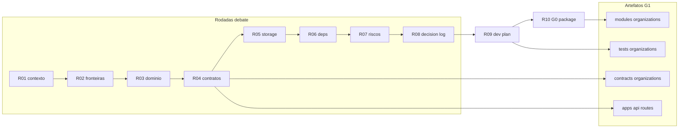

# R08 — Decision log: `modules/organizations`

**Rodada:** R8 — Síntese do debate e registro de decisões  
**Data:** 2026-09-07  
**Issue:** ANX-39 (debate) · ANX-29 (implementação, bloqueada até R10 G0) · ANX-28 (identity `in_review`)

**KEEP adapter-gateway** se já exportado. Pack ANX-389 — não `done`.

## In / Out (R8)

**In:** síntese D-ORG-*. **Out:** decision log. **Não** fechar spec accepted.

## Non-goals

Não spec `accepted`. Não ST08 live. Não ANX-389 `done`.

## Ownership

| Superfície | Dono |
| --- | --- |
| Decisões D-ORG-* | **organizations** |
| adapter-gateway | **KEEP** |

## Participantes

| Papel | Agente |
| --- | --- |
| Orquestrador | CTO orchestrator |
| Arquiteto | architect |
| Crítico | critic-reviewer |
| Security | security-reviewer |

## Objetivo da rodada

Consolidar todas as posições aceitas em R1–R7 num **decision log** rastreável (`D-ORG-*`), resolver pendências abertas em R7 (P-R7-01, P-R7-02), registrar deferências v1 e definir **pré-condições G0** para R10.

## Debate R8 (síntese atribuída)

**Orquestrador:** R1–R7 fecharam contexto, fronteiras, domínio, contratos, armazenamento, dependências e riscos. R8 não reabre decisões salvo lacunas explícitas (P-R7-01, P-R7-02).

**Crítico:** P-R7-01 é bloqueante de segurança na rota `accept-invite` — sem match de email, token vazado + sessão de terceiro ativa convite alheio.

**Security:** Concordo. Match case-insensitive `lower(session.email) === lower(invite_email)` na rota por token; rota autenticada por `membershipId` mantém regra equivalente para convidado.

**Arquiteto:** P-R7-02 (`maxCompanies`) é política comercial SDD — dono natural é **billing**; organizations expõe mecanismo, não quota. Duplicata de Agency por duas `Idempotency-Key` distintas permanece risco residual até billing P07.

**Síntese Orquestrador:** Decision log consolidado; R8 aprovado para R9 (plano de implementação).

---

## Tabela consolidada de decisões

| ID | Decisão | Rodada | Status |
| --- | --- | --- | --- |
| **D-ORG-001** | `modules/organizations` é dono autoritativo de Agency, Owner e Membership em PostgreSQL | R1, R2 | ✅ Aceito |
| **D-ORG-002** | Sessão, credencial e Better Auth permanecem em `identity` + `apps/api` — organizations recebe `principalId` já resolvido | R2, R6 | ✅ Aceito |
| **D-ORG-003** | Grants, mandatos, authorityEpoch e ALLOW/DENY pertencem a **governance** — organizations publica fatos (`role`, `status`) | R2, R6 | ✅ Aceito |
| **D-ORG-004** | Assinatura, invoice e webhooks pertencem a **billing** | R2 | ✅ Aceito |
| **D-ORG-005** | Projeção Neo4j (organograma) pertence ao módulo **graph**; organizations só emite eventos | R2, R5, R6 | ✅ Aceito |
| **D-ORG-006** | Agent/CEO blueprint runtime pertence a **agents** | R2 | ✅ Aceito |
| **D-ORG-007** | v1 scope = **Agency + Owner + Membership**; entidade `Organization` (multi-company) **fora** do v1 | R3, R4 | ✅ Aceito — deferido |
| **D-ORG-008** | `principalId` referencia identity via port `PrincipalLookup` — sem FK física cross-module | R3, R5, R6 | ✅ Aceito |
| **D-ORG-009** | Invariante INV-ORG-02: exatamente um Membership `role=owner` ativo por Agency | R3, R5 | ✅ Aceito |
| **D-ORG-010** | Idempotência HTTP via header `Idempotency-Key` → `commandId` + tabela `organizations_command_journal` | R4, R5 | ✅ Aceito |
| **D-ORG-011** | Eventos com `ownerDomain: "organizations"`, `schemaVersion: "0.1.0"`, sufixo `.v1` | R4 | ✅ Aceito |
| **D-ORG-012** | Contratos públicos em `@anxionos/contracts/organizations/*` (types, commands, queries, events) | R4, R6 | ✅ Aceito — impl G1 |
| **D-ORG-013** | REST prefixo `/v1/organizations`; mutações exigem `Idempotency-Key` | R4 | ✅ Aceito |
| **D-ORG-014** | `principalId` / `ownerPrincipalId` **nunca** vêm do body — derivados da sessão | R4, R7 | ✅ Aceito |
| **D-ORG-015** | Tenancy: toda mutação/leitura sensível valida membership ativo na Agency alvo; erro `ORG_CROSS_TENANT` 403 | R4, R7 | ✅ Aceito |
| **D-ORG-016** | Prefixo tabelas `organizations_*`; enums Drizzle alinhados a contracts | R5 | ✅ Aceito |
| **D-ORG-017** | Journal/outbox via `@anxionos/eventing` na mesma transação PG (`OrganizationUnitOfWork`) | R5, R6 | ✅ Aceito |
| **D-ORG-018** | Token de convite: 32 bytes random; persistir apenas `HMAC-SHA256(pepper, token)`; pepper via env/secrets | R5, R6 | ✅ Aceito |
| **D-ORG-019** | Token e pepper **proibidos** em eventos, logs e respostas API | R5, R7 | ✅ Aceito |
| **D-ORG-020** | SQLite **proibido** para estado institucional deste módulo | R5 | ✅ Aceito |
| **D-ORG-021** | Projeção Neo4j v1: subconjunto E003, E008, E009, E016; consumer `graph:organizations:v1` | R5, R6 | ✅ Aceito — impl graph P03 |
| **D-ORG-022** | Adapter `IdentityPrincipalLookup` implementa port; chama `getPrincipalById` exportado por identity | R6 | ✅ Aceito — pré-req ANX-28 |
| **D-ORG-023** | Identity indisponível em mutação que exige principal → fail-closed `503 ORG_IDENTITY_UNAVAILABLE` | R6, R7 | ✅ Aceito |
| **D-ORG-024** | `InviteMember` **não** consulta identity quando convidado ainda inexistente (`principal_id` null) | R6 | ✅ Aceito |
| **D-ORG-025** | Cache de existência de principal para AuthZ **proibido** | R6, R7 | ✅ Aceito |
| **D-ORG-026** | RLS PostgreSQL **não** obrigatório v1 — defense-in-depth na camada application + api | R6, R7 | ✅ Aceito — RLS adiado P09 |
| **D-ORG-027** | TTL padrão de convite: **7 dias** (`invite_expires_at`) | R7 | ✅ Aceito |
| **D-ORG-028** | Rota accept por token: `POST /v1/organizations/invites/accept` com sessão obrigatória | R7 | ✅ Aceito |
| **D-ORG-029** | Rate limit 10 tentativas/IP/min na rota accept (composition root) | R7 | ✅ Aceito |
| **D-ORG-030** | Guard centralizado `assertAgencyScope` em api + application; repositórios exigem `agencyId` | R7 | ✅ Aceito |
| **D-ORG-031** | Índice único parcial convite: `(agency_id, lower(invite_email)) WHERE status='invited'` | R5, R7 | ✅ Aceito |
| **D-ORG-032** | Rotação pepper: dual-pepper janela 24h + runbook reemitir convites | R7 | ✅ Aceito |
| **D-ORG-033** | ANX-29 bloqueada até identity G7 (ANX-28) + pacote G0 (R10) | R6, R7 | ✅ Aceito |
| **D-ORG-034** | Accept-invite por token exige **match** `lower(session.email) === lower(invite_email)` | R8 | ✅ Aceito — resolve P-R7-01 |
| **D-ORG-035** | Quota comercial `maxCompanies` (SDD) enforced por **billing** P07 — organizations v1 sem quota | R8 | ✅ Aceito — resolve P-R7-02 |
| **D-ORG-036** | Admin/owner pode ativar via `membershipId` sem match de email (fluxo assistido) | R8 | ✅ Aceito — ⚠️ **restringido por D-ORG-046** (ANX-460): sem criação de vínculo novo |
| **D-ORG-037** | Bootstrap `apps/api`: eventing → identity → organizations schemas | R5, R6 | ✅ Aceito |
| **D-ORG-038** | Realtime canal `organizations:agency:{agencyId}` — wiring opcional v1 | R4 | ⏸ Deferido R9 |
| **D-ORG-039** | Saga onboarding UI01 completa (`AdvanceOnboarding`, billing webhook) — fora v1 organizations | R4, R7 | ⏸ Deferido R9/P04 |
| **D-ORG-040** | RLS PostgreSQL tenancy hardening — critérios em P09 | R7 | ⏸ Deferido P09 |
| **D-ORG-041** | Código `ORG_INVITE_EXPIRED` em contracts | R7 | ⏸ Deferido R9 — P-R7-04 |
| **D-ORG-042** | Tabela `organizations_blueprints` / onboarding blueprint state | R5 | ⏸ Deferido R9 |
| **D-ORG-043** | Entidade `Organization` + `CONTAINS_AGENCY` (E002) multi-company | R3, R4, R5 | ⏸ Deferido pós-v1 |
| **D-ORG-044** | Export/listagem global de memberships — sem endpoint v1 | R7 | ⏸ Deferido — revisão G4 antes |
| **D-ORG-045** | `TransferOwnership` ganha rota `POST /agencies/{agencyId}/ownership/transfer` (owner-only) e `agency.ownership_transferred.v1` entra na lista fechada v1 | ANX-460 | ✅ Aceito — decisão do dono em 2026-09-11 (resolve superfície órfã) |
| **D-ORG-046** | Ativação assistida **não** cria primeira vinculação: exige principal já vinculado (reativação) e erro opaco `ORG_INVITEE_CONSENT_REQUIRED`; `revoked → active` passa a existir | ANX-460 | ✅ Aceito — decisão do dono em 2026-09-11 (achado G5-F2); **restringe D-ORG-036** |
| **D-ORG-047** | Existência do sucessor na transferência é validada **depois** da autoridade e colapsa em erro opaco único | ANX-460 | ✅ Aceito — achado G5-F1/G4-F1; sem oráculo de existência de principal |
| **D-ORG-048** | Violação de unicidade de membership (23505) vira **409** — código e mensagem derivados da `constraint`; os saves que podem violar os índices de conflito passam pelo **mapeamento derivado da constraint** — via `saveWithRevisionConflictMapping` (`InviteMember`, `ActivateMembership`, `RevokeMembership`, `UpdateAgencyMarkets`, `AdvanceOnboarding`, `TransferOwnership` — os três salvam **Agency**) ou **direto** pelo helper `throwMembershipUniquenessConflict` em `AcceptInviteByToken` (que precisa tratar o conflito de revisão de forma própria, com 404 opaco); o `CreateAgency` insere com `agencyId` novo por invocação, então não há colisão alcançável; path param não-UUID é **400**; erro desconhecido é **500 com mensagem genérica** | ANX-460 | ✅ Aceito — achados F-01/F-02/F-03 dos gates G3/G4/G5 (3 gates convergiram no `InviteMember`) |
| **D-ORG-049** | Autoridade de `owner` **não** é instalável por ativação: recusada com 409 em `ActivateMembership` **e** em `AcceptInviteByToken` (não há caminho que produza owner revogado e a restauração colidiria com `one_owner_active_uidx`) | ANX-460 | ✅ Aceito — achados F-02/F-03 do G5; corrige o ramo positivo do D-ORG-046 |

**Total decisões registradas:** 49 (`D-ORG-001` … `D-ORG-049`)  
**Aceitas v1:** 42 · **Deferidas:** 7

---

## Crosswalk Slack → decision log

Decisões registradas nas sessões Slack ([SLACK-TRANSCRIPTS.md](./SLACK-TRANSCRIPTS.md)) consolidadas neste artefato:

| ID Slack | Decisão (resumo) | Consolidado em |
| --- | --- | --- |
| **D-R7-S1-01** | Application-only tenancy v1; RLS → P09 | D-ORG-026, D-ORG-040 |
| **D-R7-S1-02** | Guard 3 camadas + `ORG_CROSS_TENANT` 403 | D-ORG-015, D-ORG-030 |
| **D-R7-S1-03** | TTL convite 7d; accept com sessão + email match | D-ORG-027, D-ORG-028, D-ORG-034 |
| **D-R7-S1-04** | Testes cross-tenant + invite race em G3/G5 | R07 checklist G5; R9 plano de testes |
| **D-R7-S1-05** | ANX-29 bloqueada até ANX-28 G7 + R10 G0 | D-ORG-033, PC-G0-04 |

**Session 2 (ratificação R07):** confirma D-R7-S1-01..05 sem reabrir eixo; P-R7-01/02 resolvidos em R8 (D-ORG-034, D-ORG-035, D-ORG-036).

---

## Resolução P-R7-01 — Match de email no accept-invite — Match de email no accept-invite

**Pergunta:** Na rota `POST /v1/organizations/invites/accept`, a sessão do Principal deve corresponder ao `invite_email`?

**Posição:** **Sim — match obrigatório na rota por token.**

| Aspecto | Decisão |
| --- | --- |
| Rota por token (`/invites/accept`) | Rejeitar se `lower(principal.email) !== lower(membership.invite_email)` → `403` + `details.code: ORG_INVITE_EMAIL_MISMATCH` |
| Rota por `membershipId` autenticada | Mesma regra quando o ativador é o **convidado** (não admin) |
| Rota admin/owner (`membershipId/activate`) | **Bypass** permitido — owner/admin pode ativar convite pendente (suporte, onboarding assistido). ⚠️ **Restringido por D-ORG-046:** a primeira vinculação passou a ser só pelo próprio convidado; a rota apenas **reativa** membership já vinculada |
| Comparação | Case-insensitive via `lower()` — alinhado ao índice único parcial |
| Principal sem email | Fail-closed `409` — convite exige Principal com email verificado (identity) |
| Token válido + sessão errada | Não vincula membership; token permanece válido até TTL para o email correto |

**Rationale:**

1. **Segurança:** Token vazado (forward de email, screenshot) não permite que terceiro autenticado se aproprie do convite — vetor coberto no checklist G5 R07.
2. **Consistência:** `InviteMember` grava `invite_email`; a ativação deve fechar o ciclo vinculando o Principal cujo email corresponde.
3. **Operação:** Fluxo assistido permanece via admin activate (D-ORG-036), sem enfraquecer a rota pública accept.
4. **Identity:** Better Auth garante email da sessão; organizations não confia em email do body.

**Registro:** P-R7-01 **resolvido** → D-ORG-034, D-ORG-036. Novo código `ORG_INVITE_EMAIL_MISMATCH` entra em R9 junto com P-R7-04.

---

## Resolução P-R7-02 — Quota `maxCompanies`

**Pergunta:** organizations deve enforcear `maxCompanies` (SDD) ou billing?

**Posição:** **Enforcement em billing (P07); organizations v1 sem quota local.**

| Aspecto | Decisão |
| --- | --- |
| Dono da política comercial | **billing** — plano/assinatura define `maxCompanies` |
| Ponto de enforcement | `apps/api` ou billing port **antes** de chamar `CreateAgency` — check síncrono |
| organizations v1 | **Não** implementa contagem/quota; permite N Agencies por Owner tecnicamente |
| Risco residual | Duas `Idempotency-Key` distintas → duas Agencies (R-ORG-06) — mitigação billing |
| Futuro (opcional) | Port read-only `CompanyQuotaLookup` chamado por billing — **não** G1 |
| Índice preventivo | **Não** adicionar `(owner_principal_id)` UNIQUE em agencies — Owner legítimo pode ter múltiplas empresas no produto |

**Rationale:**

1. **Fronteira ADR0002:** Quota é consequência de assinatura — domínio billing, não organizations.
2. **SDD UI01:** Saga onboarding começa em billing webhook; gate comercial naturalmente precede criação de Agency.
3. **Simplicidade G1:** Evita duplicar regra comercial que mudará por plano/tier sem alterar domínio organizations.
4. **R07 já documentou** risco aceito v1; billing P07 fecha o gap com teste G3 de quota excedida.

**Registro:** P-R7-02 **resolvido** → D-ORG-035. Teste G3 organizations: dupla key → duas Agencies (comportamento esperado v1). Teste quota → responsabilidade billing + integração E2E P07.

---

## Itens deferidos (v1 e pós-v1)

| ID | Item | Destino | Motivo |
| --- | --- | --- | --- |
| DEF-01 | Entidade `Organization` multi-company | Pós-v1 / R09 registro | v1 = Agency + Owner + Membership suficiente |
| DEF-02 | `CONTAINS_AGENCY` (E002), `OnboardingRun` (E005) | graph P03 / saga P04 | Projeção/saga cross-módulo |
| DEF-03 | `organizations_blueprints` | R09 | Blueprint runtime em agents |
| DEF-04 | Saga `AdvanceOnboarding` + webhook billing | R09 / P04 | UI01 completo fora slice G1 |
| DEF-05 | Realtime `organizations:agency:{agencyId}` | R9 (opcional G1) | Frontend slice P07 |
| DEF-06 | RLS PostgreSQL tenancy | **P09** Launch | Application-only v1 (D-ORG-026) |
| DEF-07 | Quota `maxCompanies` enforcement | **billing P07** | Política comercial (D-ORG-035) |
| DEF-08 | Códigos `ORG_INVITE_EXPIRED`, `ORG_INVITE_EMAIL_MISMATCH` em contracts | **R9** | P-R7-04 + P-R7-01 |
| DEF-09 | Export/paginação global memberships | Pré-export G4 | R-ORG-12 |
| DEF-10 | Department, Team (E006–E007) | Fora P02 | Escopo organizations baseline |
| DEF-11 | `@anxionos/secrets` prod pepper | Quando package existir | Env var v1 dev/staging |
| DEF-12 | Testes integração PG + AR01 boundary | **R9** | Plano de implementação |

---

## Resolução ANX-460 — superfície órfã de `TransferOwnership` (D-ORG-045)

**Achado (G0 revalidado contra o código, ANX-460):** `transferOwnership` e o evento `organizations.agency.ownership_transferred.v1` existiam no módulo implementados e testados, o `governance` já os consumia (`assertOwnershipTransferMatchesReadModel`), mas **nenhuma rota os alcançava** e nenhum artefato os autorizava:

| Artefato | Situação antes | Evidência |
| --- | --- | --- |
| Lista fechada de eventos v1 | **6** eventos, sem `ownership_transferred` | `R04-contracts.md:243-250` (AC-R4-01 ✅) |
| Esboço REST | **8** rotas, sem transferência de posse | `R04-contracts.md:294-303` |
| "Fora do escopo v1" | não menciona transferência de posse | `R04-contracts.md:307-311` |
| Código | 7 eventTypes + comando `transferOwnership` exportado | `contracts/src/organizations/events.ts:11-17`; `modules/organizations/src/index.ts` |
| Consumidor | `governance` revalida o payload contra o read-model | `organizations-membership-consumer.ts:121-152` |

**Decisão do dono (2026-09-11):** expor a rota e documentar — em vez de remover comportamento testado do qual o `governance` depende, ou de manter superfície inalcançável.

**Consequências registradas:**

| Aspecto | Decisão |
| --- | --- |
| Rota | `POST /v1/organizations/agencies/{agencyId}/ownership/transfer` — body `{ newOwnerPrincipalId }` |
| AuthZ mínima | Papel de mutação no boundary + **owner ativo** no domínio (`ORG_CROSS_TENANT` caso contrário) |
| Evento | `organizations.agency.ownership_transferred.v1` entra na lista fechada v1 |
| Pré-condição do sucessor | Membership **ativa** na agency (`ORG_OWNER_REQUIRED` caso contrário) |
| Catálogo | Entrada `organizations.agency.transferOwnership` em `capability-manifest/catalog-v1.ts` |
| Tokens de grant | Mantido o padrão do catálogo: `requiredGrants` é **descritivo** (não há enforcement em runtime) e `R04` não nomeia tokens de grant neste módulo |

**Rationale:** a operação já era o único produtor do evento consumido pelo `governance`; deixá-la inalcançável significava que a revogação derivada da troca de posse nunca ocorreria em produção. Expor a rota torna o contrato verdadeiro sem descartar o mecanismo.

---

## Resolução ANX-460 — achados dos gates G3/G4/G5 (D-ORG-046, D-ORG-047)

Os quatro gates independentes sobre o candidato `10015392` encontraram dois vetores **MEDIUM** na superfície nova e um **MEDIUM** de contrato HTTP. Ambos os vetores eram oráculos de enumeração, e o segundo tinha um efeito colateral confirmado no banco.

### D-ORG-046 — ativação assistida não cria primeira vinculação (G5-F2)

**Achado:** `handlers/memberships.ts` resolvia o alvo por `identityRepository.findByEmail(membership.inviteEmail)` e devolvia **404 `ORG_PRINCIPAL_NOT_FOUND`** quando o e-mail não tinha principal. Como `CreateAgency` é self-serve, qualquer pessoa criava a própria Agency, convidava qualquer e-mail e chamava `/activate`: **200** para e-mail registrado, **404** para não registrado — oráculo de enumeração de e-mails da plataforma. E o G5 confirmou no banco o efeito: o principal da vítima, **de outro tenant**, passava a ter membership **ativa** `operator` na Agency do atacante, **sem consentimento**.

**Conflito identificado:** D-ORG-036 ("admin/owner pode ativar via `membershipId` sem match de email — fluxo assistido", ✅ aceito) não contemplava essa consequência. O achado **restringe** D-ORG-036; a decisão do dono foi tomada em 2026-09-11.

| Aspecto | Decisão |
| --- | --- |
| Primeira vinculação | **Só** pelo próprio convidado, via `acceptInviteByToken` (token + sessão dele) |
| Ativação assistida | Passa a **reativar** membership já vinculada (`revoked` → `active`); exige `principalId` gravado |
| Erro de recusa | `ORG_INVITEE_CONSENT_REQUIRED` (403) — **o mesmo** exista ou não principal para o e-mail, para não sobrar oráculo |
| Handler | Deixa de consultar `findByEmail`; usa o `principalId` **já vinculado** (nunca um id do cliente) |
| Revinculação | `principalId !== targetPrincipalId` → `ORG_INVITE_EMAIL_MISMATCH` (403): a reativação não troca de dono |
| Reativação de `role=owner` | **Recusada** (409 `ORG_INVALID_STATUS_TRANSITION`) em `ActivateMembership` **e** em `AcceptInviteByToken` — ver D-ORG-049. O convite exclui `owner`, então a autoridade de owner só nasce em `CreateAgency`/`TransferOwnership` |
| Transição nova | `revoked → active` (antes `revoked` era terminal) |
| Escopo de privilégio | Sem mudança: o convite nunca aceita `role=owner`, então não há emissão de grant baseline para o vinculado |

**Evidência:** oráculo HTTP real (`app.handle` + PostgreSQL) `tests/organizations/integration/http-boundary.integration.test.ts` — verifica que as duas respostas são **idênticas** e que nenhuma membership é vinculada. Falsificação executada: restaurando o fluxo original (com `findByEmail` e sem o gate), o teste **falha**.

### D-ORG-047 — existência do sucessor após a autoridade, com erro opaco (G5-F1/G4-F1)

**Achado:** `transfer-ownership.ts` chamava `assertPrincipalExists(newOwnerPrincipalId)` **fora da transação e antes** da autoridade. `newOwnerPrincipalId` é 100% do cliente e `identity_principals` não tem RLS, então um owner/admin de **qualquer** Agency distinguia **404** (não existe) de **403/409** (existe) para qualquer UUID — oráculo de existência de principal na plataforma.

| Aspecto | Decisão |
| --- | --- |
| Ordem | Autoridade (owner ativo) **primeiro**; só depois qualquer avaliação do alvo |
| Gate do sucessor | Membership **ativa** — mais forte que consultar existência global e não distingue os casos |
| Código | Um único `ORG_OWNER_REQUIRED` para "não existe" e "sem membership ativa" |
| Dependência | `assertPrincipalExists` sai do caminho: `TransferOwnershipDeps` deixa de ter `principalLookup` |

**Evidência:** mesmo oráculo HTTP, com **admin** (passa o boundary e falha só na autoridade de domínio — um não-membro é barrado antes e não exercita o oráculo). Falsificação executada: reintroduzindo a checagem antes da transação, o teste **falha**.

### Contrato HTTP — body inválido é 400 (G3)

`mapOrganizationsError` caía no default `500` para `ZodError` e JSON malformado, então **todas** as rotas de organizations respondiam 500 a um body ruim (defeito pré-existente, herdado pela rota nova). Corrigido com o mesmo mapeamento já provado em `governance` (ANX-466): `ZodError`→400 com `issues`, `SyntaxError`/`ParseError`/`PARSE`→400. Coberto por teste de boundary **e** por HTTP real.

### Débitos rastreados (não bloqueiam a ANX-460)

| ID | Assunto |
| --- | --- |
| ANX-479 | OpenAPI publica `200` sem `content`/schema em 45 operações enquanto o manifest promete `outputSchemaRef` |
| ANX-480 | `organizations_command_journal` sem `tenant_id`/RLS — namespace global de `Idempotency-Key` |
| ANX-481 | `PrincipalLookup` sem escopo de tenant (`identity_principals` sem RLS) — causa-raiz de D-ORG-047 |

---

## Resolução ANX-460 — revalidação dos gates (D-ORG-048, D-ORG-049)

Segunda rodada dos quatro gates sobre o digest `34962ff5`. Três gates convergiram no **mesmo** defeito (F-01), e o G5 encontrou um **falso PASS** num teste meu (F-02).

### F-01 — `revoked → active` colidia com o índice parcial de vínculo ativo (G3, G4, G5)

Fluxo 100% pela API: convidar → aceitar → revogar → **reconvidar o mesmo e-mail** → aceitar (o principal passa a ter outro vínculo ativo) → reativar o vínculo antigo. O `UPDATE` violava `organizations_memberships_agency_principal_active_uidx` e o `23505` cru subia como **500**. Em `10015392` o passo devolvia 409, porque a transição não existia — **regressão introduzida pelo D-ORG-046**, não defeito pré-existente.

Mesma causa em `acceptInviteByToken` (ANX-482): convidar o próprio e-mail e aceitar.

**Correção:** o repositório classifica a violação `23505` (percorrendo a cadeia de `cause`, como o `identity` já fazia) e lança `MembershipAlreadyActiveError`; a aplicação converte em **409 `ORG_MEMBERSHIP_EXISTS`** nos dois comandos.

### F-02 — o ramo positivo do D-ORG-046 era um FALSO PASS (G5)

`assisted-activation.test.ts` afirmava que um owner reativa membership `role=owner` com **200**. O repositório in-memory não tem o índice `organizations_memberships_one_owner_active_uidx`; no PostgreSQL a gravação viola o índice → **500**. Ou seja: o teste passava por não modelar o banco, e o caminho que ele "provia" estava quebrado.

Mais: o estado "owner revogado" é **inalcançável pela API** — o convite exclui `owner`, revogar o único owner ativo é bloqueado e a transferência rebaixa o owner anterior para `admin` (o fuzz de 540 comandos do G5 não produziu nenhum).

**Correção de alcance (G6, digest `5a670f96`):** eu havia registrado a guarda do aceite como *defesa em profundidade*, protegendo um estado inalcançável. O G6 mediu o cenário bruto — **revogar o owner ativo por SQL** (agência com **zero** owners ativos), semear um convite `role=owner` e aceitar — e o resultado inverte a leitura:

| | Com a guarda | Sem a guarda |
| --- | --- | --- |
| Aceite | recusado (409) | **aceito** |
| Owners ativos depois | **0** | **1** |

Sem a guarda, o aceite **instala autoridade de owner** — o índice parcial `one_owner_active_uidx` não protege nesse estado, porque não há owner ativo para colidir. Ou seja: a guarda é **load-bearing**, é a única linha de defesa, e não redundante. O que é inalcançável pela API é o **estado de entrada** (owner revogado), não a consequência. O cenário está agora codificado em `assisted-reactivation.integration.test.ts` ("SEM owner ativo, aceitar convite de owner continua recusado").

**Correção (D-ORG-049):** a reativação de `role=owner` é **recusada** com 409 em vez de mantida como superficie morta e quebrada. A prova de que não há 500 vive no teste PG `integration/assisted-reactivation.integration.test.ts`.

### F-02 (boundary) — path param não-UUID era 500 (G3)

`GET /agencies/not-a-uuid` e `.../memberships/not-a-uuid/...` chegavam ao `TenantContextError` cru → **500** para qualquer sessão autenticada. Agora o boundary valida com `institutionalUuidSchema` → **400**.

### Vazamento da mensagem crua (G3/G4/G5)

O default de `toErrorResponse` é `exposeDetails = NODE_ENV !== "production"` **e nenhum arquivo de deploy deste repo define `NODE_ENV=production` para a API** — o G5 confirmou e eu verifiquei (`backend/deploy/docker/docker-compose.yml` não tem a variável). Ou seja, a mensagem do driver (query SQL + parâmetros ligados) podia chegar ao cliente **em produção**, não só em dev. O boundary passou a responder sempre genérico (`AppError.internal`, `expose:false`), com o detalhe preservado na causa.

### Correções de baixa severidade no mesmo ciclo

| Achado | Correção |
| --- | --- |
| G2 MEDIUM — contrato OpenAPI **servido** do `activateMembership` dizia "Activates an invited membership" | sumário/descrição alinhados a D-ORG-046 (reativação, consentimento, recusa de owner). O teste de catálogo não cobre descrição — foi o gate que pegou |
| G4-A2 — `assertPrincipalExists` rodava **antes** da autoridade em `/activate`, permitindo a um `viewer` distinguir principal vivo (409) de suspenso (404) | lookup **removido** do comando: o alvo vem de linha persistida, então a existência é consequência, não checagem. `principalLookup` saiu de `ActivateMembershipDeps` |
| G4-A3 — o teste de oráculo do D-ORG-047 usava **admin**, barrado antes do gate do sucessor (passaria mesmo com o oráculo reintroduzido depois da autoridade) | reescrito com ator **owner** + **controle positivo** (sucessor ativo → 200), que é o que prova que o gate foi alcançado |
| F-04/G2 — `matchesAggregate` comparava e-mail cru | comparado normalizado, como o `requestHash` e o índice parcial |
| F-06/G5 — a mensagem do 409 de idempotência nomeava o comando do outro tenant | mensagem genérica; o código em `details.code` basta para depurar |
| G4 — disposições de fingerprint do token / `request_hash` NULL estavam atribuídas a ANX-480 | registradas em R05, onde pertencem (ANX-480 é o namespace de `Idempotency-Key`) |

**Falsificação executada:** revertendo cada correção central (mapeamento `23505`, recusa de owner, validação de path), o teste correspondente **falha**. Sondas dos gates: `/tmp/g3/c4c-collision.ts`, `/tmp/g4probe/prodmap.ts`, `/tmp/g5rt2`.

---

## Resolução ANX-460 — revalidação 2 (D-ORG-048 ampliado, D-ORG-049 ampliado)

Terceira rodada de pareceres, sobre o digest `144d3be4`. **Três gates independentes** (G3, G4, G5) encontraram o **mesmo** defeito, por métodos diferentes.

### O `InviteMember` ficou de fora do mapeamento de conflito

A correção do F-01 anterior envolveu o `save` de `activate`, `accept`, `revoke`, `update-markets`, `advance-onboarding` e `transfer-ownership` — **mas não o de `invite-member`**. Duas requisições simultâneas para o mesmo e-mail passam pelo `findInvitedByAgencyAndEmail` (read-committed) sem enxergar o `INSERT` não-commitado do vizinho; ambas inserem e a perdedora viola `organizations_memberships_agency_email_invited_uidx`, cujo `23505` subia cru → **500**.

Como cada gate reproduziu:

| Gate | Método | Resultado |
| --- | --- | --- |
| G5 | corrida HTTP direta, N=2 × 10 rodadas | `200=10, 500=10` (determinístico); N=8 → até 7/8 perdedores 500 |
| G3 | barreira `LOCK TABLE … IN SHARE ROW EXCLUSIVE` (conflita com INSERT, não com SELECT) | 1×200 + 1×500 |
| G4 | 8 POST simultâneos | `[409,200,500,500,409,500,409,409]` |

**Correção:** o `save` do `InviteMember` passa pelo `saveWithRevisionConflictMapping`, e a mensagem/código são derivados da `constraint` — "convite pendente", "vínculo ativo" e "outro owner ativo" são conflitos distintos e o cliente precisa saber qual (LOW do G2 e F-2 do G4).

**Nota de método:** o oráculo que faltava não existia porque o teste de concorrência escrito antes exercitava só `createAgency`, que não toca o índice de e-mail. O novo `integration/invite-race.integration.test.ts` usa a **mesma barreira determinística** do G3 — e a primeira versão, com `Promise.allSettled` puro, dava **falso verde**: o G5 mediu **11 de 12 execuções passando** com o defeito presente (92%), porque sem barreira a corrida depende do timing. Com a barreira determinística, a falsificação falha **10/10**. O número original aqui era "1 de 2" — subestimava o falso verde; corrigido com a medição do G5.

### Guarda de `owner` no aceite (F-03 do G5)

`ActivateMembership` recusava `role=owner`, mas `AcceptInviteByToken` não. Semeando um convite `role=owner` e revogando o owner ativo por SQL, o aceite devolvia 200 e instalava owner (o `governance` reemitiria a baseline). Inalcançável pela API — o schema de convite exclui `owner` — mas a autoridade ficava protegida por **um único ponto a montante**. A mesma recusa foi aplicada no aceite (D-ORG-049 ampliado).

### Classificação por `constraint` (LOW do G2 / F-2 do G4)

O classificador convertia **qualquer** `23505` da tabela em conflito de membership. O G2 provou por sonda que uma colisão de **PRIMARY KEY** virava 409 `ORG_MEMBERSHIP_EXISTS` com mensagem falsa — um defeito de programação apareceria como conflito de negócio. Agora só as **três** constraints de conflito de membership viram erro de domínio; qualquer outro `23505` continua subindo como erro interno.

### Disposições

F-3 (reativação de principal suspenso → 200) e F-4 (500 desconhecido não é logado) estão registradas em [R05](./R05-storage.md#disposições-registradas-anx-460). A F-4 tem ressalva explícita: não há logger no boundary nem `onError` global — lacuna de plataforma a resolver antes de operar em produção.

---

## Nota de método — como (não) provar que um teste de PostgreSQL não rodou

O `bun` **carrega `backend/.env` automaticamente**, e esse arquivo (gitignored) define
`DATABASE_URL` apontando para o banco de desenvolvimento `anxionos`. Verificado nesta
issue por três vias: `grep` no arquivo, o comportamento do runner, e a precedência
(`DATABASE_URL=<outro> bun -e …` mostra que a variável **explícita vence** o `.env`).

Consequência prática: **`env -u DATABASE_URL` NÃO é um controle negativo válido** — o
processo continua conectando no banco de dev, e o teste "pula" pela flag, não pela
ausência de banco. O jeito correto de provar que um teste de integração não executou é
**omitir `RUN_PG_INTEGRATION_TESTS`** (a flag é o gate real) e conferir latência e
efeito; e para provar que **executou**, observar `pg_stat_activity`, o estado deixado
no banco, ou rodar o oráculo de banco novo (`bun run test:pg:fresh`).

Os comandos desta issue sempre passaram `DATABASE_URL` explícito (bancos isolados por
gate + oráculo), o que vence o `.env` — por isso a evidência de execução se sustenta.
O achado é do G3, que também demonstrou que o mesmo teste "passa" em **0,03 ms** sem a
flag (corpo não executa) e que um banco sem bootstrap produz erro real do Postgres
(`permission denied for table domain_journal`), provando que o caminho com a flag
conecta de verdade.

---

## Mapa decisão → artefato

---

## Pré-condições G0 (entrada R10 / claim ANX-29)

Checklist que R10 deve fechar antes de G1. Nenhum item abaixo é implementação — são gates documentais e upstream.

| # | Pré-condição | Evidência | Status |
| --- | --- | --- | --- |
| PC-G0-01 | Decision log R8 completo (este artefato) | `R08-decision-log.md` | ✅ |
| PC-G0-02 | Plano de implementação R9 (árvore, ordem, testes) | `R09-dev-plan.md` | ⏳ R9 |
| PC-G0-03 | Pacote G0 R10 (escopo ANX-29, crítico, ambiente) | `R10-g0-package.md` | ⏳ R10 |
| PC-G0-04 | identity ANX-28 aceite G7 + export `getPrincipalById` | ANX-28 `done` | ⏳ Bloqueia G1 |
| PC-G0-05 | Debate R1–R8 sem pendências bloqueantes | P-R7-01/02 resolvidos; P-R7-04 → R9 | ✅ |
| PC-G0-06 | `@anxionos/contracts` organizations schemas especificados | R04 + R09 | ⏳ R9 detalha |
| PC-G0-07 | Registro de riscos Top 5 com mitigação G4/G5 | R07 §Registro | ✅ |
| PC-G0-08 | Consumer graph `graph:organizations:v1` especificado | R06 | ✅ |
| PC-G0-09 | Issue ANX-29 escopo fechado v1 (sem Organization, sem saga) | R10 | ⏳ R10 |
| PC-G0-10 | Crítico nominal identificado para executor G1 | R10 | ⏳ R10 |

**Gate:** G0 só autoriza claim ANX-29 quando PC-G0-01..10 ✅. **G1 permanece bloqueado** enquanto PC-G0-04 (identity G7) pendente.

---

## Resolução pendências R07

| ID | Assunto | Status R8 |
| --- | --- | --- |
| **P-R7-01** | Match email accept-invite | ✅ **Resolvido** — D-ORG-034, D-ORG-036 |
| **P-R7-02** | Quota maxCompanies | ✅ **Resolvido** — D-ORG-035; billing P07 |
| P-R7-03 | RLS P09 critérios | ⏸ Mantido — DEF-06, D-ORG-040 |
| P-R7-04 | `ORG_INVITE_EXPIRED` em contracts | ⏸ **R9** — DEF-08 |

---

## Critérios de aceite R8

| # | Critério | Status |
| --- | --- | --- |
| AC-R8-01 | Tabela D-ORG-001+ com fonte de rodada | ✅ |
| AC-R8-02 | P-R7-01 resolvido com rationale | ✅ |
| AC-R8-03 | P-R7-02 resolvido com rationale | ✅ |
| AC-R8-04 | Lista de deferidos v1/pós-v1 | ✅ |
| AC-R8-05 | Pré-condições G0 para R10 | ✅ |
| AC-R8-06 | Sem reabertura de decisões R1–R7 salvo gaps | ✅ |

## Saída R8

✅ Decision log consolidado — debate pronto para **R9** (plano de implementação).
