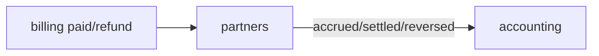

# R02 — Fronteiras: `modules/partners`

**Rodada:** R2  
**Pacote SDD:** P07  
**Data:** 2026-09-11  
**Issues:** ANX-113 · ANX-389  
**Callers:** [R01-context.md](./R01-context.md) · [R03-domain-sketch.md](./R03-domain-sketch.md) · [ROUNDS.md](./ROUNDS.md). Arquivos já existentes (fatten). Sem API runtime. Instrução: fatten partners thin R*.

## In / Out (R2)

**In:** referral, regra de comissão, acruo, batch de payout.

**Out:** Invoice (`billing`). Ledger (`accounting`). Pasta marketplace PC 29.

## Non-goals

Não spec `accepted`. Não ST08 live. Não ANX-389 `done`. Sem código de produto.

## Ownership

| Superfície | Dono |
| --- | --- |
| Referral / CommissionRule / Accrual / PayoutBatch | **partners** |
| adapter-gateway | **KEEP** |

## Objetivo

Fechar possui/não possui; comissão **não** é invoice; payout **não** é ledger; PC 29 sem pasta.

## Debate R2

**Arquiteto:** partners dono de referral + regra + acruo + batch de payout.

**Crítico:** Accrual dispara `partners.commission.accrued.v1` — accounting projeta. Refund billing **reverte** comissão (não apaga invoice).

**Security:** T01 `partners.*`; Partner console ≠ Agency leak; PII de parceiro não no grafo.

## POSSUI

Referral, CommissionRule, CommissionAccrual, PayoutBatch.

## NÃO POSSUI

| Item | Dono |
| --- | --- |
| Invoice paid | billing |
| Ledger | accounting |
| Marketplace pasta | PC 29 |
| D-GOV-010 | risk P06 |

## Non-goals

Não criar `marketplace/`, `approvals/`, `policies/`. Não confirmar payout em SQLite. Não emitir `billing.invoice.*`.

## Invariantes (`PTR-R02-INV-*`)

| ID | Regra |
| --- | --- |
| PTR-R02-INV-01 | Dono único agregados R03 |
| PTR-R02-INV-02 | Cross-module só evento/contrato |
| PTR-R02-INV-03 | SQLite não autoritativo |
| PTR-R02-INV-04 | `ownerDomain=partners` |
| PTR-R02-INV-05 | Accrual UNIQUE (invoiceId, referralId) |
| PTR-R02-INV-06 | Reversal UNIQUE (refundId) |
| PTR-R02-INV-07 | D-GOV-010 não neste módulo |

## Aceite R02

AC-R02-01 tabela IN/OUT · AC-R02-02 billing ≠ partners · AC-R02-03 sem pasta marketplace.

→ **R03** ([R03-domain-sketch.md](./R03-domain-sketch.md))
