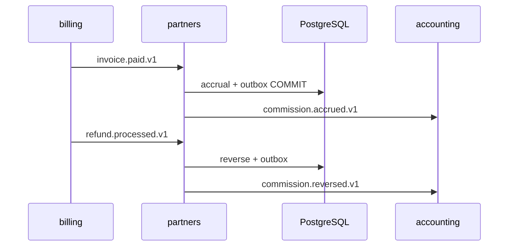

# R05 — Armazenamento: `modules/partners`

**Rodada:** R5  
**Data:** 2026-09-11  
**Issues:** ANX-389 · ANX-113  
**Callers:** [R04-contracts-events.md](./R04-contracts-events.md) · [R06-dependencies.md](./R06-dependencies.md).  
ADR0004: PG autoritativo; Neo4j projector; **sem** Timescale; SQLite **não**. ST08 **0/23**. **Sem migration.** Nomes de tabela documentais (alvo G1).

## In / Out (R5)

**In:** writes de Referral/Rule/Accrual/Payout via UoW; projector **graph** consome eventos.

**Out:** rows `partners_*` + `partners_command_journal` + outbox. Sem FK `billing_invoices`; sem montante como ledger.

## Out of scope (não gravar aqui)

| Dado | Dono |
| --- | --- |
| Invoice / webhook | **billing** |
| JournalEntry | **accounting** |
| Driver Neo4j | **graph** |
| Rails PSP payout live | defer — não neste pack |

## Non-goals

Sem migration; spec accepted; ST08 live; ANX-342/389 done; SQLite payout.

## Ownership de engines

| Store | Uso | Não |
| --- | --- | --- |
| PG `partners_referrals` | atribuição | Invoice |
| PG `partners_commission_rules` | published imutável | marketplace |
| PG `partners_accruals` | UNIQUE (invoice_id, referral_id) | ledger |
| PG `partners_reversals` | UNIQUE (refund_id) | apagar invoice |
| PG `partners_payout_batches` | state machine | SETTLED duplicado |
| PG `partners_command_journal` + outbox | UoW atômica | tokens |
| Neo4j `graph:partners:v1` | ids | neo4j-driver aqui |

**KEEP adapter-gateway**.

## Princípios

PG `partners_*` verdade; journal/outbox mesma UoW; sem FK billing/accounting; grafo `graph:partners:v1` só ids.

## Tabelas (alvo G1)

| Tabela | Propósito |
| --- | --- |
| `partners_referrals` | tenant + partner principal id |
| `partners_commission_rules` | published imutável |
| `partners_accruals` | UNIQUE (invoice_id, referral_id) |
| `partners_reversals` | UNIQUE (refund_id) |
| `partners_payout_batches` | state machine |
| `partners_command_journal` | command_id PK |

**PTR-R05-01** PG autoritativo. **PTR-R05-02** mutação+outbox. **PTR-R05-03** RLS defer P09.

## Neo4j

referral.registered → Partner/HAS_REFERRAL; accrued → ACCRUED_FROM (invoiceId lógico).

## Alternativas rejeitadas

Payout SQLite; accrual só grafo; FK invoices.

## Saída R5

Modelo v1. Nenhuma migration.
