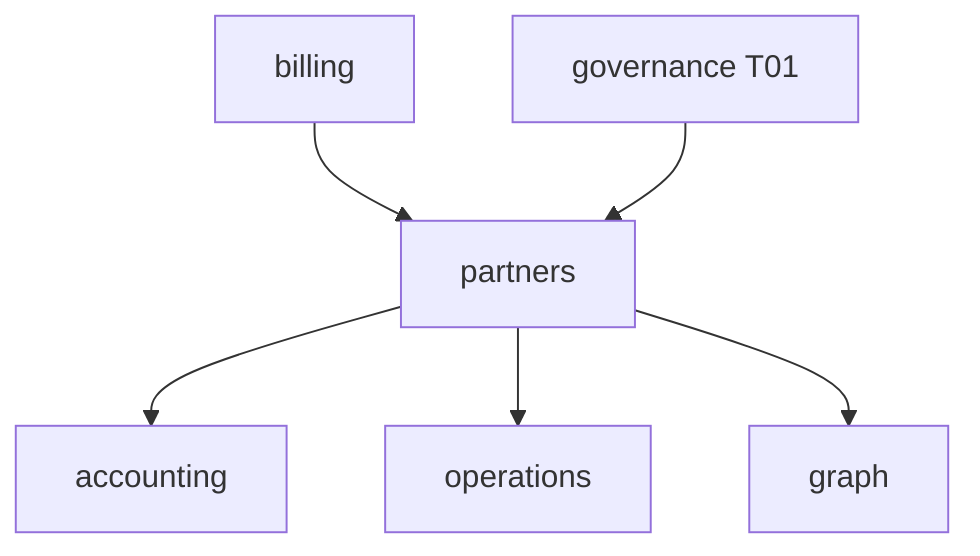

# R06 — Dependências: `modules/partners`

**Rodada:** R6  
**Data:** 2026-09-11  
**Issues:** ANX-389 · ANX-113 · gate billing ANX-103  
**Callers:** [R05-storage-pg.md](./R05-storage-pg.md) · [R07-risks.md](./R07-risks.md). Sem API runtime.

## Decisões

| ID | Decisão |
| --- | --- |
| PTR-R06-01 | Accrual só evento billing — sem import billing/infra |
| PTR-R06-02 | AgencyScopePort sem FK |
| PTR-R06-03 | T01 fail-closed |
| PTR-R06-04 | graph:partners:v1 no módulo **graph** |
| PTR-R06-05 | Não emite journal accounting |
| PTR-R06-06 | D-GOV-010 = risk P06 |
| PTR-R06-07 | Sem pasta marketplace |

## Upstream

identity, organizations, governance T01, billing events, eventing, contracts.

## Downstream

accounting, operations, graph, audit, Partner console.

## Imports proibidos

`billing/infrastructure/**`, `accounting/infrastructure/**`, `neo4j-driver`, rails de pagamento em `domain/`.

## Saída R6

Mapa v1 para R7.
