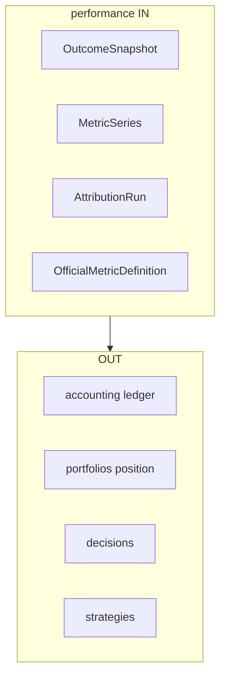

# R02 — Fronteiras: `modules/performance`

**Pacote SDD:** P06 · **Issue:** ANX-105 · pack P1 **ANX-389**  
**Callers:** [R01-context.md](./R01-context.md) · [R03-domain-sketch.md](./R03-domain-sketch.md) · [ROUNDS.md](./ROUNDS.md).

## Debate R2

**Arquiteto:** performance é dono de métricas **oficiais** (OutcomeSnapshot, MetricSeries, AttributionRun, OfficialMetricDefinition). Rebuild a partir de ledger + posição; nunca reescreve saldo.

**Crítico:** Não é segundo ledger (accounting) nem posição (portfolios). Analytics PC 22 = performance + market-data, sem pasta `analytics/`.

**Security:** Cross-tenant fail-closed. Série Timescale não autoriza capital.

## POSSUI

OutcomeSnapshot, MetricSeries (Timescale derivado), AttributionRun, OfficialMetricDefinition.

## NÃO POSSUI

| Item | Dono |
| --- | --- |
| Ledger / cash | accounting |
| Posição / NAV autoritativo | portfolios |
| Decision / TradeIntent | decisions |
| StrategyVersion | strategies |
| Ticks | market-data |
| Pasta analytics/ | PC 22 composto |

## Non-goals

Não gravar grants. SQLite não é métrica oficial. D-GOV-010 = risk P06.

## Invariantes (`PERF-R02-INV-*`)

| ID | Regra |
| --- | --- |
| PERF-R02-INV-01 | Dono único agregados R03 |
| PERF-R02-INV-02 | Cross-module só contrato/evento |
| PERF-R02-INV-03 | SQLite proibido estado autoritativo |
| PERF-R02-INV-04 | ownerDomain=performance |
| PERF-R02-INV-05 | Série Timescale **não** é saldo |
| PERF-R02-INV-06 | Rebuild idempotente (organizationId, snapshotId, revision) |

## Saída R2

Boundary aprovado para R3.
