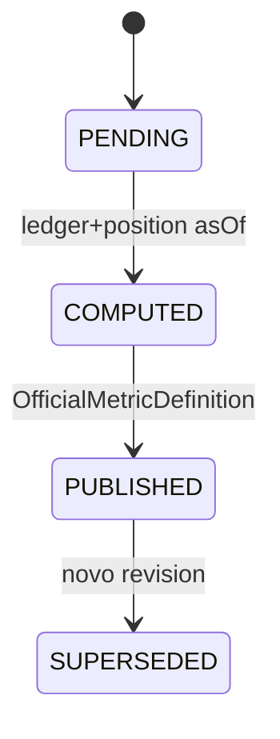

# R03 — Esboço de domínio: `modules/performance`

**Rodada:** R3  
**Data:** 2026-09-11  
**Issue:** ANX-105 · pack ANX-389  
**Callers:** [R02-boundaries.md](./R02-boundaries.md) · [R04-contracts-events.md](./R04-contracts-events.md). Spec 003 **draft**.

## In / Out (R3)

**In:** agregados OfficialMetricDefinition, OutcomeSnapshot, AttributionRun, MetricSeries; ports UoW + consumers ledger/position; comandos Record/Publish/Compute/Register.

**Out:** esboço para R4. **Não** muta accounting/portfolios. Fill só cross-check.

## Non-goals

Não spec `accepted`. Não ST08 live. Não ANX-342/389 `done`. Não pasta `analytics/`.

## Ownership (domínio)

| Superfície | Dono |
| --- | --- |
| OfficialMetricDefinition / OutcomeSnapshot / AttributionRun / MetricSeries | **performance** |
| JournalEntry | **accounting** |
| Position | **portfolios** |
| Fill | **execution** |
| adapter-gateway | **KEEP** |

## Agregados

| Agregado | Papel |
| --- | --- |
| OfficialMetricDefinition | Catálogo versionado (código, unidade, fórmula hash) |
| OutcomeSnapshot | P&L/NAV **oficial** asOfRevision + valuationVersion |
| AttributionRun | Atribuição strategy/agent; input hashes |
| MetricSeries | Pontos Timescale derivados — **não** saldo |

## Ports

| Port | Uso |
| --- | --- |
| PerformanceUnitOfWork | estado + journal + outbox |
| LedgerPostedConsumer | `accounting.ledger.posted.v1` |
| PositionUpdatedConsumer | `portfolios.position.updated.v1` |
| FillCrossCheckPort | `execution.fill.confirmed.v1` só reconciliação |
| TraversalEvaluator | T01 `performance.read` |
| AgencyScopePort | tenancy |

## Comandos

| Comando | Evento |
| --- | --- |
| RecordOutcomeSnapshot | `performance.outcome.recorded.v1` |
| PublishMetricSnapshot | `performance.metric.snapshot.v1` |
| ComputeAttribution | `performance.attribution.computed.v1` |
| RegisterMetricDefinition | `performance.metric_definition.published.v1` |

**PERF-R03-01:** rebuild projector idempotente. **PERF-R03-02:** fill NÃO substitui ledger para cash.

## Saída R3

Para R4.
