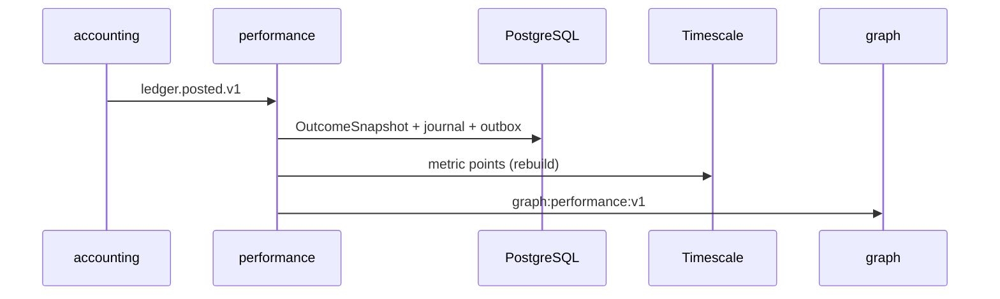

# R05 — Armazenamento: `modules/performance`

**Issue:** ANX-105 · pack ANX-389  
**Callers:** [R04-contracts-events.md](./R04-contracts-events.md) · [R06-dependencies.md](./R06-dependencies.md).  
ADR0004: PG autoritativo; Timescale **derivado**; Neo4j via `graph:performance:v1`; SQLite não oficial. Storage map **draft**; ST08 0/23.

## Princípios

| Princípio | Decisão |
| --- | --- |
| Snapshot / definition / attribution | PostgreSQL `performance_*` |
| Séries | Timescale hypertables read-model |
| Journal/outbox | mesma transação PG |
| FK cross-module | **Não** |
| Série = saldo | **Proibido** |

## Tabelas (alvo G1 — sem migration neste pack)

| Tabela | Engine |
| --- | --- |
| `performance_metric_definitions` | PG |
| `performance_outcome_snapshots` | PG |
| `performance_attribution_runs` | PG |
| `performance_command_journal` | PG |
| `performance_metric_points` | Timescale |
| `performance_pnl_series` | Timescale |

**PERF-R05-01** PG autoritativo. **PERF-R05-02** UoW+outbox. **PERF-R05-03** RLS defer P09.

## Alternativas rejeitadas

SQLite oficial; Timescale ledger; FK accounting.

## Saída R5

Para R6.
