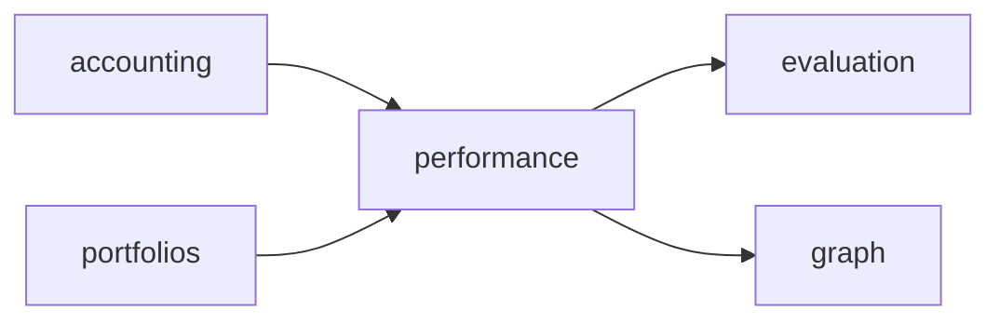

# R06 — Dependências: `modules/performance`

**Issues:** ANX-105 · ANX-106 · pack ANX-389  
**Callers:** [R05-storage-pg.md](./R05-storage-pg.md) · [R07-risks.md](./R07-risks.md).

## Decisões

| ID | Decisão |
| --- | --- |
| PERF-R06-01 | Consome accounting + portfolios; fill só cross-check |
| PERF-R06-02 | T01 `performance.read` / admin |
| PERF-R06-03 | Projector graph:performance:v1 no **graph** |
| PERF-R06-04 | Não importa infrastructure de accounting |
| PERF-R06-05 | evaluation/billing consomem eventos — billing usage ≠ P&L trading |

## Upstream

| Módulo | Uso |
| --- | --- |
| accounting | `ledger.posted.v1` |
| portfolios | `position.updated.v1` |
| execution | fill confirm (reconciliação) |
| decisions / strategies | ids para attribution |
| identity / organizations / governance | actor + T01 |
| packages/eventing | journal/outbox |

## Downstream

evaluation, billing (reports), operations, frontend Owner, audit, graph.

## Imports proibidos

`accounting/infrastructure/**`, `neo4j-driver`, secrets em domain/.

## Saída R6

Para R7.
