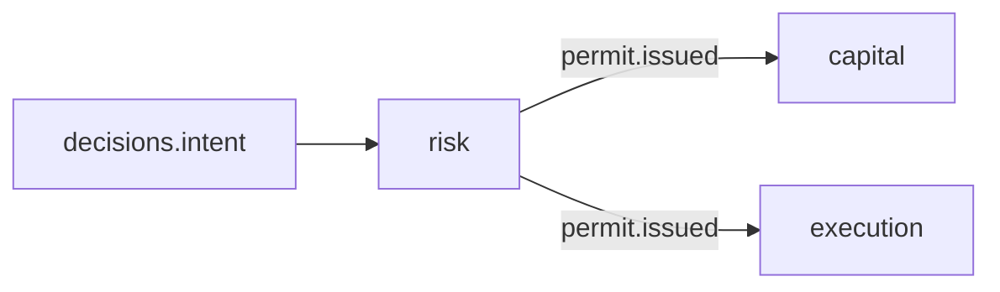

# R01 — Contexto: `modules/risk`

**Componente:** modules/risk  
**Rodada:** R1 — Inventário documental  
**Pacote SDD:** P06  
**Data:** 2026-09-11  
**Issue pack:** ANX-389 · debate estrutura ANX-42 · debate módulo **ANX-99** · impl futura **ANX-100** (não neste pack) · gate ANX-58  
**Callers:** [R02-boundaries.md](./R02-boundaries.md) · [ROUNDS.md](./ROUNDS.md).

## Objetivo da rodada

Inventariar políticas/limites de risco, checks e kill switch. D-GOV-010 vive **aqui** (P06). Spec 003 **draft**. ST08 **0/23**. SIMULATED|PAPER only v1. Não stamp `accepted`. Não done ANX-342 / ANX-389. Não G1.

## Propósito

Risk **avalia** TradeIntent (hash) e exposição canônica, **emite** RiskPermit ou DENY fail-closed, e **opera** kill switch + `riskEpoch`. **Não** executa ordem. **Não** reserva capital. **Não** é MandateVersion (governance).

## In / Out (R1)

**In:** `decisions.intent.submitted.v1`; `portfolios.position.updated.v1`; `capital.reservation.created.v1` (consulta); preços asOf de market-data; PolicyReference de governance (não o corpo até P06 LimitPolicy).

**Out:** `risk.check.completed.v1`; `risk.permit.issued.v1`; `risk.epoch.bumped.v1`; `risk.kill_switch.activated.v1`. LimitPolicy / ExposureSnapshot / RiskCheckResult / RiskPermit em PG. Projector `graph:risk:v1`.

**Não sai:** `execution.order.*`; mutate de saldo; apply de grant.

## O módulo POSSUI

LimitPolicy (PolicyVersion kind=RISK), RiskCheck / RiskCheckResult, limites, riskEpoch, kill switch, RiskPermit, ExposureSnapshot.

## O módulo NÃO POSSUI (ownership nomeado)

| Item | Dono |
| --- | --- |
| Grants genéricos / MandateVersion | **governance** |
| TradeIntent | **decisions** |
| Ordens / fills | **execution** (revalida permit) |
| Reserva / saldo | **capital** |
| Posição canônica | **portfolios** |
| Preços | **market-data** |

## Non-goals

- REAL/live v1 (schema reject).
- SQLite como estado de risco.
- LLM override de DENY determinístico.
- Post-trade S4 defer.
- Migration / ST08 live.

## Dependências

| Direção | Componentes |
| --- | --- |
| Upstream | governance, portfolios, market-data, decisions, capital (consulta) |
| Downstream | execution, decisions, graph, operations (incidentes), audit |

## Armazenamento

PG políticas/checks/permits/kill switch. Neo4j restrições via projector. SQLite **não** validar risco. ST08 0/23.

## Estado do código

**Ausente** como bounded context completo.

## Oráculos (não executados)

| ID | Gate | Esperado |
| --- | --- | --- |
| G3-RK-S2-01 | G3 | check PASS emite permit |
| G3-RK-S2-02 | G3 | CONFIG_REQUIRED deny |
| G5-RK-01 | G5 | cross-tenant RK_CROSS_TENANT |

→ **R02** ([R02-boundaries.md](./R02-boundaries.md))
