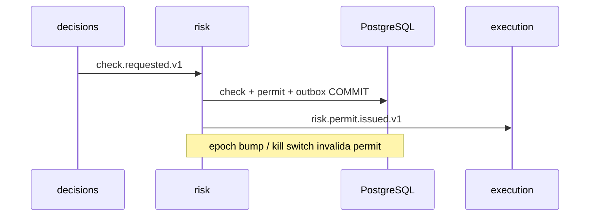

# R05 — Armazenamento: `modules/risk`

**Rodada:** R5  
**Data:** 2026-09-11  
**Issues:** ANX-389 · ANX-99  
**Callers:** [R04-contracts-events.md](./R04-contracts-events.md) · [R06-dependencies.md](./R06-dependencies.md).  
ADR0004: PG autoritativo; Neo4j projector; **sem** Timescale para check/permit; SQLite **não**. ST08 **0/23**. **Sem migration.** Nomes de tabela documentais (alvo G1). D-GOV-010 (corpo PolicyVersion RISK) **deferido P06** — este pack só nomeia `risk_limit_policies` + PolicyReference em governance.

## In / Out (R5)

**In:** PG `risk_*`, journal/outbox, kill switch/epoch neste módulo.

**Out:** Timescale check/permit. SQLite. FK capital/portfolios. D-GOV-010 corpo completo (defer P06).

## Non-goals

Não spec `accepted`. Não ST08 live. Não ANX-389 `done`. Sem código de produto.

## Ownership

| Superfície | Dono |
| --- | --- |
| Store `risk_*` | **risk** |
| adapter-gateway | **KEEP** |

## Princípios

PG `risk_*` verdade; journal/outbox mesma UoW; sem FK capital/portfolios; grafo `graph:risk:v1` só ids. Kill switch e epoch são estado deste módulo, não do board.

## Tabelas (alvo G1)

| Tabela | Propósito |
| --- | --- |
| `risk_limit_policies` | LimitPolicy publicada; UNIQUE (org_id, policy_id, revision) |
| `risk_exposure_snapshots` | ExposureSnapshot asOf; rebuildável |
| `risk_check_results` | RiskCheckResult append-only |
| `risk_permits` | RiskPermit single-use; UNIQUE (org_id, permit_id) |
| `risk_kill_switch_state` | hierarquia GLOBAL→ORG→PORTFOLIO |
| `risk_epoch_registry` | riskEpoch monotônico por org |
| `risk_command_journal` | command_id PK; owner_domain=risk |

## Invariantes storage (`RK-R05-*`)

| ID | Regra |
| --- | --- |
| RK-R05-01 | Nenhum check/permit/kill switch autoritativo fora PostgreSQL |
| RK-R05-02 | Mutação + outbox na mesma transação |
| RK-R05-03 | Permit single-use; CONSUMED não reemite |
| RK-R05-04 | Sem FK para `capital_*` / `portfolios_*` |
| RK-R05-05 | SQLite / WAL local → rejeitado em CI |
| RK-R05-06 | RLS defer P09 — application-only tenancy |
| RK-R05-07 | D-GOV-010 corpo PolicyVersion RISK **não** migrado neste pack |

## Neo4j

check.completed → RESTRICTS / VIOLATED (ids). Sem segundo writer de permit.

## Alternativas rejeitadas

Check em SQLite; permit só no grafo; FK para portfolios_positions; pasta `policies/` no repo.

## Saída R5

Modelo v1 nomeado. Nenhuma migration. D-GOV-010 = P06.
