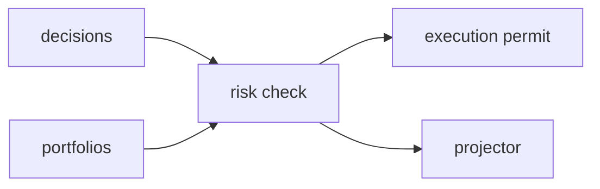

# R06 — Dependências: `modules/risk`

**Rodada:** R6 · 2026-09-11 · ANX-389 · ANX-99  
**Callers:** [R05-storage-pg.md](./R05-storage-pg.md) · [R07-risks.md](./R07-risks.md).

## In / Out (R6)

**In:** PolicyReference (governance); exposição (portfolios); reservas (capital consulta); preços (market-data); StrategyVersion hash (strategies); pré-TradeIntent (decisions).

**Out:** RiskCheckResult → decisions; bloqueio de reserva → capital; RiskPermit → execution; projector graph; audit. **Não** import execution-go / neo4j-driver / secrets de venue.

## Non-goals

- Não import execution-go / neo4j-driver / secrets de venue.
- D-GOV-010 **é** deste módulo (P06) — não reenviar para evaluation.
- Não spec `accepted`. Não ST08 live. Não ANX-342/389 `done`.

## Ownership

| Superfície | Dono |
| --- | --- |
| LimitPolicy / ExposureSnapshot / RiskCheckResult / RiskPermit | **risk** |
| MandateVersion declarativo | **governance** |
| Reserva saldo | **capital** (consulta) |
| adapter-gateway | **KEEP** |

## Debate R6

**Arquiteto:** corpo RISK executável = LimitPolicy **aqui**. Governance só PolicyReference.

**Crítico:** capital gate on permit.issued — risk não muta reserva.

## Upstream

| Módulo | Uso |
| --- | --- |
| governance | PolicyReference; corpo RISK = LimitPolicy **aqui** P06 |
| portfolios | exposição canônica |
| capital | reservas/saldos para limite (consulta) |
| market-data | preços para check |
| strategies | StrategyVersion hash |
| decisions | pré-TradeIntent check |
| identity / organizations | actor + AgencyScope |

## Downstream

decisions (RiskCheckResult), capital (gate reserva), execution (permit), audit, graph projector, operations (kill switch incidente).

Imports proibidos: execution-go direto, Neo4j driver, secrets de venue.

## Oráculos de fronteira

| ID | Esperado |
| --- | --- |
| G3-RK-S2-01 | PASS → permit |
| G3-RK-S2-02 | CONFIG_REQUIRED deny |
| G5-RK-01 | cross-tenant reject |

## Saída R6

Para R07.
