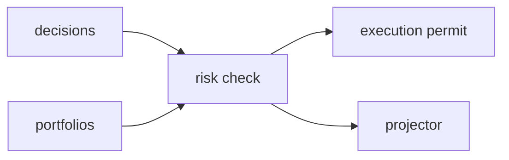

# R06 — Dependências: `modules/risk`

**Rodada:** R6  
**Data:** 2026-09-11

## Upstream

| Módulo | Uso |
| --- | --- |
| governance | PolicyReference; NÃO corpo RISK até P06 |
| portfolios | exposição canônica |
| capital | reservas/saldos para limite |
| market-data | preços para check |
| strategies | StrategyVersion hash |
| decisions | pré-TradeIntent check |

## Downstream

decisions (RiskCheckResult), capital (bloqueio reserva), execution (permit), audit, graph projector.

Imports proibidos: execution-go direto, Neo4j driver, secrets de venue.

## Saída R6

Para R07.
