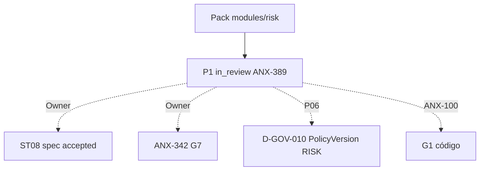

# R10 — Pacote G0 (handoff): `modules/risk`

**Rodada:** R10  
**Data:** 2026-09-11  
**Issues:** ANX-389 (pack P1) · ANX-99 (debate histórico) · **ANX-100** (impl — **não** executada neste pack)  
**Callers:** [R09-dev-plan.md](./R09-dev-plan.md) · [ROUNDS.md](./ROUNDS.md). Sem código de produto. Specs 001–005 **draft**. ANX-342 permanece `todo`. D-GOV-010 = **risk P06** (deferido — não implementado neste pack).

## Classificação epistemológica

| Afirmação | Status |
| --- | --- |
| Debate R01–R10 neste dir | fechado P1 documental |
| Specs 001–005 | **draft** (ST08 0/23) |
| ANX-342 | **todo** — não hijack |
| D-GOV-010 | **risk P06** — pack só referencia PolicyReference |
| Pasta approvals/policies | **não criar** — PolicyVersion RISK = D-GOV-010 P06 |
| Código `backend/modules/risk` | pack ≠ G1/G7 |

## In scope documental

| Área | Entrega |
| --- | --- |
| Domínio | LimitPolicy, ExposureSnapshot, RiskCheckResult, RiskPermit, KillSwitchState, RiskEpoch |
| Contratos | `@anxionos/contracts/risk/*` + eventos R04 |
| Persistência nomeada | PostgreSQL `risk_limit_policies`, `risk_exposure_snapshots`, `risk_check_results`, `risk_permits`, `risk_kill_switch_state`, `risk_epoch_registry`, `risk_command_journal` |
| Grafo | projector `graph:risk:v1` — restrições/violações (ids) |
| API | `/v1/risk` esboço R04 |
| Testes | G3-RK-* / G5-RK-* abaixo |

## Out of scope

| Item | Destino |
| --- | --- |
| Corpo PolicyVersion RISK (D-GOV-010) | **este módulo, P06** — não neste pack |
| ChangeProposal / Grant | governance |
| Order submit | execution |
| Position canônica | portfolios |
| Neo4j driver | graph |
| Spec accepted | Owner + checklist |
| ANX-342 G7 | Owner |
| G1 código ANX-100 | issue distinta |

## Non-goals

- Nenhuma migration ST08 neste pack.
- SQLite **não** valida risco autoritativo.
- Risk **não** duplica Position/Allocation; lê snapshots/contratos.
- Sem pasta `approvals/` / `policies/` no repo.
- Kill switch **não** é implementado como código neste pack; só contrato + tabela nomeada.
- Sem FK para capital/portfolios (UoW local).

## Oráculos G3 / G5 (fecho do pack)

| ID | Gate | Esperado |
| --- | --- | --- |
| G3-RK-S2-01 | G3 | check PASS emite permit |
| G3-RK-S2-02 | G3 | CONFIG_REQUIRED deny |
| G3-RK-S2-03 | G3 | cross-tenant reject |
| G3-RK-S2-04 | G3 | stale epoch reject |
| G3-RK-S2-05 | G3 | limit exceeded deny |
| G5-RK-01 | G5 | portfolio org-A + intent org-B → RK_CROSS_TENANT |
| G5-RK-02 | G5 | kill switch após PASS → RK_PERMIT_STALE |
| G5-RK-03 | G5 | policy revogada + epoch bump → RK_POLICY_STALE |

## Critérios de aceite **deste** pack (P1 documental)

| # | Critério |
| --- | --- |
| AC-P1-01 | In/out/non-goals explícitos |
| AC-P1-02 | Oráculos G3/G5 nomeados |
| AC-P1-03 | Tabelas PG nomeadas em R05 + R10 |
| AC-P1-04 | Decision log R08 com P1-RK-* |
| AC-P1-05 | R09 **sem** greenlight G1 |
| AC-P1-06 | D-GOV-010 explícito como P06 |

**Veredito P1:** G0 documental completo. **Não** autoriza G1. D-GOV-010 permanece P06.

## Saída R10

G0 debate P1 fechado. ANX-389 evidência — não G7. ANX-342 `todo`. Specs 001–005 **draft**. D-GOV-010 = risk P06.
