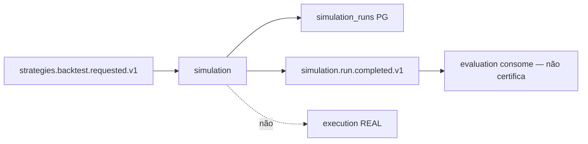

# R01 — Contexto: `modules/simulation`

**Componente:** modules/simulation  
**Rodada:** R1 — Inventário documental  
**Pacote SDD:** P08  
**Data:** 2026-09-11  
**Issue pack:** ANX-389 · debate módulo **ANX-115** · impl futura **ANX-116** (não neste pack)  
**Callers:** [R02-boundaries.md](./R02-boundaries.md) · [ROUNDS.md](./ROUNDS.md).  
**Fonte serial:** PC 21 (Digital Twin / experiments) — composto **sem pasta** `experiments/`. Spec 004 (evolução institucional) permanece **draft**.

## In / Out (R1)

**In:** inventário de Twin, cenário pinado, run isolado e checkpoint de sandbox neste pack.

**Out:** este contexto. **Não** Certification (`evaluation`). **Não** Order REAL (`execution`). **Não** ChangeProposal (`governance`). Sem código de produto.

## Non-goals

Não spec `accepted`. Não ST08 live. Não ANX-342/389 `done`. Não pastas `approvals/` / `policies/` / `experiments/`. D-GOV-010 = **risk P06**.

## Ownership

| Superfície | Dono |
| --- | --- |
| SimulationRun / ScenarioSnapshot / TwinManifest / SandboxCheckpoint | **simulation** |
| StrategyVersion verdade | **strategies** |
| CertificationIssued | **evaluation** |
| Order / Fill REAL | **execution** |
| adapter-gateway | **KEEP** |

## Propósito

Digital Twin e execução **isolada** de cenários/backtests. Snapshots **não** mutam produção. Código de produto **ausente**; este pack é G0 documental. Spec 004 permanece **draft** (ST08 0/23). PC 21 não cria 24º módulo.

## O módulo POSSUI (estado)

- TwinManifest (fidelityTier; só `TIER_SIMULATED` completa para evaluation)
- ScenarioSnapshot (datasetRef + hash pinado)
- SimulationRun (seed, status, resultRef)
- SandboxCheckpoint (path isolado; cleanup COMPLETED/FAILED)

## O módulo NÃO POSSUI

| Item | Dono |
| --- | --- |
| Certification / auto-promote | evaluation |
| ChangeProposal / apply | governance |
| Ordens / fills REAL | execution |
| StrategyVersion verdade | strategies |
| Ticks / candles autoritativos | market-data (fixtures por hash) |
| P&L oficial | performance |
| Kill switch / D-GOV-010 | risk P06 |
| Pasta `experiments/` | PC 21 composto |

## Dependências

| Direção | Componentes |
| --- | --- |
| Upstream | strategies (`backtest.requested.v1`), market-data (fixtures hash), governance (grant experimento), identity, organizations, graph T01 |
| Downstream | evaluation (`run.completed.v1`), strategies (resultRef, **sem** mutar version), audit, graph projector isolado |

## Armazenamento (mapa draft)

PostgreSQL autoritativo (`simulation_*` + journal + outbox). Object store: resultRef. SQLite: sandbox **non-auth** `{SANDBOX_ROOT}/{organizationId}/{runId}/sandbox.db`. Neo4j: **somente** `graph:simulation:v1` (subgrafo isolado — **não** muta grafo de produção). Fonte: `brain/notes/anxionos-storage-ownership.md` (**draft**; ST08 0/23).

## Spec / ADR

| Artefato | Papel | Status |
| --- | --- | --- |
| ADR0002 | módulo físico `simulation/` | accepted |
| ADR0004 | PG + Neo4j; SQLite só sandbox | accepted |
| spec 001 | envelope / tenancy | **draft** |
| spec 004 | Twin / promoção — simulation **não** certifica | **draft** |
| PC 21 | composto — **sem pasta** `experiments/` | P1 |

## Estado do código

**Ausente** neste pack. ANX-116 não começa aqui.

## Debate R1 (síntese atribuída)

**Explorador:** o pack canônico em `docs/orchestration/modules/simulation/` estava abaixo da profundidade agents/billing (R02–R04 ~175–194 palavras). R1 fecha inventário **neste** diretório.

**Arquiteto:** simulation é o runtime isolado do Twin — não é evaluation, não é execution REAL, não é o dono de StrategyVersion.

**Crítico:** não criar pasta `experiments/`. Spec 004 permanece `draft` até checklist de promoção evidenciado (não está). Não stamp ST08.

**Security:** sandbox deny-by-default; credenciais REAL **proibido**; T01 no start run.

**Orquestrador:** R1 fecha inventário. Próximo: R2 fronteiras.

## Diagrama de contexto

## Saída R1

Inventário fechado. → **R02** ([R02-boundaries.md](./R02-boundaries.md))
