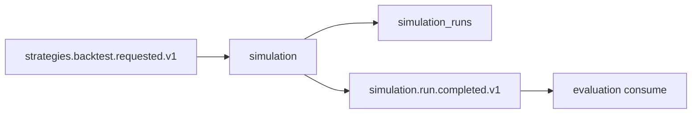

# R01 — Contexto: `modules/simulation`

**Rodada:** R1 · P08 · 2026-09-11 · ANX-389 · ANX-115  
**Callers:** [R02-boundaries.md](./R02-boundaries.md) · [ROUNDS.md](./ROUNDS.md). Fatten in-place. Fonte: `brain/notes/anxionos-pc21-experiments-debate.md`. Instrução: fatten simulation.

## Propósito

Digital Twin e execução **isolada** de cenários/backtests. Snapshots **não** mutam produção. **Não** aplica ChangeProposal (governance). **Não** certifica (evaluation). **Não** emite ordens reais (execution). Specs **draft**. Sem `approvals/`. D-GOV-010 em **risk P06**.

## POSSUI

SimulationRun, ScenarioSnapshot, TwinManifest, SandboxCheckpoint.

## NÃO POSSUI

| Item | Dono |
| --- | --- |
| Certification / promote | evaluation |
| ChangeProposal | governance |
| Ordens / fills | execution |
| StrategyVersion verdade | strategies |
| Ticks autoritativos | market-data (fixtures) |

SQLite sandbox **non-auth** por run. PG autoritativo para estado do run. ST08 0/23.

## In / Out (R1)

**In:** `strategies.backtest.requested.v1` ou POST run (grant SIMULATED); datasetRef+hash; seed.
**Out:** SimulationRun PG + `simulation.run.started.v1` / completed / failed; resultRef object store. **Não** execution.order.*, **não** evaluation.certification.*, **não** mutação de capital.

→ **R02** ([R02-boundaries.md](./R02-boundaries.md))
