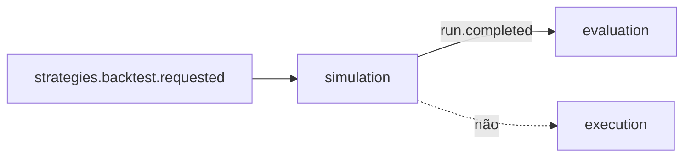

# R02 — Fronteiras: `modules/simulation`

**Rodada:** R2 · P08 · ANX-115 · ANX-389  
**Callers:** [R01-context.md](./R01-context.md) · [R03-domain-sketch.md](./R03-domain-sketch.md). Sem API runtime. Instrução: fatten simulation.

## POSSUI

SimulationRun, ScenarioSnapshot, TwinManifest, SandboxCheckpoint.

## NÃO POSSUI

| Item | Dono |
| --- | --- |
| Certification | evaluation |
| Order / REAL | execution |
| Strategy publish | strategies |
| D-GOV-010 | risk P06 |
| Pasta experiments/ | PC 21 composto |

## Non-goals

Egress REAL; SQLite como verdade cross-tenant; emitir `execution.order.*`; auto-promote.

## Invariantes SIM-R02-INV-*

01 dono único · 02 só eventos · 03 SQLite sandbox non-auth · 04 ownerDomain=simulation · 05 deny network REAL · 06 TIER_SIMULATED para completed→evaluation · 07 D-GOV-010 não aqui.

→ **R03** ([R03-domain-sketch.md](./R03-domain-sketch.md))
