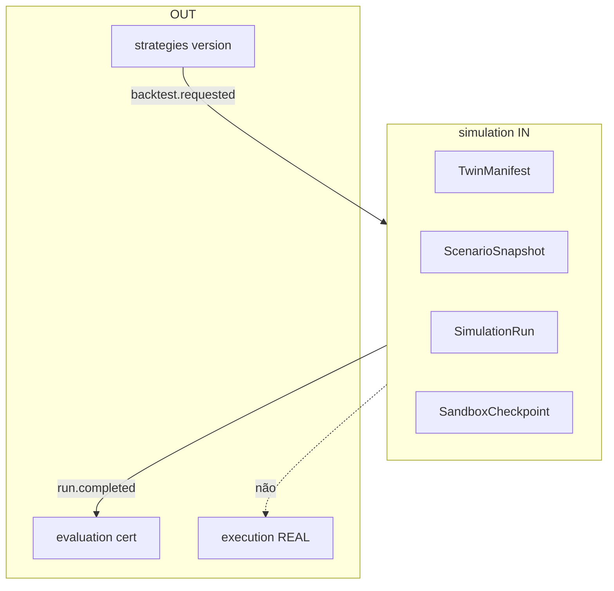

# R02 — Fronteiras: `modules/simulation`

**Componente:** modules/simulation  
**Rodada:** R2 — Scope boundary  
**Pacote SDD:** P08  
**Data:** 2026-09-11  
**Issue debate:** ANX-115 · pack **ANX-389**  
**Callers:** [R01-context.md](./R01-context.md) · [R03-domain-sketch.md](./R03-domain-sketch.md) · [ROUNDS.md](./ROUNDS.md). Sem API runtime.

## In / Out (R2)

**In:** TwinManifest, ScenarioSnapshot, SimulationRun, SandboxCheckpoint; consumer `strategies.backtest.requested.v1`; POST run com grant SIMULATED; datasetRef+hash; seed; AgencyScopePort; TraversalEvaluator (`TIER_SIMULATED`).

**Out:** Certification (`evaluation`). Order REAL (`execution`). Strategy publish (`strategies`). D-GOV-010 (`risk` P06). Pasta `experiments/` (PC 21).

## Non-goals

Não spec `accepted`. Não ST08 live. Não ANX-389 `done`. Sem código de produto. Sem egress REAL. Sem SQLite como verdade cross-tenant. Sem emitir `execution.order.*`. Sem auto-promote.

## Ownership

| Superfície | Dono |
| --- | --- |
| SimulationRun / ScenarioSnapshot / TwinManifest / SandboxCheckpoint | **simulation** |
| adapter-gateway | **KEEP** |

## Objetivo da rodada

Fechar **possui / não possui** entre simulation e vizinhos; ratificar que `run.completed` **não** é Certification; proibir pasta `experiments/` e SQLite autoritativo.

## Fontes aplicadas

| Fonte | Uso em R2 |
| --- | --- |
| [R01-context.md](./R01-context.md) | Inventário |
| spec 004 | Twin / avaliação — **draft** |
| ADR0002 | dono físico |
| ADR0004 | PG verdade do run; SQLite sandbox |
| ANX-115 | debate histórico |

## Debate R2 (síntese)

**Arquiteto:** simulation é o motor isolado: manifesto, snapshot hash, run, checkpoint. Completa para evaluation **somente** com `TIER_SIMULATED`.

**Crítico:** O que não entra? Certification, Order REAL, mutação de capital, ChangeProposal. Evaluation **consome** completed; **não** certifica neste módulo.

**Security:** T01 no start; network deny-by-default; path sandbox `orgId/runId`; credenciais **proibido**.

**QA:** hash mismatch → FAILED; completed não emite `evaluation.certification.*` nem `execution.order.*`.

## O módulo POSSUI

SimulationRun, ScenarioSnapshot, TwinManifest, SandboxCheckpoint.

## O módulo NÃO POSSUI

| Item | Dono correto |
| --- | --- |
| Certification / promote | evaluation |
| Order / Fill REAL | execution |
| StrategyVersion verdade | strategies |
| D-GOV-010 / kill switch | risk P06 |
| ChangeProposal | governance |
| Pasta experiments/ | PC 21 composto — **sem pasta** |

## Non-goals (lista)

- Não criar `approvals/`, `policies/`, `experiments/`.
- Não persistir ticks autoritativos (market-data).
- Não confirmar Twin em SQLite compartilhado.
- LIVE/REAL de **trading** é fail-closed (SIM_REAL_EGRESS_FORBIDDEN).

## Decisão: possui / não possui

| Dado / comportamento | Dono |
| --- | --- |
| SimulationRun, Snapshot, Manifest, Checkpoint | **simulation** |
| StrategyVersion | **strategies** |
| CertificationIssued | **evaluation** |
| Order REAL | **execution** |

## Invariantes R02 (`SIM-R02-INV-*`)

| ID | Regra |
| --- | --- |
| SIM-R02-INV-01 | Dono único dos agregados R03 |
| SIM-R02-INV-02 | Cross-module só contrato/evento — sem FK cross-schema |
| SIM-R02-INV-03 | SQLite sandbox non-auth — **nunca** ledger/grant/ordem |
| SIM-R02-INV-04 | `ownerDomain=simulation` em comandos/eventos |
| SIM-R02-INV-05 | Deny network REAL; SIM_REAL_EGRESS_FORBIDDEN |
| SIM-R02-INV-06 | Só `TIER_SIMULATED` completa para evaluation |
| SIM-R02-INV-07 | D-GOV-010 **não** vive neste módulo |

## Critérios de aceite — R02

| # | Critério | Status |
| --- | --- | --- |
| AC-R02-01 | Tabela possui/não possui | ✅ |
| AC-R02-02 | simulation ≠ evaluation ≠ execution | ✅ |
| AC-R02-03 | SQLite non-auth + sem pasta experiments/ | ✅ |

→ **R03** ([R03-domain-sketch.md](./R03-domain-sketch.md))
