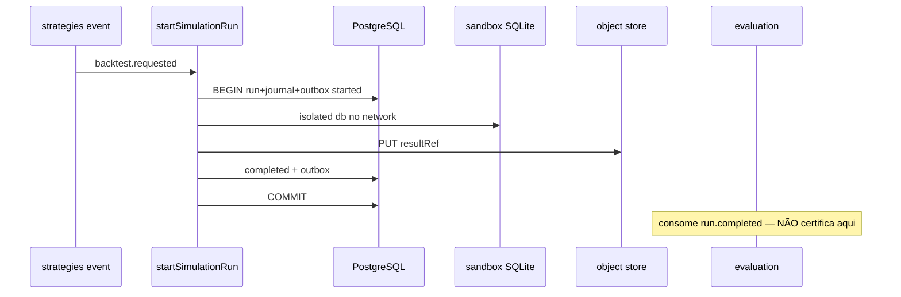

# R05 — Armazenamento: `modules/simulation`

**Rodada:** R5 · 2026-09-11 · ANX-389 · debate ANX-115 · **não** impl ANX-116  
**Callers:** [R04-contracts-events.md](./R04-contracts-events.md) · [R06-dependencies.md](./R06-dependencies.md).  
**Fonte:** `brain/notes/anxionos-storage-ownership.md` · ADR0004 · P08 na estrutura.

## In / Out (R5)

**In:** PG run/snapshot/manifest; object store resultRef; SQLite sandbox non-auth; projector isolado.

**Out:** Mutar grafo de produção. SQLite como ledger. Certificação (`evaluation`).

## Ownership

| Superfície | Dono |
| --- | --- |
| SimulationRun / Snapshot / Manifest | **simulation** |
| adapter-gateway | **KEEP** |

## In scope

| Engine | O que simulation **possui** |
| --- | --- |
| PostgreSQL | Manifestos, SimulationRun, snapshots oficiais, command journal |
| Object store | Payloads de resultado / dumps por **resultRef** (hash) |
| SQLite sandbox | `{SANDBOX_ROOT}/{organizationId}/{runId}/sandbox.db` — **non-auth**, local ao run |
| Neo4j | Subgrafo isolado **só** via `graph:simulation:v1` (snapshot/diff); **não** muta grafo de produção |

## Out of scope

| Dado | Dono |
| --- | --- |
| Ticks / candles autoritativos | `market-data` (fixtures **hashes** copiados, não write path) |
| StrategyVersion | `strategies` |
| Certification | `evaluation` |
| Orders / fills | `execution` |
| ChangeProposal | `governance` |
| P&L oficial | `performance` |
| D-GOV-010 PolicyVersion | `risk` P06 |
| Driver Neo4j | `graph` |

## Non-goals

Sem migration; ST08 0/23; pasta `experiments/` **não** existe (PC 21); SQLite **nunca** ledger/grant/ordem; specs `draft`; sem G1.

## Princípios

| Princípio | Decisão |
| --- | --- |
| Estado do run | PostgreSQL `simulation_*` |
| Sandbox | SQLite 0700; cleanup ON COMPLETE; TTL 24h failed; **sem ATTACH** externo |
| Credenciais | **Proibido** no sandbox (SIM_REAL_EGRESS_FORBIDDEN) |
| FK cross-module | **Não** |
| Dataset | hash pinado no manifest; mismatch → FAILED |

## Fluxo run

## Tabelas PostgreSQL

| Tabela | Propósito |
| --- | --- |
| `simulation_manifests` | TwinManifest; dataset_hash; sandbox_policy |
| `simulation_runs` | SimulationRun; status; result_ref; UNIQUE via journal |
| `simulation_snapshots` | ScenarioSnapshot metadata; blob no object store |
| `simulation_command_journal` | command_id PK |

**SIM-R05-01:** PG é verdade do run.  
**SIM-R05-02:** UoW + outbox.  
**SIM-R05-03:** SQLite nunca verdade cross-tenant / financeira.  
**SIM-R05-04:** dataset hash obrigatório.  
**SIM-R05-05:** RLS defer P09.

## Alternativas rejeitadas

SQLite compartilhado entre tenants; sandbox com credenciais REAL; Neo4j de produção como twin; hypertable de ticks **neste** módulo.

## Oráculos

| ID | Gate | Esperado |
| --- | --- | --- |
| G3-SIM-01 | G3 | backtest.requested → started + completed (ou failed) com journal |
| G3-SIM-02 | G3 | hash mismatch → FAILED SIM_DATASET_HASH_MISMATCH; sem result oficial |
| G3-SIM-03 | G3 | completed **não** emite certification.* |
| G5-SIM-01 | G5 | cross-tenant GET run → 403 |
| G5-SIM-02 | G5 | tentativa REAL egress → SIM_REAL_EGRESS_FORBIDDEN; run failed |
| G5-SIM-04 | G5 | apagar sandbox.db não altera `simulation_runs` (ST04) |

## Saída R5

Modelo v1. Sem migration.
