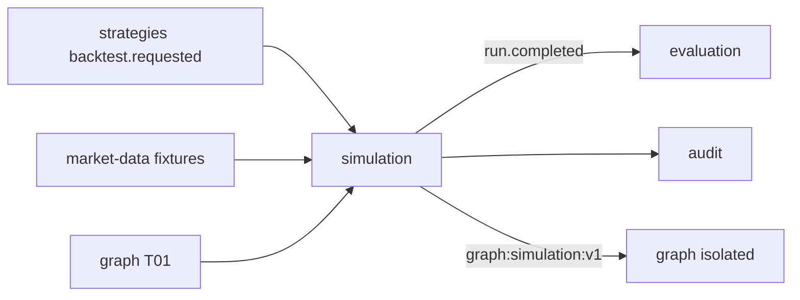

# R06 — Dependências: `modules/simulation`

**Rodada:** R6 · 2026-09-11 · ANX-389 · ANX-115  
**Callers:** [R05-storage-pg.md](./R05-storage-pg.md) · [R07-risks.md](./R07-risks.md).  
**Fonte:** `brain/notes/anxionos-backend-structure.md`.

## In / Out (R6)

**In:** backtest.requested; fixtures pinadas; grant de experimento; T01 start run.

**Out:** Certificação. Ordens reais. Pasta `experiments/`. D-GOV-010.

## Ownership

| Superfície | Dono |
| --- | --- |
| Contratos simulation.* | **simulation** |
| adapter-gateway | **KEEP** |

## In scope

| Direção | Módulo | Contrato |
| --- | --- | --- |
| In | `strategies` | `strategies.backtest.requested.v1` (evento; sem infra) |
| In | `market-data` | fixtures pinadas por hash |
| In | `governance` | sandbox scope / grant de experimento |
| In | identity + organizations | Principal + AgencyScope |
| In | `graph` | T01 no start run |
| Mecanismo | eventing | journal + outbox |
| Out | `evaluation` | `simulation.run.completed.v1` |
| Out | `strategies` | resultRef (não muta version) |
| Out | `audit` | manifesto do run |
| Out | `graph` | `graph:simulation:v1` subgrafo isolado |

## Out of scope / imports proibidos

`execution/infrastructure/**` · `neo4j-driver` · LLM SDK em `domain/` · pasta `experiments/`.

## Non-goals

D-GOV-010 = `risk` P06. Research-python protocol (ANX-90 S3) **defer**. Não emitir `execution.order.*`.

**SIM-R06-01** Backtest via evento — sem import strategies/infra.  
**SIM-R06-02** fixtures market-data por hash.  
**SIM-R06-03** T01 no start.  
**SIM-R06-04** projector `graph:simulation:v1`.  
**SIM-R06-05** D-GOV-010 = risk P06.  
**SIM-R06-06** sem `experiments/`.

## Oráculos

| ID | Gate | Esperado |
| --- | --- | --- |
| G3-SIM-04 | G3 | boundaries: import execution/infra falha |
| G3-SIM-05 | G3 | completed não dispara order.* |
| G5-SIM-02 | G5 | REAL egress |
| G5-SIM-05 | G5 | T01 DENY → 403 SIM_GRANT_INVALID; run não started |

## Saída R6

Mapa v1.
