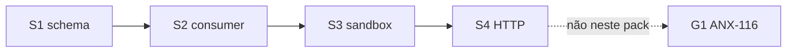

# R09 — Plano de implementação: `modules/simulation`

**Rodada:** R9 · 2026-09-11 · ANX-389 / ANX-115  
**Implementação:** **ANX-116** — não neste pack.  
**Callers:** [R08-decision-log.md](./R08-decision-log.md) · [R10-g0-handoff.md](./R10-g0-handoff.md).

## In / Out (R9)

**In:** plano G1 futuro (`simulation_*`, sandbox, HTTP runs, projector isolado, consumer backtest.requested).

**Out:** Migration agora. D-GOV-010. Pasta `experiments/`. Certificação. Ordens reais. ST08 live. ANX-342/389 done.

## Ownership

| Superfície | Dono |
| --- | --- |
| Plano G0 documental | **simulation** |
| Certificação G1 | **evaluation** (issue distinta) |
| adapter-gateway | **KEEP** |

## In scope (G1 futuro)

Schema `simulation_*`, contratos, consumer `backtest.requested`, sandbox SQLite + resultRef, HTTP `/v1/simulation/runs`, eventos started/completed/failed, contrato projector isolado.

## Out of scope

Migration agora; D-GOV-010; RLS P09; ST08; research-python (ANX-90 S3); pasta `experiments/`; certificação; ordens reais; scaffold 23 módulos.

## Non-goals P1

Só G0 documental. Não executar ANX-116. Não criar `experiments/`. Não fake ST08.

## Pré-requisitos G1 (greenlight Owner)

eventing · graph T01 · AgencyScope · fixtures market-data com hash · object store para resultRef.

## Árvore alvo

```text
backend/modules/simulation/src/
  domain/  application/commands/  application/consumers/
  infrastructure/persistence/  api/  index.ts
```

## Fatias P08 (pós-Owner)

| Slice | Entrega | Critério |
| --- | --- | --- |
| P08-S1 | Schema + contracts | PG run state; SQLite só sandbox |
| P08-S2 | Consumer backtest.requested | G3-SIM-01 |
| P08-S3 | Sandbox + resultRef | G3-SIM-02; G5-SIM-02 |
| P08-S4 | HTTP runs | G5-SIM-01 |

## Matriz oráculos

| ID | Caso |
| --- | --- |
| G3-SIM-01 | requested → started+completed/failed |
| G3-SIM-02 | hash mismatch FAILED |
| G3-SIM-03 | sem certification.* |
| G3-SIM-04 | boundaries sem execution/infra |
| G3-SIM-05 | sem order.* |
| G5-SIM-01 | 403 cross-tenant |
| G5-SIM-02 | REAL egress |
| G5-SIM-03 | hash mismatch |
| G5-SIM-04 | ST04 SQLite |
| G5-SIM-05 | T01 DENY |

## Defer

D-GOV-010; RLS P09; ST08; research-python protocol; spec `accepted`.



## Saída R9

Plano para R10. P1 **não** executa S1–S4.
